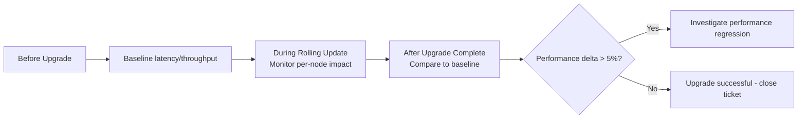

# How to Monitor Calico on Kubernetes Upgrades

Author: [nawazdhandala](https://github.com/nawazdhandala)

Tags: Calico, Kubernetes, Networking, Upgrades, Monitoring

Description: Monitor Calico upgrades in real time to detect failures, measure upgrade duration, and capture network impact during rolling updates across cluster nodes.

---

## Introduction

Monitoring a Calico upgrade in real time provides the confidence to proceed or abort based on objective data. The key metrics to watch during an upgrade are: pod restart counts (normal during rolling update), node network health (brief dips expected, prolonged unavailability indicates problems), and policy programming latency (should stabilize quickly after each node update).

## Real-Time Upgrade Monitor

```bash
#!/bin/bash
# monitor-calico-upgrade.sh
TARGET_VERSION="${1:?Provide target version}"
START_TIME=$(date +%s)

while true; do
  clear
  ELAPSED=$(( ($(date +%s) - START_TIME) / 60 ))
  echo "=== Calico Upgrade Monitor [${ELAPSED}m elapsed] ==="
  echo "Target: ${TARGET_VERSION}"
  echo ""

  # Version progress
  echo "--- Node Version Progress ---"
  TOTAL=$(kubectl get nodes --no-headers | wc -l)
  ON_TARGET=0
  while IFS= read -r line; do
    node=$(echo "${line}" | awk '{print $1}')
    image=$(echo "${line}" | awk '{print $2}')
    if echo "${image}" | grep -q "${TARGET_VERSION}"; then
      echo "  UPDATED: ${node}"
      ON_TARGET=$((ON_TARGET + 1))
    else
      echo "  PENDING: ${node}"
    fi
  done < <(kubectl get pods -n calico-system -l app=calico-node \
    -o jsonpath='{range .items[*]}{.spec.nodeName}{"\t"}{range .spec.containers[*]}{.image}{"\n"}{end}{end}')

  echo ""
  echo "Progress: ${ON_TARGET}/${TOTAL} nodes updated"

  # TigeraStatus
  echo ""
  echo "--- TigeraStatus ---"
  kubectl get tigerastatus 2>/dev/null

  sleep 15
done
```

## Prometheus Queries for Upgrade Monitoring

```promql
# Track upgrade progress via version metric
count(felix_version{version="3.28.0"}) /
count(kube_node_info)

# Monitor pod restart rate during upgrade (spikes are normal)
rate(kube_pod_container_status_restarts_total{namespace="calico-system"}[5m])

# Monitor policy programming latency during upgrade
histogram_quantile(0.99, rate(felix_int_dataplane_apply_time_seconds_bucket[5m]))
```

## Upgrade Duration Tracking

```bash
# Track how long each node's upgrade takes
# Add to monitoring script:
declare -A NODE_START_TIMES
declare -A NODE_END_TIMES

# Record when each node starts upgrading
# Record when each node is back on target version
# Calculate per-node upgrade duration
# Alert if any node takes >10x average time (stuck upgrade indicator)
```

## Upgrade Impact Measurement



## Alert During Upgrade

```yaml
apiVersion: monitoring.coreos.com/v1
kind: PrometheusRule
metadata:
  name: calico-upgrade-alerts
  namespace: monitoring
spec:
  groups:
    - name: calico.upgrade
      rules:
        - alert: CalicoUpgradeStuck
          expr: |
            (time() - kube_daemonset_status_updated_number_scheduled{daemonset="calico-node",namespace="calico-system"} / kube_daemonset_status_desired_number_scheduled{daemonset="calico-node",namespace="calico-system"}) > 900
          annotations:
            summary: "Calico upgrade appears to be stuck - less than 100% updated after 15 minutes"
```

## Conclusion

Monitoring Calico upgrades in real time provides the visibility needed to detect stuck upgrades, unexpected performance impacts, and nodes that fail to update. The combination of a real-time terminal monitor (for operator awareness) and Prometheus-based alerts (for automated detection) ensures upgrade issues are caught within minutes. Track upgrade duration as a metric over time — increasing upgrade durations may indicate cluster health issues that should be addressed before the next upgrade.
