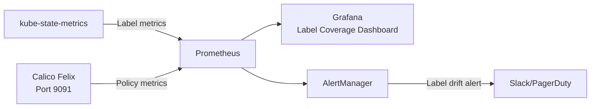

# How to Monitor Calico Label-Based Network Policy Impact

Author: [nawazdhandala](https://github.com/nawazdhandala)

Tags: Calico, Kubernetes, Network Policy, Labels, Monitoring

Description: Monitor the effectiveness and impact of Calico label-based network policies using metrics, label coverage reports, and traffic analytics.

---

## Introduction

Monitoring label-based network policies means tracking two interrelated dimensions: the health of your label taxonomy (are all pods correctly labeled?) and the effectiveness of your policies (are they matching the right pods and making the right traffic decisions?). Both require ongoing attention because Kubernetes is dynamic - deployments update, new services are added, and labels can drift from their intended state.

Calico's Prometheus metrics expose policy evaluation data, and Kubernetes provides pod label metrics through kube-state-metrics. Together, you can build dashboards that show label coverage, policy match rates, and traffic trends over time.

This guide shows you how to set up monitoring for label-based Calico policies, including label coverage tracking, policy match rate alerts, and traffic anomaly detection.

## Prerequisites

- Kubernetes cluster with Calico v3.26+
- Prometheus and Grafana deployed
- kube-state-metrics installed
- `calicoctl` and `kubectl` installed

## Step 1: Track Label Coverage with kube-state-metrics

```promql
# Count pods missing the tier label
count(kube_pod_info) - count(kube_pod_labels{label_tier!=""})

# Percentage of pods with required labels
100 * count(kube_pod_labels{label_tier!="",label_environment!=""}) / count(kube_pod_info)
```

## Step 2: Monitor Policy Evaluation Rate

```promql
# Policy evaluations per second
rate(felix_policy_evaluation_total[5m])

# Denied packets - indicates policy blocks
rate(felix_denied_packets_total[5m])

# Policy match rate (allow vs deny ratio)
rate(felix_active_network_policies[5m])
```

## Step 3: Create a Grafana Dashboard

```json
{
  "panels": [
    {
      "title": "Pod Label Coverage",
      "type": "stat",
      "targets": [{
        "expr": "100 * count(kube_pod_labels{label_tier!=\"\"}) / count(kube_pod_info)",
        "legendFormat": "% Pods Labeled"
      }]
    },
    {
      "title": "Denial Rate",
      "type": "graph",
      "targets": [{
        "expr": "rate(felix_denied_packets_total[5m])",
        "legendFormat": "Denials/s"
      }]
    }
  ]
}
```

## Step 4: Alert on Label Coverage Degradation

```yaml
apiVersion: monitoring.coreos.com/v1
kind: PrometheusRule
metadata:
  name: label-coverage-alerts
  namespace: monitoring
spec:
  groups:
    - name: calico.labels
      rules:
        - alert: LabelCoverageDegraded
          expr: |
            100 * count(kube_pod_labels{label_tier!=""}) / count(kube_pod_info) < 95
          for: 10m
          labels:
            severity: warning
          annotations:
            summary: "Pod label coverage dropped below 95%"
        - alert: SuddenDenialSpike
          expr: rate(felix_denied_packets_total[5m]) > 50
          for: 2m
          labels:
            severity: critical
          annotations:
            summary: "High packet denial rate - possible label misconfiguration"
```

## Step 5: Weekly Label Audit Report

```bash
#!/bin/bash
echo "Weekly Label Audit - $(date)"
echo "=============================="
echo "Total pods: $(kubectl get pods --all-namespaces --no-headers | wc -l)"
echo "Pods with tier label: $(kubectl get pods --all-namespaces -l tier --no-headers | wc -l)"
echo "Pods with environment label: $(kubectl get pods --all-namespaces -l environment --no-headers | wc -l)"
echo ""
echo "Pods missing labels:"
kubectl get pods --all-namespaces -o json | jq -r '.items[] | select(.metadata.labels.tier == null) | "\(.metadata.namespace)/\(.metadata.name)"'
```

## Monitoring Architecture



## Conclusion

Monitoring label-based Calico policies requires visibility into both the label state of your pods and the policy evaluation metrics from Calico Felix. Track label coverage as a percentage and alert when it drops, monitor denial rates for sudden spikes that indicate label misconfigurations, and run weekly audit reports to catch drift early. Good monitoring turns your label taxonomy from a one-time configuration into an actively maintained security control.
