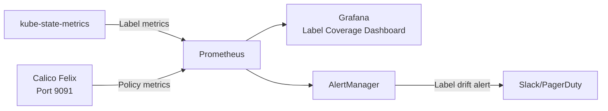

# How to Monitor Calico Label-Based Network Policy Impact

Author: [nawazdhandala](https://github.com/nawazdhandala)

Tags: Calico, Kubernetes, Network Policy, Labels, Monitoring

Description: Monitor the effectiveness and impact of Calico label-based network policies using metrics, label coverage reports, and traffic analytics.

---

## Introduction

Monitoring label-based network policies means tracking two interrelated dimensions: the health of your label taxonomy (are all pods correctly labeled?) and the effectiveness of your policies (are they matching the right pods and making the right traffic decisions?). Both require ongoing attention because Kubernetes is dynamic - deployments update, new services are added, and labels can drift from their intended state.

Calico's Prometheus metrics expose active policy and selector evaluation data, and Kubernetes provides pod label metrics through kube-state-metrics. Together, you can build dashboards that show label coverage, selector match rates, and selector evaluation trends over time.

This guide shows you how to set up monitoring for label-based Calico policies, including label coverage tracking, selector match rate alerts, and selector evaluation anomaly detection.

## Prerequisites

- Kubernetes cluster with Calico v3.26+
- Prometheus and Grafana deployed
- kube-state-metrics installed and configured to expose the required pod labels, such as `--metric-labels-allowlist=pods=[tier,environment]`
- `calicoctl` and `kubectl` installed

## Step 1: Track Label Coverage with kube-state-metrics

```promql
# Count pods missing the tier label

count(kube_pod_info) - count(kube_pod_labels{label_tier!=""})

# Percentage of pods with required labels
100 * count(kube_pod_labels{label_tier!="",label_environment!=""}) / count(kube_pod_info)
```

## Step 2: Monitor Policy Selector Metrics

```promql
# Active policies that match local endpoints
felix_active_local_policies

# Active rule selectors on this node
felix_active_local_selectors

# Selector match rate
sum(rate(felix_label_index_selector_evals{result="true"}[5m])) / sum(rate(felix_label_index_selector_evals[5m]))
```

## Step 3: Create a Grafana Dashboard

```json
{
  "panels": [
    {
      "title": "Pod Label Coverage",
      "type": "stat",
      "targets": [{
        "expr": "100 * count(kube_pod_labels{label_tier!=\"\"}) / count(kube_pod_info)",
        "legendFormat": "% Pods Labeled"
      }]
    },
    {
      "title": "Selector Match Rate",
      "type": "timeseries",
      "targets": [{
        "expr": "sum(rate(felix_label_index_selector_evals{result=\"true\"}[5m])) / sum(rate(felix_label_index_selector_evals[5m]))",
        "legendFormat": "Selector Matches"
      }]
    }
  ]
}
```

## Step 4: Alert on Label Coverage Degradation

```yaml
apiVersion: monitoring.coreos.com/v1
kind: PrometheusRule
metadata:
  name: label-coverage-alerts
  namespace: monitoring
spec:
  groups:
    - name: calico.labels
      rules:
        - alert: LabelCoverageDegraded
          expr: |
            100 * count(kube_pod_labels{label_tier!=""}) / count(kube_pod_info) < 95
          for: 10m
          labels:
            severity: warning
          annotations:
            summary: "Pod label coverage dropped below 95%"
        - alert: SelectorNoMatchSpike
          expr: |
            sum(rate(felix_label_index_selector_evals{result="false"}[5m])) > 10 * sum(rate(felix_label_index_selector_evals{result="true"}[5m]))
            and sum(rate(felix_label_index_selector_evals{result="true"}[5m])) > 0
          for: 2m
          labels:
            severity: critical
          annotations:
            summary: "High selector no-match rate - possible label or selector misconfiguration"
```

## Step 5: Weekly Label Audit Report

```bash
#!/bin/bash
echo "Weekly Label Audit - $(date)"
echo "=============================="
echo "Total pods: $(kubectl get pods --all-namespaces --no-headers | wc -l)"
echo "Pods with tier label: $(kubectl get pods --all-namespaces -l tier --no-headers | wc -l)"
echo "Pods with environment label: $(kubectl get pods --all-namespaces -l environment --no-headers | wc -l)"
echo ""
echo "Pods missing labels:"
kubectl get pods --all-namespaces -o json | jq -r '.items[] | select(.metadata.labels.tier == null) | "\(.metadata.namespace)/\(.metadata.name)"'
```

## Monitoring Architecture


```mermaid
flowchart LR
    A[kube-state-metrics] -->|Label metrics| B[Prometheus]
    C[Calico Felix\nPort 9091] -->|Policy metrics| B
    B --> D[Grafana\nLabel Coverage Dashboard]
    B --> E[AlertManager]
    E -->|Label drift alert| F[Slack/PagerDuty]
```

## Conclusion

Monitoring label-based Calico policies requires visibility into both the label state of your pods and the selector evaluation metrics from Calico Felix. Track label coverage as a percentage and alert when it drops, monitor selector no-match rates for sudden spikes that indicate label misconfigurations, and run weekly audit reports to catch drift early. Good monitoring turns your label taxonomy from a one-time configuration into an actively maintained security control.
