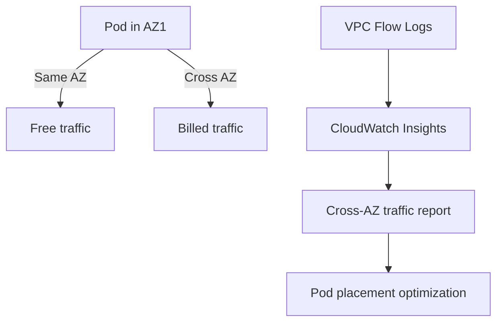

# Monitor Calico Networking on AWS

Author: [nawazdhandala](https://github.com/nawazdhandala)

Tags: Calico, Kubernetes, Networking, AWS, Cloud, Monitoring, Observability

Description: Set up comprehensive monitoring for Calico networking on AWS, including VPC flow logs, Felix metrics, and cross-AZ traffic visibility for Kubernetes clusters.

---

## Introduction

Monitoring Calico networking on AWS benefits from combining Calico's own telemetry with AWS-native monitoring capabilities. AWS VPC Flow Logs capture traffic at the VPC level - including dropped packets that never reach the destination node - while Calico's Felix metrics show policy enforcement decisions. Together, these sources give you full visibility from the VPC network layer through to the pod-level policy layer.

On AWS, cross-AZ traffic patterns are particularly important to monitor because they directly affect cost (cross-AZ data transfer is billed) and latency. Tracking the ratio of same-AZ vs cross-AZ pod communication helps identify opportunities to improve pod placement.

## Prerequisites

- Calico installed on AWS with Felix metrics enabled
- VPC Flow Logs enabled for the cluster VPC
- Prometheus and Grafana deployed
- CloudWatch or a log aggregation system

## Step 1: Enable VPC Flow Logs

```bash
# Enable VPC flow logs to CloudWatch
aws ec2 create-flow-logs \
  --resource-type VPC \
  --resource-ids vpc-0123456789 \
  --traffic-type ALL \
  --log-destination-type cloud-watch-logs \
  --log-group-name /aws/vpc/flow-logs/k8s-cluster \
  --deliver-logs-permission-arn arn:aws:iam::123456789:role/VPCFlowLogsRole
```

## Step 2: Enable Felix Prometheus Metrics

```bash
kubectl patch felixconfiguration default \
  --type=merge \
  --patch='{"spec":{"prometheusMetricsEnabled":true,"prometheusMetricsPort":9091}}'
```

## Step 3: Monitor Cross-AZ Traffic



Use CloudWatch Logs Insights to query cross-AZ traffic:

```sql
fields @timestamp, srcAddr, dstAddr, bytes, action
| filter srcAddr like /192\.168\./
| stats sum(bytes) as totalBytes by srcAddr, dstAddr
| sort totalBytes desc
| limit 20
```

## Step 4: Key Metrics Dashboard

Configure Grafana with AWS CloudWatch data source:

```yaml
# Grafana panel queries
# Cross-AZ vs same-AZ packet ratio
felix_policy_passed_packets_total{node_az="us-east-1a"}
```

Key metrics to track:

| Metric | Source | Alert Threshold |
|--------|--------|----------------|
| `felix_active_local_endpoints` | Prometheus | Sudden drop |
| `felix_policy_dropped_packets_total` | Prometheus | > 100/s |
| VPC flow log drop events | CloudWatch | > 50/min |
| Cross-AZ bytes | CloudWatch | Budget threshold |

## Step 5: CloudWatch Alarm for VPC Drops

```bash
aws cloudwatch put-metric-alarm \
  --alarm-name "CalicoVPCDroppedPackets" \
  --alarm-description "High packet drops in Calico cluster VPC" \
  --metric-name PacketsDropped \
  --namespace AWS/VPC \
  --statistic Sum \
  --period 300 \
  --threshold 1000 \
  --comparison-operator GreaterThanThreshold \
  --dimensions Name=VPC,Value=vpc-0123456789 \
  --evaluation-periods 2 \
  --alarm-actions arn:aws:sns:us-east-1:123456789:calico-alerts
```

## Step 6: Node-Level Network Metrics

Monitor network throughput and error rates on nodes using the node exporter:

```yaml
# Prometheus alert for interface errors on nodes
- alert: NodeNetworkErrorsHigh
  expr: rate(node_network_transmit_errs_total[5m]) > 10
  for: 5m
  labels:
    severity: warning
  annotations:
    summary: "High network errors on {{ $labels.instance }} interface {{ $labels.device }}"
```

## Conclusion

Monitoring Calico on AWS combines Felix Prometheus metrics for policy enforcement visibility with AWS VPC Flow Logs for network-level traffic analysis. By tracking cross-AZ traffic volume, packet drops, and Felix endpoint health, you can maintain visibility into both the security posture and cost implications of your cluster's networking behavior. CloudWatch alarms for VPC-level drops provide an early warning system independent of Calico's own monitoring.
