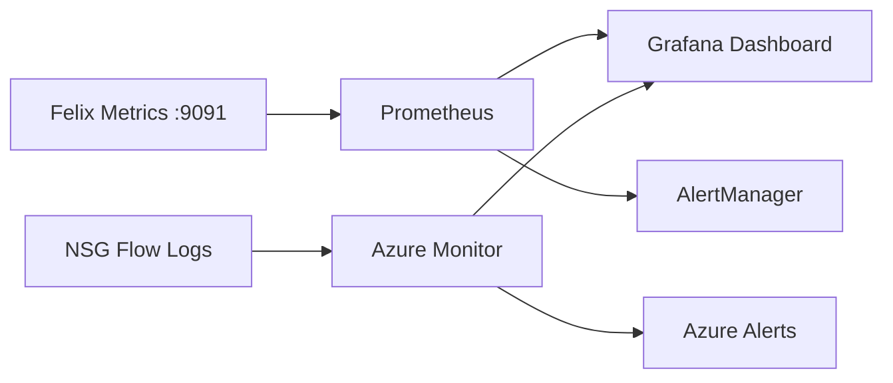

# Monitor Calico Networking on Azure

Author: [nawazdhandala](https://github.com/nawazdhandala)

Tags: Calico, Kubernetes, Networking, Azure, Cloud, Monitoring, Observability

Description: Set up monitoring for Calico networking on Azure using NSG flow logs, Felix metrics, and Azure Monitor to maintain visibility into pod network health and security policy enforcement.

---

## Introduction

Monitoring Calico on Azure combines the platform-level visibility of Azure NSG Flow Logs and Azure Monitor with Calico's Felix metrics. NSG Flow Logs capture all traffic allowed or denied at the Azure network layer, providing an audit trail and anomaly detection source that is independent of Calico itself. Felix metrics provide deep insight into policy enforcement at the pod level.

On Azure, it's particularly valuable to monitor for IP Forwarding configuration drift - if IP Forwarding gets disabled on a VM NIC (which can happen during certain Azure maintenance operations or VM recreations), pod networking silently breaks.

## Prerequisites

- Calico on Azure with Felix metrics enabled
- Azure Monitor and NSG Flow Logs configured
- Prometheus and Grafana deployed
- Azure CLI access

## Step 1: Enable NSG Flow Logs

```bash
# Create storage account for flow logs
az storage account create \
  --name k8sflowlogs \
  --resource-group k8s-rg \
  --location eastus \
  --sku Standard_LRS

# Enable NSG flow logs
az network watcher flow-log create \
  --resource-group k8s-rg \
  --nsg k8s-workers-nsg \
  --storage-account k8sflowlogs \
  --enabled true \
  --retention 7 \
  --format JSON \
  --log-version 2
```

## Step 2: Enable Felix Metrics

```bash
kubectl patch felixconfiguration default \
  --type=merge \
  --patch='{"spec":{"prometheusMetricsEnabled":true,"prometheusMetricsPort":9091}}'
```

## Step 3: Monitor IP Forwarding Configuration

Create a script that checks IP Forwarding is enabled on all worker VM NICs:

```bash
#!/bin/bash
# check-ip-forwarding.sh
for node in $(kubectl get nodes -o name | cut -d/ -f2); do
  NIC_ID=$(az vm show -g k8s-rg -n $node \
    --query "networkProfile.networkInterfaces[0].id" -o tsv 2>/dev/null)
  IP_FWD=$(az network nic show --ids "$NIC_ID" \
    --query enableIPForwarding -o tsv 2>/dev/null)
  if [ "$IP_FWD" != "true" ]; then
    echo "ALERT: IP Forwarding disabled on $node"
    exit 1
  fi
done
echo "All nodes: IP Forwarding enabled"
```

Schedule as a Kubernetes CronJob:

```yaml
apiVersion: batch/v1
kind: CronJob
metadata:
  name: ip-forwarding-check
spec:
  schedule: "*/15 * * * *"
  jobTemplate:
    spec:
      template:
        spec:
          containers:
            - name: checker
              image: mcr.microsoft.com/azure-cli
              command: ["/bin/bash", "/scripts/check-ip-forwarding.sh"]
          restartPolicy: OnFailure
```

## Step 4: Prometheus Alerts for Calico on Azure



```yaml
- alert: CalicoAzureNodeEndpointDown
  expr: felix_active_local_endpoints == 0
  for: 5m
  labels:
    severity: critical
  annotations:
    summary: "Felix reports 0 active endpoints on {{ $labels.node }} - possible IP forwarding issue"

- alert: CalicoAzureHighDropRate
  expr: rate(felix_policy_dropped_packets_total[5m]) > 100
  for: 2m
  labels:
    severity: warning
  annotations:
    summary: "High Calico policy drop rate on Azure node {{ $labels.node }}"
```

## Step 5: Azure Monitor Dashboard

Use Azure Monitor workbooks to visualize NSG Flow Log data:

```bash
# Query Flow Logs for denied traffic
az monitor log-analytics query \
  --workspace $WORKSPACE_ID \
  --analytics-query "
AzureNetworkAnalytics_CL
| where SubType_s == 'FlowLog'
| where FlowStatus_s == 'D'
| where SrcIP_s startswith '192.168.'
| summarize count() by SrcIP_s, DestIP_s
| top 10 by count_
"
```

## Conclusion

Monitoring Calico on Azure requires tracking both Azure platform settings (IP Forwarding per VM) and Calico runtime metrics (Felix endpoints, drop rates). NSG Flow Logs provide independent network-layer visibility that can detect issues even when Calico's own metrics look healthy. Automated IP Forwarding checks run as CronJobs provide proactive detection of platform-level configuration drift that would otherwise silently break pod networking.
