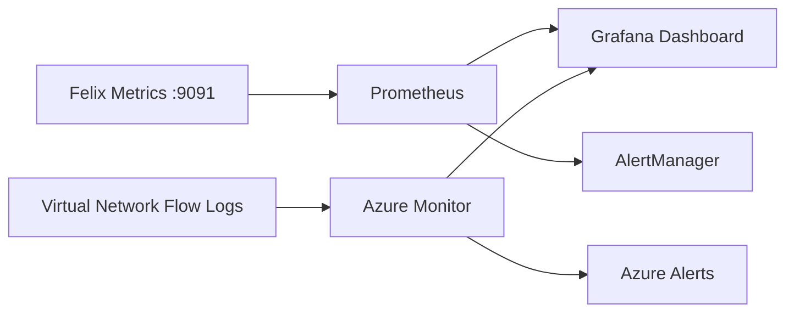

# Monitor Calico Networking on Azure

Author: [nawazdhandala](https://github.com/nawazdhandala)

Tags: Calico, Kubernetes, Networking, Azure, Cloud, Monitoring, Observability

Description: Set up monitoring for Calico networking on Azure using NSG flow logs, Felix metrics, and Azure Monitor to maintain visibility into pod network health and security policy enforcement.

---

## Introduction

Monitoring Calico on Azure combines the platform-level visibility of Azure virtual network flow logs and Azure Monitor with Calico's Felix metrics. Virtual network flow logs capture allowed and denied IP traffic at the Azure network layer, providing an audit trail and anomaly detection source that is independent of Calico itself. Felix metrics provide deep insight into policy enforcement at the pod level.

On Azure, it's particularly valuable to monitor for IP Forwarding configuration drift - if IP Forwarding gets disabled on a VM NIC (which can happen during certain Azure maintenance operations or VM recreations), pod networking silently breaks.

## Prerequisites

- Calico on Azure with Felix metrics enabled
- Azure Monitor and virtual network flow logs configured
- Prometheus and Grafana deployed
- Azure CLI access

## Step 1: Enable Virtual Network Flow Logs

Azure NSG flow logs are being retired and can no longer be created for new deployments. Use virtual network flow logs for new monitoring setups.

```bash
# Create storage account for flow logs

az storage account create \
  --name k8sflowlogs \
  --resource-group k8s-rg \
  --location eastus \
  --sku Standard_LRS

# Enable virtual network flow logs with Traffic Analytics
az network watcher flow-log create \
  --resource-group k8s-rg \
  --location eastus \
  --name k8s-vnet-flowlog \
  --vnet k8s-vnet \
  --storage-account k8sflowlogs \
  --enabled true \
  --retention 7 \
  --format JSON \
  --log-version 2 \
  --traffic-analytics true \
  --workspace k8s-law
```

## Step 2: Enable Felix Metrics

```bash
kubectl patch felixconfiguration default \
  --type=merge \
  --patch='{"spec":{"prometheusMetricsEnabled":true,"prometheusMetricsPort":9091}}'
```

## Step 3: Monitor IP Forwarding Configuration

Create a script that checks IP Forwarding is enabled on all worker VM NICs:

```bash
#!/bin/bash
# check-ip-forwarding.sh
for node in $(kubectl get nodes -o name | cut -d/ -f2); do
  NIC_ID=$(az vm show -g k8s-rg -n $node \
    --query "networkProfile.networkInterfaces[0].id" -o tsv 2>/dev/null)
  IP_FWD=$(az network nic show --ids "$NIC_ID" \
    --query enableIPForwarding -o tsv 2>/dev/null)
  if [ "$IP_FWD" != "true" ]; then
    echo "ALERT: IP Forwarding disabled on $node"
    exit 1
  fi
done
echo "All nodes: IP Forwarding enabled"
```

Schedule as a Kubernetes CronJob:

```yaml
apiVersion: batch/v1
kind: CronJob
metadata:
  name: ip-forwarding-check
spec:
  schedule: "*/15 * * * *"
  jobTemplate:
    spec:
      template:
        spec:
          containers:
            - name: checker
              image: mcr.microsoft.com/azure-cli
              command: ["/bin/bash", "/scripts/check-ip-forwarding.sh"]
          restartPolicy: OnFailure
```

## Step 4: Prometheus Alerts for Calico on Azure


```mermaid
graph LR
    A[Felix Metrics :9091] --> B[Prometheus]
    C[Virtual Network Flow Logs] --> D[Azure Monitor]
    B --> E[Grafana Dashboard]
    D --> E
    B --> F[AlertManager]
    D --> G[Azure Alerts]
```

```yaml
- alert: CalicoAzureNodeEndpointDown
  expr: felix_active_local_endpoints == 0
  for: 5m
  labels:
    severity: critical
  annotations:
    summary: "Felix reports 0 active endpoints on {{ $labels.node }} - possible IP forwarding issue"

- alert: CalicoAzureDataplaneFailures
  expr: increase(felix_int_dataplane_failures[5m]) > 0
  for: 2m
  labels:
    severity: warning
  annotations:
    summary: "Felix dataplane update failures on Azure node {{ $labels.node }}"
```

## Step 5: Azure Monitor Dashboard

Use Azure Monitor workbooks to visualize virtual network flow log data:

```bash
# Query Flow Logs for denied traffic
az monitor log-analytics query \
  --workspace $WORKSPACE_ID \
  --analytics-query "
NTANetAnalytics
| where SubType == 'FlowLog'
| where FlowStatus == 'D'
| where SrcIp startswith '192.168.'
| summarize count() by SrcIp, DestIp
| top 10 by count_
"
```

## Conclusion

Monitoring Calico on Azure requires tracking both Azure platform settings (IP Forwarding per VM) and Calico runtime metrics (Felix endpoints, dataplane failures). Virtual network flow logs provide independent network-layer visibility that can detect issues even when Calico's own metrics look healthy. Automated IP Forwarding checks run as CronJobs provide proactive detection of platform-level configuration drift that would otherwise silently break pod networking.
