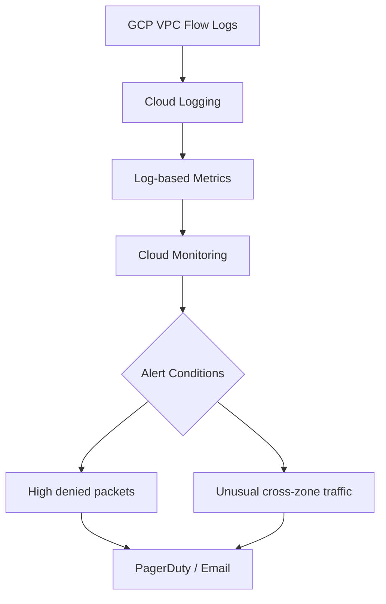

# Monitor Calico Networking on Google Compute Engine

Author: [nawazdhandala](https://github.com/nawazdhandala)

Tags: Calico, Kubernetes, Networking, GCE, Google Cloud, Monitoring, Observability

Description: Set up comprehensive monitoring for Calico networking on GCE using GCP VPC Flow Logs, Cloud Monitoring, and Felix metrics for end-to-end visibility into Kubernetes pod networking.

---

## Introduction

Monitoring Calico on GCE combines GCP's native network observability tools with Calico's own metrics. GCP VPC Flow Logs provide packet-level visibility into allowed and denied traffic at the VPC layer, while Cloud Monitoring can alert on network anomalies. Felix metrics, exposed via Prometheus, show the health of policy enforcement at the pod level.

GCE-specific monitoring should also track VPC route table health — as the number of nodes grows, ensuring that all pod CIDR routes remain present is critical for cluster stability.

## Prerequisites

- Calico on GCE with Felix metrics enabled
- GCP VPC Flow Logs enabled on subnets
- Prometheus and Grafana deployed
- Google Cloud SDK access

## Step 1: Enable VPC Flow Logs

```bash
# Enable flow logs on the worker subnet
gcloud compute networks subnets update k8s-workers-subnet \
  --region us-central1 \
  --enable-flow-logs \
  --logging-flow-sampling 0.5 \
  --logging-metadata INCLUDE_ALL_METADATA
```

## Step 2: Enable Felix Prometheus Metrics

```bash
kubectl patch felixconfiguration default \
  --type=merge \
  --patch='{"spec":{"prometheusMetricsEnabled":true,"prometheusMetricsPort":9091}}'
```

## Step 3: Monitor VPC Route Health

Create a Cloud Monitoring check that verifies VPC routes exist for all active nodes:

```bash
#!/bin/bash
# check-vpc-routes.sh - Run as Cloud Functions scheduled job or CronJob

EXPECTED_ROUTES=$(calicoctl ipam show --show-blocks --output=json | \
  python3 -c "
import json, sys
data = json.load(sys.stdin)
blocks = [b['cidr'] for b in data.get('blocks', [])]
print(len(blocks))
")

ACTUAL_ROUTES=$(gcloud compute routes list \
  --filter="destRange~192.168" \
  --format="value(name)" | wc -l)

echo "Expected routes: $EXPECTED_ROUTES, Actual: $ACTUAL_ROUTES"
if [ "$EXPECTED_ROUTES" -ne "$ACTUAL_ROUTES" ]; then
  echo "ALERT: VPC route count mismatch!"
  exit 1
fi
```

## Step 4: Cloud Monitoring Alerts



Create a log-based metric for denied packets:

```bash
gcloud logging metrics create calico_vpc_denied_packets \
  --description="Packets denied in Calico cluster VPC" \
  --log-filter='resource.type="gce_instance" jsonPayload.connection.dest_port!="-"' \
  --value-extractor="EXTRACT(jsonPayload.bytes_sent)"
```

## Step 5: Prometheus Alerts for GCE

```yaml
groups:
  - name: calico-gce
    rules:
      - alert: CalicoGCEEndpointDrop
        expr: |
          decrease(felix_active_local_endpoints[5m]) > 2
        for: 3m
        labels:
          severity: warning
        annotations:
          summary: "Calico endpoints decreased on GCE node {{ $labels.node }}"

      - alert: CalicoGCEFelixRestarts
        expr: |
          increase(felix_resyncs_total[15m]) > 5
        for: 5m
        labels:
          severity: warning
        annotations:
          summary: "Felix on {{ $labels.node }} is resyncing frequently"
```

## Step 6: Dashboard Metrics

Key metrics for a GCE Calico Grafana dashboard:

| Panel | Metric | Visualization |
|-------|--------|--------------|
| Active Endpoints | `felix_active_local_endpoints` | Time series |
| Policy Drops | `rate(felix_policy_dropped_packets_total[5m])` | Time series |
| IPAM Usage | Custom from `calicoctl ipam show` | Gauge |
| VPC Route Count | Custom script | Single stat |

## Conclusion

Monitoring Calico on GCE combines VPC Flow Log analysis for network-layer visibility with Felix Prometheus metrics for policy enforcement health. GCE-specific monitoring must also track VPC static route count to detect drift when nodes are added or removed. By alerting on route count mismatches, Felix restarts, and high drop rates, you can catch GCE-specific Calico issues before they escalate to cluster-wide connectivity problems.
