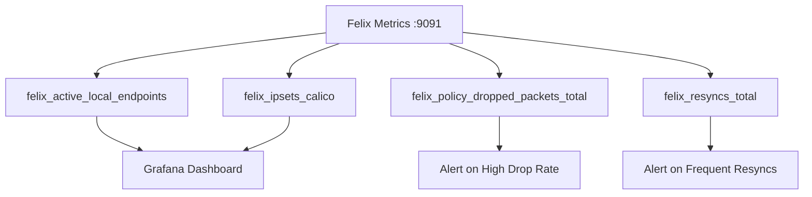

# Monitor Calico Networking on IBM Cloud

Author: [nawazdhandala](https://github.com/nawazdhandala)

Tags: Calico, Kubernetes, Networking, IBM Cloud, Monitoring, Observability

Description: Set up monitoring for Calico networking on IBM Cloud using IBM Cloud Monitoring, Felix metrics, and VPC flow logs for comprehensive visibility into Kubernetes pod networking health.

---

## Introduction

Monitoring Calico on IBM Cloud combines IBM Cloud's native observability tools with Calico's Felix metrics. IBM Cloud Monitoring (based on Sysdig) provides deep Kubernetes and Calico observability out of the box for IKS clusters, while custom Prometheus setups work for self-managed clusters.

For IKS clusters, IBM Cloud Monitoring automatically collects Calico-related metrics when the monitoring agent is deployed. For self-managed clusters, you'll need to configure Prometheus scraping of Felix's metrics endpoint. This guide covers both approaches.

## Prerequisites

- Calico on IBM Cloud with Felix metrics enabled
- IBM Cloud Monitoring service provisioned (for IKS)
- Or Prometheus and Grafana for self-managed clusters
- `kubectl` with cluster admin access

## Step 1: Enable Felix Prometheus Metrics

```bash
kubectl patch felixconfiguration default \
  --type=merge \
  --patch='{"spec":{"prometheusMetricsEnabled":true,"prometheusMetricsPort":9091}}'
```

## Step 2: IBM Cloud Monitoring Integration (IKS)

Deploy the IBM Cloud Monitoring agent:

```bash
# Get your monitoring ingestion key
ibmcloud resource service-key my-monitoring-key --output json | \
  jq -r '.credentials.Sysdig_Access_Key'

# Deploy monitoring agent
helm repo add ibm-charts https://raw.githubusercontent.com/IBM/charts/master/repo/stable/
helm install ibm-monitoring ibm-charts/ibm-sysdig-agent \
  --namespace ibm-monitoring \
  --create-namespace \
  --set sysdig.accessKey=<ACCESS_KEY> \
  --set sysdig.settings.k8s_cluster_name=my-cluster \
  --set sysdig.settings.tags="role:kubernetes,cloud:ibm"
```

## Step 3: Key Calico Metrics to Monitor



| Metric | Purpose | Alert Threshold |
|--------|---------|----------------|
| `felix_active_local_endpoints` | Endpoints per node | Drop of > 5 in 5m |
| `felix_policy_dropped_packets_total` | Policy denials | Rate > 100/s |
| `felix_resyncs_total` | Felix restarts/resyncs | Increase > 3 in 10m |
| `felix_ipsets_calico` | IP sets in kernel | Sudden change |

## Step 4: IBM Cloud Log Analysis for Calico

Configure log forwarding to IBM Cloud Log Analysis:

```bash
# Install IBM Log Analysis agent on IKS
kubectl apply -f https://raw.githubusercontent.com/IBM/icp4d-install/master/logdna-agent.yaml

# Or use IBM Cloud Operator
kubectl create secret generic logdna-agent-key \
  --from-literal=logdna-agent-key=<INGESTION_KEY> \
  -n ibm-observe
```

Create alerts for Calico errors in IBM Log Analysis:

```
# Alert query: Felix permission denied errors
"calico-node" AND "permission denied"
```

## Step 5: VPC Flow Logs (IBM Cloud VPC)

```bash
# Enable VPC flow logs
ibmcloud is flow-log-create \
  --target <subnet-id> \
  --storage-bucket calico-flow-logs \
  --name calico-subnet-flows \
  --active true
```

## Step 6: Prometheus Alerting Rules

```yaml
groups:
  - name: calico-ibm
    rules:
      - alert: CalicoIBMEndpointDrop
        expr: |
          decrease(felix_active_local_endpoints[5m]) > 3
        for: 3m
        labels:
          severity: warning
          cloud: ibm
        annotations:
          summary: "Calico endpoints decreased on IBM Cloud node {{ $labels.node }}"

      - alert: CalicoIBMPolicyDropHigh
        expr: rate(felix_policy_dropped_packets_total[5m]) > 100
        for: 2m
        labels:
          severity: warning
        annotations:
          summary: "High policy drop rate on IBM Cloud Kubernetes"
```

## Conclusion

Monitoring Calico on IBM Cloud is enhanced by using IBM Cloud Monitoring's pre-built Kubernetes integration for IKS clusters, which provides out-of-the-box Calico metrics without manual configuration. For self-managed clusters, Felix Prometheus metrics combined with IBM Cloud Log Analysis provide similar visibility. VPC flow logs add network-layer monitoring that complements Calico's policy-level metrics.
