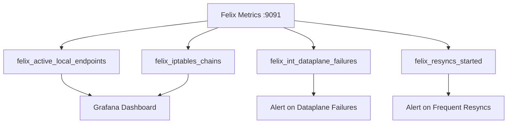

# Monitor Calico Networking on IBM Cloud

Author: [nawazdhandala](https://github.com/nawazdhandala)

Tags: Calico, Kubernetes, Networking, IBM Cloud, Monitoring, Observability

Description: Set up monitoring for Calico networking on IBM Cloud using IBM Cloud Monitoring, Felix metrics, and VPC flow logs for comprehensive visibility into Kubernetes pod networking health.

---

## Introduction

Monitoring Calico on IBM Cloud combines IBM Cloud's native observability tools with Calico's Felix metrics. IBM Cloud Monitoring (based on Sysdig) provides Kubernetes and infrastructure observability for IKS clusters, while custom Prometheus scraping is needed for Felix-specific metrics.

For IKS clusters, IBM Cloud Monitoring collects Kubernetes and node metrics when the monitoring agent is deployed. For Felix-specific Calico metrics, configure a Prometheus-compatible scrape of Felix's metrics endpoint. This guide covers both approaches.

## Prerequisites

- Calico on IBM Cloud with Felix metrics enabled
- IBM Cloud Monitoring service provisioned (for IKS)
- Or Prometheus and Grafana for self-managed clusters
- `kubectl` with cluster admin access

## Step 1: Enable Felix Prometheus Metrics

```bash
kubectl patch felixconfiguration default \
  --type=merge \
  --patch='{"spec":{"prometheusMetricsEnabled":true,"prometheusMetricsPort":9091}}'
```

## Step 2: IBM Cloud Monitoring Integration (IKS)

Deploy the IBM Cloud Monitoring agent:

```bash
# Get your monitoring ingestion key

ibmcloud resource service-key my-monitoring-key --output json | \
  jq -r '.credentials["Access Key"]'

# Deploy monitoring agent
helm repo add sysdig https://charts.sysdig.com
helm repo update

helm install sysdig-agent sysdig/sysdig-deploy \
  --namespace ibm-observe \
  --create-namespace \
  --set global.sysdig.accessKey=<ACCESS_KEY> \
  --set agent.collectorSettings.collectorHost=<INGESTION_ENDPOINT> \
  --set global.clusterConfig.name=my-cluster \
  --set nodeAnalyzer.enabled=false
```

## Step 3: Key Calico Metrics to Monitor


```mermaid
graph TD
    A[Felix Metrics :9091] --> B[felix_active_local_endpoints]
    A --> C[felix_int_dataplane_failures]
    A --> D[felix_iptables_chains]
    A --> E[felix_resyncs_started]
    B --> F[Grafana Dashboard]
    C --> G[Alert on Dataplane Failures]
    D --> F
    E --> H[Alert on Frequent Resyncs]
```

| Metric | Purpose | Alert Threshold |
|--------|---------|----------------|
| `felix_active_local_endpoints` | Endpoints per node | Drop of > 5 in 5m |
| `felix_int_dataplane_failures` | Dataplane update failures | Increase > 0 in 5m |
| `felix_resyncs_started` | Felix datastore resyncs | Increase > 3 in 10m |
| `felix_iptables_chains` | Active iptables chains | Sudden change |

## Step 4: IBM Cloud Logs for Calico

Configure log forwarding to IBM Cloud Logs:

```bash
# Create a service ID API key for the logging agent
ibmcloud iam service-id-create kubernetes-logs-agent \
  --description "Service ID for sending logs from IKS"
ibmcloud iam service-policy-create kubernetes-logs-agent \
  --service-name logs \
  --roles Sender
ibmcloud iam service-api-key-create kubernetes-logs-agent-apikey \
  kubernetes-logs-agent \
  --description "API key for sending logs to IBM Cloud Logs"

# Deploy the IBM Cloud Logs agent with Helm
helm registry login -u iambearer \
  -p $(ibmcloud iam oauth-tokens --output json | jq -r .iam_token | cut -d " " -f2) \
  icr.io

helm install logs-agent oci://icr.io/ibm/observe/logs-agent-helm \
  --version <CHART_VERSION> \
  --namespace ibm-observe \
  --create-namespace \
  --values logs-values.yaml \
  --set secret.iamAPIKey=<API_KEY>
```

Create alerts for Calico errors in IBM Cloud Logs:

```plaintext
# Alert query: Felix permission denied errors
"calico-node" AND "permission denied"
```

## Step 5: VPC Flow Logs (IBM Cloud VPC)

```bash
# Enable VPC flow logs
ibmcloud is flow-log-create \
  --target <subnet-id> \
  --bucket calico-flow-logs \
  --name calico-subnet-flows \
  --active true
```

## Step 6: Prometheus Alerting Rules

```yaml
groups:
  - name: calico-ibm
    rules:
      - alert: CalicoIBMEndpointDrop
        expr: |
          decrease(felix_active_local_endpoints[5m]) > 3
        for: 3m
        labels:
          severity: warning
          cloud: ibm
        annotations:
          summary: "Calico endpoints decreased on IBM Cloud node {{ $labels.node }}"

      - alert: CalicoIBMDataplaneFailures
        expr: increase(felix_int_dataplane_failures[5m]) > 0
        for: 2m
        labels:
          severity: warning
        annotations:
          summary: "Calico dataplane update failures on IBM Cloud Kubernetes"
```

## Conclusion

Monitoring Calico on IBM Cloud is enhanced by using IBM Cloud Monitoring's pre-built Kubernetes integration for IKS clusters, which provides out-of-the-box Kubernetes and node metrics. For Felix-specific visibility, scrape Felix Prometheus metrics and combine them with IBM Cloud Logs. VPC flow logs add network-layer monitoring that complements Calico's dataplane metrics.
