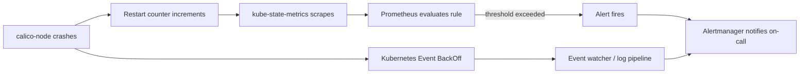

# How to Monitor Calico Node CrashLoopBackOff

Author: [nawazdhandala](https://github.com/nawazdhandala)

Tags: Calico, Kubernetes, Networking, Troubleshooting

Description: Monitoring and alerting setup to detect calico-node CrashLoopBackOff events early using Prometheus metrics, Kubernetes events, and log-based detection.

---

## Introduction

Detecting calico-node CrashLoopBackOff quickly is critical because each crash cycle withdraws BGP routes and may cause new pod scheduling to fail on the affected node. Without monitoring, teams often learn about this condition from application-level alerts or user reports - by which time the cluster may have been degraded for many minutes.

Effective monitoring for CrashLoopBackOff combines multiple signals: Kubernetes pod restart counters (via kube-state-metrics), calico-node readiness probe failures, and structured log patterns from the Felix process. Layering these signals provides redundancy so that no single monitoring gap leaves the cluster blind to calico-node crashes.

This guide covers the setup of Prometheus-based alerting, Kubernetes event watchers, and log monitoring for calico-node CrashLoopBackOff.

## Symptoms

- High restart count on calico-node pods not triggering any alert
- Node networking failures discovered through application-layer timeouts
- On-call team unaware of calico-node crashes until multiple restarts occurred

## Root Causes

- No Prometheus rule monitoring kube_pod_container_status_restarts_total for calico-node
- kube-state-metrics not deployed or not scraping kube-system namespace
- Log aggregation not configured to alert on calico-node crash patterns

## Diagnosis Steps

```bash
# Check current restart counts
kubectl get pods -n kube-system -l k8s-app=calico-node \
  -o jsonpath='{range .items[*]}{.metadata.name}{"\t"}{.status.containerStatuses[0].restartCount}{"\n"}{end}'

# Verify kube-state-metrics is running
kubectl get pods -n kube-system | grep kube-state-metrics

# Verify Prometheus is scraping kube-state-metrics
kubectl get servicemonitor -n monitoring | grep kube-state
```

## Solution

**Step 1: Create PrometheusRule for CrashLoopBackOff detection**

```yaml
apiVersion: monitoring.coreos.com/v1
kind: PrometheusRule
metadata:
  name: calico-node-crashloop-alerts
  namespace: kube-system
spec:
  groups:
  - name: calico.crashloop
    rules:
    - alert: CalicoNodeCrashLoopBackOff
      expr: |
        increase(kube_pod_container_status_restarts_total{
          namespace="kube-system",
          container="calico-node"
        }[10m]) > 3
      for: 5m
      labels:
        severity: critical
      annotations:
        summary: "calico-node CrashLoopBackOff on {{ $labels.pod }}"
        description: "calico-node pod {{ $labels.pod }} has restarted {{ $value }} times in the last 10 minutes"
    - alert: CalicoNodeNotReady
      expr: |
        kube_pod_container_status_ready{
          namespace="kube-system",
          container="calico-node"
        } == 0
      for: 3m
      labels:
        severity: warning
      annotations:
        summary: "calico-node not ready on {{ $labels.pod }}"
```

**Step 2: Monitor pod events with a continuous watch**

```bash
# Pipe events to a logging system
kubectl get events -n kube-system --watch \
  --field-selector reason=BackOff \
  2>/dev/null | grep calico
```

**Step 3: Create a CronJob to check restart counts**

```yaml
apiVersion: batch/v1
kind: CronJob
metadata:
  name: calico-health-check
  namespace: kube-system
spec:
  schedule: "*/5 * * * *"
  jobTemplate:
    spec:
      template:
        spec:
          serviceAccountName: calico-node
          containers:
          - name: checker
            image: bitnami/kubectl:latest
            command:
            - /bin/sh
            - -c
            - |
              RESTARTS=$(kubectl get pods -n kube-system -l k8s-app=calico-node \
                -o jsonpath='{range .items[*]}{.status.containerStatuses[0].restartCount}{"\n"}{end}' \
                | sort -n | tail -1)
              if [ "$RESTARTS" -gt 5 ]; then
                echo "ALERT: calico-node restart count $RESTARTS exceeds threshold"
                exit 1
              fi
          restartPolicy: OnFailure
```



## Prevention

- Deploy kube-state-metrics and Prometheus as part of every cluster bootstrap
- Test alert rules in staging by manually killing calico-node pods
- Include calico-node restart count in your weekly cluster health report

## Conclusion

Monitoring calico-node CrashLoopBackOff requires combining Prometheus restart-count metrics with Kubernetes event watching. With PrometheusRules in place and kube-state-metrics deployed, CrashLoopBackOff conditions surface within minutes, enabling rapid response before extended cluster degradation occurs.
