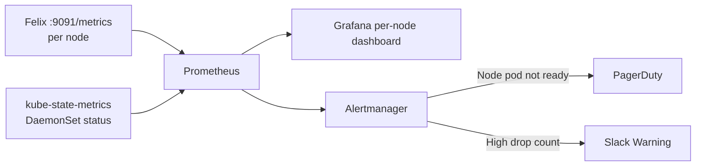

# How to Monitor Calico Node Health for Diagnostics

Author: [nawazdhandala](https://github.com/nawazdhandala)

Tags: Calico, Kubernetes, Networking, Diagnostics, Monitoring

Description: Monitor per-node Calico health using Felix Prometheus metrics, DaemonSet rollout status, and node-level alerts to detect individual node failures before they cause application connectivity issues.

---

## Introduction

Monitoring Calico at the node level requires tracking Felix health metrics per node, alerting when a calico-node pod is not Running on any node, and detecting BGP peer failures on individual nodes. Node-level monitoring complements cluster-wide TigeraStatus monitoring by catching issues that affect only a subset of nodes.

## Felix Prometheus Metrics for Node Monitoring

```yaml
# ServiceMonitor for Felix per-node metrics
apiVersion: monitoring.coreos.com/v1
kind: ServiceMonitor
metadata:
  name: felix-per-node
  namespace: calico-system
spec:
  selector:
    matchLabels:
      k8s-app: calico-node
  endpoints:
    - port: http-metrics
      path: /metrics
      interval: 30s
  namespaceSelector:
    matchNames: ["calico-system"]
```

## Alert Rules for Node-Level Health

```yaml
apiVersion: monitoring.coreos.com/v1
kind: PrometheusRule
metadata:
  name: calico-node-alerts
  namespace: calico-system
spec:
  groups:
    - name: calico.node
      rules:
        - alert: CalicoNodePodNotRunning
          expr: |
            kube_daemonset_status_desired_number_scheduled{daemonset="calico-node"}
            - kube_daemonset_status_number_ready{daemonset="calico-node"} > 0
          for: 5m
          annotations:
            summary: "{{ $value }} calico-node pods are not ready"

        - alert: CalicoFelixHighDropCount
          expr: |
            increase(felix_int_dataplane_failures[5m]) > 0
          for: 5m
          labels:
            severity: warning
          annotations:
            summary: "High Felix policy drop count on {{ $labels.instance }}"

        - alert: CalicoFelixDataplaneErrors
          expr: |
            rate(felix_int_dataplane_failures_total[5m]) > 0
          for: 5m
          annotations:
            summary: "Felix dataplane failures on node {{ $labels.instance }}"
```

## Node Health Monitoring Dashboard

```json
{
  "title": "Calico Per-Node Health",
  "panels": [
    {
      "title": "calico-node Pods Ready",
      "type": "stat",
      "targets": [{
        "expr": "kube_daemonset_status_number_ready{daemonset='calico-node'}"
      }]
    },
    {
      "title": "Felix Policy Drops by Node",
      "type": "graph",
      "targets": [{
        "expr": "rate(felix_int_dataplane_failures[5m])",
        "legendFormat": "{{instance}}"
      }]
    }
  ]
}
```

## Monitoring Architecture



## Conclusion

Node-level Calico monitoring requires two data sources: Felix Prometheus metrics for per-node health signals and kube-state-metrics for DaemonSet pod readiness. The most critical alert is `CalicoNodePodNotRunning` — a missing calico-node pod means one node has no network policy enforcement and pods on that node may have connectivity issues. Combine this with the Felix dataplane failures alert to catch iptables programming errors before they cause visible outages.
