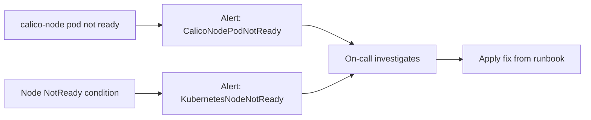

# How to Monitor Calico Node Not Ready Status

Author: [nawazdhandala](https://github.com/nawazdhandala)

Tags: Calico, Kubernetes, Networking, Troubleshooting

Description: Monitor for Calico-related node NotReady conditions using kube-state-metrics alerts, calico-node readiness tracking, and node condition watchers.

---

## Introduction

Monitoring for node NotReady status caused by Calico requires tracking both node conditions and calico-node pod readiness in parallel. A calico-node pod becoming not-ready is an early warning signal that typically precedes the node NotReady condition by 30-60 seconds. Alerting on calico-node readiness provides a head start on response.

## Symptoms

- Node transitions to NotReady without prior warning
- calico-node pod readiness change not detected before node impact

## Root Causes

- No alert defined for calico-node pod readiness
- Node condition monitoring does not correlate with calico-node health

## Diagnosis Steps

```bash
kubectl get nodes
kubectl get pods -n kube-system -l k8s-app=calico-node
```

## Solution

**Step 1: Alert on calico-node pod not ready**

```yaml
apiVersion: monitoring.coreos.com/v1
kind: PrometheusRule
metadata:
  name: calico-node-health-alerts
  namespace: monitoring
spec:
  groups:
  - name: calico.health
    rules:
    - alert: CalicoNodePodNotReady
      expr: |
        kube_pod_status_ready{
          namespace="kube-system",
          pod=~"calico-node-.*",
          condition="true"
        } == 0
      for: 2m
      labels:
        severity: critical
    - alert: KubernetesNodeNotReady
      expr: kube_node_status_condition{condition="Ready",status="true"} == 0
      for: 2m
      labels:
        severity: critical
      annotations:
        summary: "Node {{ $labels.node }} is NotReady"
```

**Step 2: Dashboard panels**

Monitor these metrics:
- `kube_node_status_condition{condition="Ready"}` — node readiness
- `kube_pod_status_ready{namespace="kube-system",pod=~"calico-node-.*"}` — calico-node readiness
- `kube_pod_container_status_restarts_total{container="calico-node"}` — restart rate

**Step 3: Event watcher**

```bash
kubectl get events --all-namespaces --watch \
  --field-selector reason=NodeNotReady 2>/dev/null
```



## Prevention

- Deploy both alerts: calico-node readiness and node readiness
- Set calico-node alert threshold at 2 minutes to alert before node impact
- Include calico-node readiness in cluster health dashboards

## Conclusion

Monitoring Calico node NotReady status requires two layers: calico-node pod readiness (early warning at 2 minutes) and node NotReady condition (urgent alert). The combination provides both early warning and a confirmed critical alert, enabling tiered response.
