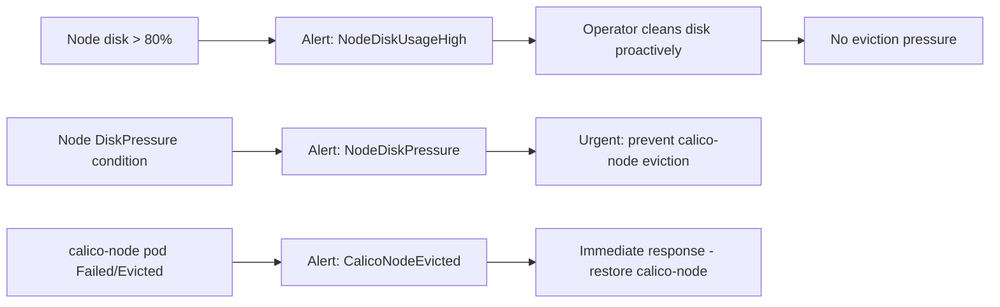

# How to Monitor Calico Node Pod Eviction

Author: [nawazdhandala](https://github.com/nawazdhandala)

Tags: Calico, Kubernetes, Networking, Troubleshooting

Description: Monitor for calico-node pod eviction using node pressure metrics, pod eviction events, and calico-node availability alerts.

---

## Introduction

Monitoring for calico-node eviction requires tracking both the preconditions (node pressure metrics) and the event itself (pod eviction). Node pressure metrics provide advance warning — when disk or memory pressure builds, intervention is possible before calico-node is evicted.

## Symptoms

- calico-node eviction detected only after node goes NotReady
- No advance warning of node pressure before eviction

## Root Causes

- No node pressure monitoring
- No alert on calico-node pod eviction events

## Diagnosis Steps

```bash
kubectl get nodes -o json | jq '.items[].status.conditions[] | select(.type | test("Pressure"))'
```

## Solution

**Alert on node pressure conditions**

```yaml
apiVersion: monitoring.coreos.com/v1
kind: PrometheusRule
metadata:
  name: node-pressure-alerts
  namespace: monitoring
spec:
  groups:
  - name: node.pressure
    rules:
    - alert: NodeDiskPressure
      expr: kube_node_status_condition{condition="DiskPressure",status="true"} == 1
      for: 5m
      labels:
        severity: warning
      annotations:
        summary: "Node {{ $labels.node }} has disk pressure - calico-node may be evicted"
    - alert: NodeMemoryPressure
      expr: kube_node_status_condition{condition="MemoryPressure",status="true"} == 1
      for: 5m
      labels:
        severity: warning
      annotations:
        summary: "Node {{ $labels.node }} has memory pressure"
    - alert: CalicoNodeEvicted
      expr: |
        kube_pod_status_phase{
          namespace="kube-system",
          pod=~"calico-node-.*",
          phase="Failed"
        } == 1
      for: 1m
      labels:
        severity: critical
      annotations:
        summary: "calico-node pod evicted on {{ $labels.pod }}"
```

**Monitor node disk usage**

```yaml
apiVersion: monitoring.coreos.com/v1
kind: PrometheusRule
metadata:
  name: node-disk-alerts
  namespace: monitoring
spec:
  groups:
  - name: node.disk
    rules:
    - alert: NodeDiskUsageHigh
      expr: |
        (1 - (node_filesystem_avail_bytes{mountpoint="/"} / node_filesystem_size_bytes{mountpoint="/"})) > 0.80
      for: 10m
      labels:
        severity: warning
      annotations:
        summary: "Node {{ $labels.instance }} disk usage > 80%"
```



## Prevention

- Set disk usage alert at 80% to provide cleanup time before eviction
- Monitor node pressure conditions as early warning signals
- Include node disk and memory utilization in cluster health dashboards

## Conclusion

Monitoring calico-node eviction requires three layers: disk usage trends (advance warning), node pressure conditions (urgent warning), and pod eviction events (immediate alert). Acting on disk usage alerts before pressure conditions occur prevents calico-node eviction entirely.
