# How to Monitor Calico Operator Migration

Author: [nawazdhandala](https://github.com/nawazdhandala)

Tags: Calico, Kubernetes, Networking, Operator, Migration, Monitoring

Description: Monitor the Calico manifest-to-operator migration in real time, tracking progress, detecting failures, and measuring network impact during the transition.

---

## Introduction

Monitoring the Calico operator migration in real time gives you the ability to detect problems before they affect production workloads and to make informed decisions about whether to continue or abort the migration. The migration happens in phases across nodes, so having per-node visibility is essential.

During migration, you need to monitor: the operator's reconciliation progress via TigeraStatus, individual node network health via `NodeNetworkUnavailable` conditions, pod readiness across all namespaces, and actual network performance metrics to detect any latency or packet loss introduced during the transition.

## Prerequisites

- Calico migration in progress or about to start
- Prometheus, Grafana, and kubectl access
- Terminal multiplexer (tmux) for parallel monitoring

## Real-Time Migration Dashboard

Set up a tmux session for parallel monitoring:

```bash
#!/bin/bash
# start-migration-monitoring.sh
tmux new-session -d -s calico-migration

# Pane 1: TigeraStatus watch
tmux send-keys -t calico-migration:0 \
  "watch -n5 'kubectl get tigerastatus'" C-m

# Pane 2: calico-system pods
tmux split-window -h -t calico-migration:0
tmux send-keys -t calico-migration:0.1 \
  "kubectl get pods -n calico-system -w" C-m

# Pane 3: kube-system calico pods (should empty out)
tmux split-window -v -t calico-migration:0.0
tmux send-keys -t calico-migration:0.2 \
  "watch -n5 'kubectl get pods -n kube-system | grep calico'" C-m

# Pane 4: Node conditions
tmux split-window -v -t calico-migration:0.1
tmux send-keys -t calico-migration:0.3 \
  "watch -n10 \"kubectl get nodes -o custom-columns='NAME:.metadata.name,READY:.status.conditions[?(@.type==\\'Ready\\')].status'\"" C-m

tmux attach-session -t calico-migration
```

## Prometheus Metrics to Watch During Migration

```promql
# Track calico-node availability during migration
kube_daemonset_status_number_available{daemonset="calico-node"}
/ kube_daemonset_status_desired_number_scheduled{daemonset="calico-node"}

# Track pod restart rate (spikes indicate migration issues)
rate(kube_pod_container_status_restarts_total{namespace="calico-system"}[5m])

# Monitor node network unavailability
kube_node_status_condition{condition="NetworkReady", status="false"}
```

## Migration Progress Tracker

```bash
#!/bin/bash
# track-migration-progress.sh
while true; do
  clear
  echo "=== CALICO MIGRATION PROGRESS $(date) ==="
  echo ""

  # Old pods (should decrease to 0)
  OLD_PODS=$(kubectl get pods -n kube-system -l k8s-app=calico-node \
    --no-headers 2>/dev/null | wc -l)
  echo "Legacy kube-system calico-node pods: ${OLD_PODS}"

  # New pods (should increase to node count)
  NEW_PODS=$(kubectl get pods -n calico-system -l k8s-app=calico-node \
    --field-selector=status.phase=Running --no-headers 2>/dev/null | wc -l)
  TOTAL_NODES=$(kubectl get nodes --no-headers | wc -l)
  echo "New calico-system calico-node pods: ${NEW_PODS}/${TOTAL_NODES}"

  # TigeraStatus
  echo ""
  echo "TigeraStatus:"
  kubectl get tigerastatus 2>/dev/null

  # Network health
  echo ""
  echo "Node Network Status:"
  kubectl get nodes -o jsonpath='{range .items[*]}{.metadata.name}{"\t"}\
{range .status.conditions[?(@.type=="NetworkReady")]}{.status}{"\n"}{end}{end}' 2>/dev/null

  sleep 15
done
```

## Migration Timeline Visualization

```mermaid
gantt
    title Calico Operator Migration Timeline
    dateFormat HH:mm
    section Operator Install
    Install Tigera Operator    :10:00, 5m
    Operator Ready             :10:05, 3m
    section Migration
    Apply Installation CR      :10:08, 2m
    Node 1 migration           :10:10, 3m
    Node 2 migration           :10:11, 3m
    Node 3 migration           :10:12, 3m
    section Validation
    All nodes migrated         :10:15, 2m
    Network connectivity test  :10:17, 5m
    Policy enforcement test    :10:22, 5m
```



## Network Performance Monitoring During Migration

```bash
# Monitor network latency during migration
# Deploy a continuous ping test before migration starts
cat <<EOF | kubectl apply -f -
apiVersion: v1
kind: Pod
metadata:
  name: migration-latency-test
  namespace: default
spec:
  containers:
    - name: ping
      image: busybox
      command:
        - sh
        - -c
        - |
          while true; do
            START=\$(date +%s%N)
            wget -qO/dev/null http://kubernetes.default.svc 2>/dev/null
            END=\$(date +%s%N)
            echo "\$(date): latency \$(((END-START)/1000000))ms"
            sleep 5
          done
EOF

# Monitor the output during migration
kubectl logs -f migration-latency-test
```

## Post-Migration Monitoring

```bash
# After migration, check for any elevated error rates
kubectl get events -n calico-system --sort-by='.lastTimestamp' | \
  grep -i "error\|warning\|fail" | tail -20

# Verify operator is managing expected resources
kubectl get all -n calico-system
kubectl get all -n tigera-operator
```

## Conclusion

Real-time monitoring during Calico operator migration gives you the confidence to proceed or abort based on objective data. By tracking TigeraStatus, per-node migration progress, network latency, and pod restart rates simultaneously, you can detect issues within seconds of them occurring. Set up the tmux monitoring dashboard before starting the migration and keep the network latency test running throughout — an unexpected spike in latency or pod restarts is your early warning signal to investigate before the migration completes.
