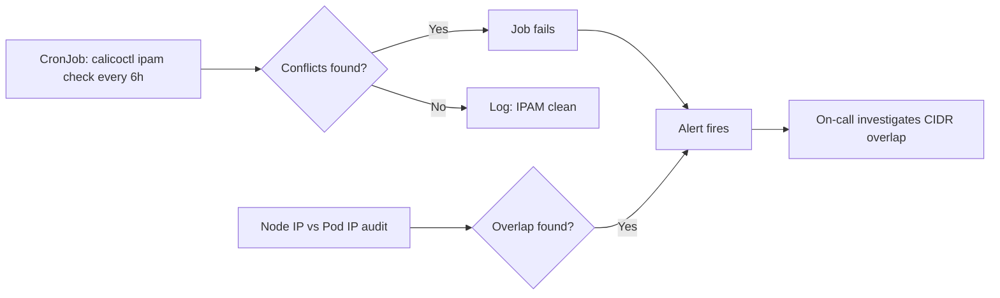

# How to Monitor Calico Pod CIDR Conflicts

Author: [nawazdhandala](https://github.com/nawazdhandala)

Tags: Calico, Kubernetes, Networking, Troubleshooting

Description: Monitor for Calico pod CIDR conflicts using regular IPAM checks, pod IP allocation audits, and routing table anomaly detection.

---

## Introduction

Monitoring for CIDR conflicts in Calico involves periodic IPAM audits and routing anomaly detection. While conflicts are typically created at provisioning time, they can also emerge when the node network changes (e.g., cluster expansion into a new subnet) or when a second IP pool is added that overlaps with existing infrastructure.

The most direct monitoring approach is a scheduled `calicoctl ipam check` CronJob that runs regularly and alerts on any reported conflicts or unreachable addresses.

## Symptoms

- Pod connectivity anomalies affecting specific IP address ranges
- New nodes joining a subnet that overlaps with the pod CIDR

## Root Causes

- No scheduled IPAM audit to detect conflicts early
- Node CIDR expands into pod CIDR range during cluster scaling

## Diagnosis Steps

```bash
calicoctl ipam check
calicoctl ipam show --show-blocks
```

## Solution

**Step 1: Schedule regular IPAM checks**

```yaml
apiVersion: batch/v1
kind: CronJob
metadata:
  name: calico-ipam-audit
  namespace: kube-system
spec:
  schedule: "0 */6 * * *"
  jobTemplate:
    spec:
      template:
        spec:
          serviceAccountName: calico-node
          containers:
          - name: checker
            image: calico/ctl:v3.27.0
            command:
            - /bin/sh
            - -c
            - |
              calicoctl ipam check 2>&1
              if calicoctl ipam check 2>&1 | grep -i "conflict\|overlap\|error"; then
                echo "ALERT: IPAM conflict detected"
                exit 1
              fi
              echo "IPAM check: no conflicts found"
          restartPolicy: Never
```

**Step 2: Alert on pod IP duplication**

```bash
# Check for pod IPs that match node IPs (sign of CIDR conflict)
NODE_IPS=$(kubectl get nodes \
  -o jsonpath='{range .items[*]}{.status.addresses[?(@.type=="InternalIP")].address}{" "}{end}')
POD_IPS=$(kubectl get pods --all-namespaces \
  -o jsonpath='{range .items[*]}{.status.podIP}{" "}{end}')

for IP in $NODE_IPS; do
  if echo "$POD_IPS" | grep -qw "$IP"; then
    echo "CONFLICT: Pod has same IP as node: $IP"
  fi
done
```

**Step 3: Monitor routing table for anomalies**

```bash
# Watch for routes that should not exist (node IPs via pod tunnel)
ip route show | grep tunl0 | while read ROUTE; do
  echo "Tunnel route: $ROUTE"
  # Flag if this matches a known node IP
done
```



## Prevention

- Run IPAM checks as part of cluster health reporting
- Alert on IPAM CronJob failures
- Audit node IPs when adding new nodes to confirm they do not overlap with pod CIDR

## Conclusion

Monitoring Calico CIDR conflicts requires scheduled IPAM audits and cross-checking pod IPs against node IPs. A CronJob running `calicoctl ipam check` every 6 hours provides early detection of emerging conflicts before they cause production traffic issues.
