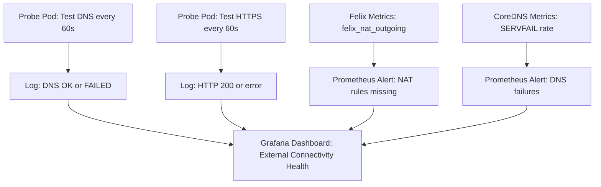

# How to Monitor Calico Pods for External Service Connectivity

Author: [nawazdhandala](https://github.com/nawazdhandala)

Tags: Calico, Kubernetes, Monitoring, External Services, Networking, Prometheus

Description: Set up monitoring to detect when Calico pods lose external service connectivity using synthetic probes, DNS monitoring, and NAT rule health checks.

---

## Introduction

External service connectivity failures are often discovered by users rather than by monitoring systems. Proactive monitoring requires synthetic connectivity checks that run from within pods, DNS resolution monitoring, and NAT rule health verification. This monitoring catches external connectivity issues before they impact application functionality.

## Prerequisites

- Prometheus and Grafana deployed in the cluster
- `kubectl` access to create monitoring resources
- OneUptime account for external probe monitoring (optional)

## Step 1: Deploy a Connectivity Probe Pod

Create a monitoring pod that continuously tests external connectivity.

```yaml
# external-connectivity-probe.yaml
# A monitoring pod that probes external connectivity every 60 seconds
apiVersion: apps/v1
kind: Deployment
metadata:
  name: external-connectivity-probe
  namespace: monitoring
spec:
  replicas: 1
  selector:
    matchLabels:
      app: external-connectivity-probe
  template:
    metadata:
      labels:
        app: external-connectivity-probe
    spec:
      containers:
        - name: probe
          image: nicolaka/netshoot
          command:
            - /bin/bash
            - -c
            - |
              while true; do
                # Test DNS
                if nslookup google.com > /dev/null 2>&1; then
                  echo "$(date): DNS OK"
                else
                  echo "$(date): DNS FAILED"
                fi

                # Test HTTPS
                HTTP_CODE=$(curl -s -o /dev/null -w "%{http_code}" \
                  --connect-timeout 10 https://google.com 2>/dev/null || echo "000")
                echo "$(date): External HTTPS: HTTP ${HTTP_CODE}"

                sleep 60
              done
          resources:
            requests:
              cpu: "10m"
              memory: "32Mi"
```

```bash
# Apply the probe deployment
kubectl apply -f external-connectivity-probe.yaml

# Monitor the probe logs
kubectl logs -n monitoring -l app=external-connectivity-probe -f
```

## Step 2: Create Prometheus Alerts for Connectivity Loss

```yaml
# external-connectivity-alerts.yaml
apiVersion: monitoring.coreos.com/v1
kind: PrometheusRule
metadata:
  name: calico-external-connectivity
  namespace: monitoring
spec:
  groups:
    - name: calico.external.connectivity
      rules:
        # Alert when NAT masquerade rules are missing
        - alert: CalicoNATMasqueradeRulesMissing
          expr: |
            felix_nat_outgoing_active == 0
          for: 5m
          labels:
            severity: critical
          annotations:
            summary: "Calico NAT outgoing rules missing on {{ $labels.instance }}"
            description: "Pods on this node cannot reach external services. NAT masquerade rules are not programmed."

        # Alert when DNS queries from pods are failing
        - alert: PodDNSResolutionHigh
          expr: |
            rate(coredns_dns_requests_total{type="A",rcode="SERVFAIL"}[5m]) > 0.1
          for: 5m
          labels:
            severity: warning
          annotations:
            summary: "High DNS SERVFAIL rate - external hostnames may not resolve"
```

```bash
# Apply alerts
kubectl apply -f external-connectivity-alerts.yaml
```

## Step 3: Monitor NAT Rules Health

```bash
# Check felix_nat_outgoing_active metric on all nodes
kubectl exec -n calico-system \
  $(kubectl get pods -n calico-system -l k8s-app=calico-node -o name | head -1) -- \
  wget -qO- http://localhost:9091/metrics 2>/dev/null | \
  grep "felix_nat_outgoing"

# Create a CronJob to validate NAT rules on all nodes
cat <<'EOF' | kubectl apply -f -
apiVersion: batch/v1
kind: CronJob
metadata:
  name: nat-rule-validator
  namespace: calico-system
spec:
  schedule: "*/10 * * * *"
  jobTemplate:
    spec:
      template:
        spec:
          hostNetwork: true
          serviceAccountName: calico-node
          containers:
          - name: validator
            image: calico/node:v3.27.0
            securityContext:
              privileged: true
            command: ["/bin/bash", "-c"]
            args:
            - |
              MASQ_COUNT=$(iptables -t nat -L POSTROUTING -n 2>/dev/null | grep -c "MASQUERADE\|cali-nat")
              if [ "${MASQ_COUNT}" -lt 1 ]; then
                echo "ALERT: No NAT masquerade rules found"
                exit 1
              fi
              echo "OK: ${MASQ_COUNT} NAT rules present"
          restartPolicy: Never
          tolerations:
          - operator: Exists
EOF
```

## Step 4: Set Up End-to-End External Connectivity Dashboard



## Step 5: OneUptime Integration for External Probing

Use OneUptime to probe external connectivity from synthetic monitors that simulate pod traffic.

```bash
# Create a OneUptime monitor that checks if your cluster's external IP
# can reach specific external APIs
# Configure in OneUptime dashboard:
# - Monitor type: HTTP
# - URL: https://api.your-external-service.com/health
# - Check interval: 60 seconds
# - Alert: Notify when unreachable for 3 consecutive checks
```

## Best Practices

- Run connectivity probe pods in every namespace where external connectivity is critical
- Alert on NAT rule absence as a leading indicator before applications start failing
- Monitor CoreDNS SERVFAIL rates as an early warning for DNS-related external access failures
- Include external connectivity tests in post-deployment smoke tests for all new services

## Conclusion

Monitoring external service connectivity from Calico pods requires synthetic probe pods, Felix NAT metrics, and CoreDNS failure rate monitoring. The combination of proactive probes and reactive alerts ensures external connectivity issues are detected within minutes rather than discovered by end users.
