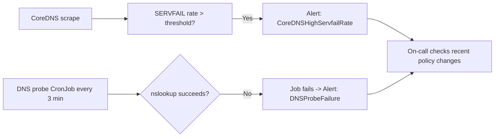

# How to Monitor Calico Policy Blocking DNS

Author: [nawazdhandala](https://github.com/nawazdhandala)

Tags: Calico, Kubernetes, Networking, Troubleshooting

Description: Monitor for Calico policy DNS blocking using CoreDNS error rate metrics, per-namespace DNS probe CronJobs, and SERVFAIL rate alerts.

---

## Introduction

Monitoring for DNS blocking by Calico policies requires detecting DNS failures quickly and identifying which namespace is affected. CoreDNS Prometheus metrics provide cluster-wide visibility, while per-namespace DNS probe CronJobs pinpoint the specific namespace where policies are blocking DNS.

## Symptoms

- CoreDNS SERVFAIL rate increases after a policy change
- Specific namespace's DNS probe failing

## Root Causes

- Policy deployed without DNS monitoring
- No per-namespace DNS health checks

## Diagnosis Steps

```bash
kubectl exec -n kube-system \
  $(kubectl get pods -n kube-system -l k8s-app=kube-dns -o name | head -1) \
  -- wget -qO- http://localhost:9153/metrics | grep coredns_dns
```

## Solution

**Alert on CoreDNS SERVFAIL rate**

```yaml
apiVersion: monitoring.coreos.com/v1
kind: PrometheusRule
metadata:
  name: dns-policy-blocking-alerts
  namespace: monitoring
spec:
  groups:
  - name: dns.policy
    rules:
    - alert: CoreDNSHighServfailRate
      expr: |
        rate(coredns_dns_responses_total{rcode="SERVFAIL"}[5m]) > 0.5
      for: 2m
      labels:
        severity: warning
      annotations:
        summary: "CoreDNS SERVFAIL rate elevated - possible policy blocking DNS"
    - alert: DNSProbeFailure
      expr: |
        kube_job_status_failed{job_name=~"dns-probe.*"} > 0
      for: 5m
      labels:
        severity: critical
      annotations:
        summary: "DNS probe failing in namespace {{ $labels.namespace }}"
```

**Per-namespace DNS probe**

```yaml
apiVersion: batch/v1
kind: CronJob
metadata:
  name: dns-probe
  namespace: production
spec:
  schedule: "*/3 * * * *"
  jobTemplate:
    spec:
      template:
        spec:
          containers:
          - name: probe
            image: busybox
            command: ["/bin/sh", "-c"]
            args:
            - |
              nslookup kubernetes.default.svc.cluster.local || exit 1
              echo "DNS OK"
          restartPolicy: Never
```



## Prevention

- Deploy DNS probes in all namespaces with policies
- Monitor CoreDNS SERVFAIL rate at all times
- Alert within 5 minutes of DNS failure onset

## Conclusion

Monitoring for DNS blocking by Calico policies uses two signals: CoreDNS SERVFAIL rate (cluster-wide indicator) and per-namespace DNS probe CronJobs (precise localization). Together they provide detection within minutes of a policy change that blocks DNS.
