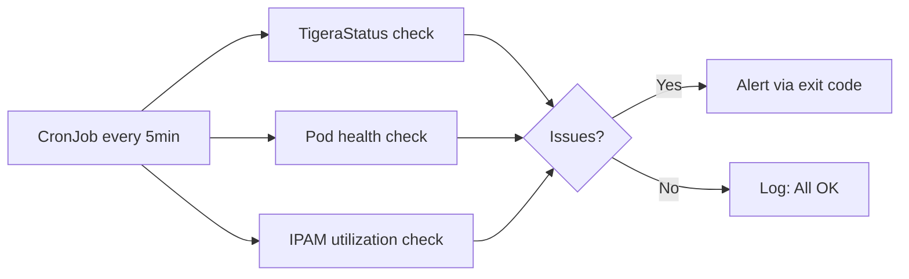

# How to Monitor Calico Using Standard Troubleshooting Commands

Author: [nawazdhandala](https://github.com/nawazdhandala)

Tags: Calico, Kubernetes, Networking, Troubleshooting, Monitoring

Description: Build a continuous monitoring approach using Calico troubleshooting commands as health checks, running them periodically to detect BGP peer failures, IPAM exhaustion, and policy count anomalies...

---

## Introduction

Calico troubleshooting commands are not just for incident response - they can be run as scheduled health checks to detect issues before applications are affected. `calicoctl node status` (BGP peer health), `calicoctl ipam show` (IPAM exhaustion), and `kubectl get tigerastatus` (operator health) together cover the three most common Calico failure modes. Running these on a schedule turns diagnostic commands into a monitoring system.

## Scheduled Calico Health Monitor

```bash
#!/bin/bash
# calico-health-monitor.sh
FAILURES=0

echo "=== Calico Health Check $(date) ==="

# 1. TigeraStatus
NOT_AVAILABLE=$(kubectl get tigerastatus --no-headers 2>/dev/null | \
  grep -v "Available" | wc -l)
if [ "${NOT_AVAILABLE}" -gt 0 ]; then
  echo "WARN: ${NOT_AVAILABLE} TigeraStatus components not Available"
  kubectl get tigerastatus | grep -v "Available"
  FAILURES=$((FAILURES + 1))
else
  echo "OK: All TigeraStatus components Available"
fi

# 2. calico-system pod health
NOT_RUNNING=$(kubectl get pods -n calico-system --no-headers | \
  grep -v Running | wc -l)
if [ "${NOT_RUNNING}" -gt 0 ]; then
  echo "WARN: ${NOT_RUNNING} calico-system pods not Running"
  FAILURES=$((FAILURES + 1))
else
  echo "OK: All calico-system pods Running"
fi

# 3. IPAM utilization
IPAM_OUT=$(calicoctl ipam show 2>/dev/null)
USED=$(echo "${IPAM_OUT}" | grep "IPs in use" | awk '{print $NF}' | tr -d '%')
if [ -n "${USED}" ] && [ "${USED}" -gt 85 ]; then
  echo "WARN: IPAM utilization at ${USED}%"
  FAILURES=$((FAILURES + 1))
else
  echo "OK: IPAM utilization at ${USED}%"
fi

echo ""
echo "Health check: ${FAILURES} issues found"
exit ${FAILURES}
```

## CronJob to Run Health Monitor

```yaml
apiVersion: batch/v1
kind: CronJob
metadata:
  name: calico-health-monitor
  namespace: calico-system
spec:
  schedule: "*/5 * * * *"  # Every 5 minutes
  jobTemplate:
    spec:
      template:
        spec:
          serviceAccountName: calico-diagnostics
          containers:
            - name: health-check
              image: bitnami/kubectl:latest
              command: ["/scripts/calico-health-monitor.sh"]
          restartPolicy: OnFailure
```

## Monitoring Coverage



## Alert Integration

```bash
# Wrap the health monitor with an alerting action on failure
./calico-health-monitor.sh
if [ $? -ne 0 ]; then
  # Send alert via your preferred channel
  curl -X POST "${SLACK_WEBHOOK}" \
    -H 'Content-type: application/json' \
    --data "{\"text\":\"Calico health check FAILED on cluster ${CLUSTER_NAME}\"}"
fi
```

## Conclusion

Converting Calico troubleshooting commands into scheduled health checks provides continuous visibility without requiring a separate monitoring system. The three-check pattern (TigeraStatus, pod health, IPAM utilization) covers the most common pre-failure signals. Run these every 5 minutes via CronJob and integrate the exit code into your alerting pipeline. When an alert fires, the diagnostic bundle script provides the full context needed for immediate triage.
