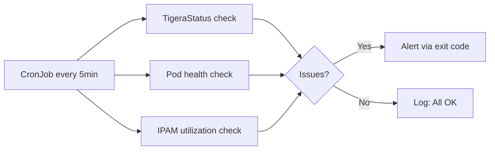

# How to Monitor Calico Using Standard Troubleshooting Commands

Author: [nawazdhandala](https://github.com/nawazdhandala)

Tags: Calico, Kubernetes, Networking, Troubleshooting, Monitoring

Description: Build a continuous monitoring approach using Calico troubleshooting commands as health checks, running them periodically to detect BGP peer failures, IPAM exhaustion, and policy count anomalies...

---

## Introduction

Calico troubleshooting commands are not just for incident response - they can be run as scheduled health checks to detect issues before applications are affected. `kubectl get tigerastatus` (operator health), `kubectl get pods -n calico-system` (pod health), and `calicoctl ipam show` (IPAM exhaustion) together cover three common Calico failure modes. Running these on a schedule turns diagnostic commands into a monitoring system.

## Scheduled Calico Health Monitor

```bash
#!/bin/bash
# calico-health-monitor.sh

FAILURES=0

echo "=== Calico Health Check $(date) ==="

# 1. TigeraStatus
if ! TIGERA_OUT=$(kubectl get tigerastatus --no-headers 2>/dev/null); then
  echo "WARN: unable to read TigeraStatus resources"
  FAILURES=$((FAILURES + 1))
else
  NOT_AVAILABLE=$(echo "${TIGERA_OUT}" | awk '$2 != "True" || $4 != "False" {count++} END {print count+0}')
  if [ "${NOT_AVAILABLE}" -gt 0 ]; then
    echo "WARN: ${NOT_AVAILABLE} TigeraStatus components not Available or Degraded"
    kubectl get tigerastatus
    FAILURES=$((FAILURES + 1))
  else
    echo "OK: All TigeraStatus components Available"
  fi
fi

# 2. calico-system pod health
if ! POD_OUT=$(kubectl get pods -n calico-system --no-headers 2>/dev/null); then
  echo "WARN: unable to read calico-system pods"
  FAILURES=$((FAILURES + 1))
else
  NOT_RUNNING=$(echo "${POD_OUT}" | awk '$3 != "Running" || $2 !~ /^[0-9]+\/[0-9]+$/ {count++; next} {split($2, ready, "/"); if (ready[1] != ready[2]) count++} END {print count+0}')
  if [ "${NOT_RUNNING}" -gt 0 ]; then
    echo "WARN: ${NOT_RUNNING} calico-system pods not Running and Ready"
    kubectl get pods -n calico-system
    FAILURES=$((FAILURES + 1))
  else
    echo "OK: All calico-system pods Running and Ready"
  fi
fi

# 3. IPAM utilization
if ! IPAM_OUT=$(calicoctl ipam show 2>/dev/null); then
  echo "WARN: unable to read Calico IPAM utilization"
  FAILURES=$((FAILURES + 1))
else
  USED=$(echo "${IPAM_OUT}" | awk -F'|' '/IP Pool/ { pct=$5; sub(/.*\(/, "", pct); sub(/%.*/, "", pct); if (pct ~ /^[0-9]+$/ && pct+0 > max) max=pct+0 } END { print max+0 }')
  if [ "${USED}" -gt 85 ]; then
    echo "WARN: IPAM utilization at ${USED}%"
    FAILURES=$((FAILURES + 1))
  else
    echo "OK: IPAM utilization at ${USED}%"
  fi
fi

echo ""
echo "Health check: ${FAILURES} issues found"
exit ${FAILURES}
```

## CronJob to Run Health Monitor

```yaml
apiVersion: batch/v1
kind: CronJob
metadata:
  name: calico-health-monitor
  namespace: calico-system
spec:
  schedule: "*/5 * * * *"  # Every 5 minutes
  jobTemplate:
    spec:
      template:
        spec:
          serviceAccountName: calico-diagnostics
          containers:
            - name: health-check
              # Use a custom image that contains kubectl and a calicoctl version
              # matching your Calico cluster version.
              image: your-registry/calico-health-monitor:latest
              command: ["/scripts/calico-health-monitor.sh"]
              volumeMounts:
                - name: scripts
                  mountPath: /scripts
                  readOnly: true
          volumes:
            - name: scripts
              configMap:
                name: calico-health-monitor
                defaultMode: 0755
          restartPolicy: OnFailure
```

## Monitoring Coverage


```mermaid
flowchart LR
    A[CronJob every 5min] --> B[TigeraStatus check]
    A --> C[Pod health check]
    A --> D[IPAM utilization check]
    B --> E{Issues?}
    C --> E
    D --> E
    E -->|Yes| F[Alert via exit code]
    E -->|No| G[Log: All OK]
```

## Alert Integration

```bash
# Wrap the health monitor with an alerting action on failure
./calico-health-monitor.sh
if [ $? -ne 0 ]; then
  # Send alert via your preferred channel
  curl -X POST "${SLACK_WEBHOOK}" \
    -H 'Content-type: application/json' \
    --data "{\"text\":\"Calico health check FAILED on cluster ${CLUSTER_NAME}\"}"
fi
```

## Conclusion

Converting Calico troubleshooting commands into scheduled health checks provides continuous visibility without requiring a separate monitoring system. The three-check pattern (TigeraStatus, pod health, IPAM utilization) covers the most common pre-failure signals. Run these every 5 minutes via CronJob and integrate the exit code into your alerting pipeline. When an alert fires, the command output provides the context needed for immediate triage.
