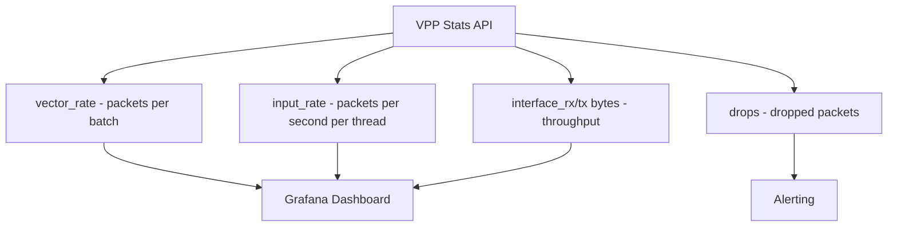

# Monitor Calico VPP Host Networking

Author: [nawazdhandala](https://github.com/nawazdhandala)

Tags: Calico, Kubernetes, Networking, VPP, DPDK, Monitoring, Performance

Description: Set up monitoring for Calico VPP host networking using VPP metrics, Prometheus integration, and performance dashboards to maintain visibility into VPP dataplane health.

---

## Introduction

Monitoring Calico VPP requires tracking metrics that are unique to the VPP dataplane - vector size statistics, DPDK interface counters, hugepage utilization, and VPP worker thread health. These metrics are not available through standard Linux networking tools or the Felix metrics that apply to the kernel dataplane.

VPP exposes a rich set of performance counters through its native metrics API, which can be integrated with Prometheus via the VPP stats exporter. Combined with Calico's own agent metrics, this provides comprehensive observability into the VPP dataplane health.

## Prerequisites

- Calico VPP deployed and operational
- Prometheus and Grafana deployed in the cluster
- VPP stats exporter configured (or Prometheus native VPP exporter)

## Step 1: Enable VPP Prometheus Metrics

Deploy the VPP Prometheus exporter:

```yaml
apiVersion: apps/v1
kind: DaemonSet
metadata:
  name: vpp-exporter
  namespace: calico-vpp-dataplane
spec:
  selector:
    matchLabels:
      app: vpp-exporter
  template:
    metadata:
      labels:
        app: vpp-exporter
    spec:
      containers:
        - name: vpp-exporter
          image: calicovpp/vpp-prometheus-exporter:latest
          ports:
            - containerPort: 9099
          volumeMounts:
            - name: vpp-stats
              mountPath: /run/vpp
      volumes:
        - name: vpp-stats
          hostPath:
            path: /run/vpp
```

## Step 2: Key VPP Metrics



| Metric | Description | Alert Threshold |
|--------|-------------|----------------|
| `vpp_vector_rate` | Average packets per processing vector | < 1 (VPP idle) or > 256 (saturation) |
| `vpp_dpdk_rx_missed_errors` | Packets dropped at NIC level | > 0 |
| `vpp_punt_rx` | Packets punted to slow path | High rate |
| `vpp_worker_wait` | Worker thread idle time | Consistently 100% (underutilized) |

## Step 3: VPP Interface Counters

```bash
# Check interface counters via VPP CLI
kubectl exec -n calico-vpp-dataplane ds/calico-vpp-node -c vpp -- \
  vppctl show interface counters

# Reset counters for a clean measurement
kubectl exec -n calico-vpp-dataplane ds/calico-vpp-node -c vpp -- \
  vppctl clear interfaces
```

## Step 4: Prometheus Alerts for VPP

```yaml
groups:
  - name: calico-vpp
    rules:
      - alert: VPPInterfaceDown
        expr: vpp_if_combined_drop_packets{interface="GigabitEthernet0/0/0"} > 1000
        for: 1m
        labels:
          severity: critical
        annotations:
          summary: "VPP uplink interface dropping packets on {{ $labels.node }}"

      - alert: VPPHugepageExhausted
        expr: vpp_memory_free_bytes < 104857600  # 100MB
        for: 5m
        labels:
          severity: warning
        annotations:
          summary: "VPP hugepage memory low on {{ $labels.node }}"

      - alert: VPPWorkerSaturation
        expr: vpp_vector_rate > 200
        for: 10m
        labels:
          severity: warning
        annotations:
          summary: "VPP worker threads saturated on {{ $labels.node }}"
```

## Step 5: Grafana Dashboard

Key panels for a VPP health dashboard:

```plaintext
# Throughput panel
rate(vpp_if_combined_bytes[5m])

# Packet rate per second
rate(vpp_if_combined_packets[5m])

# Drop rate
rate(vpp_if_combined_drop_packets[5m])

# Vector rate (health indicator)
vpp_vector_rate
```

## Step 6: Correlate with Host Network Metrics

Compare VPP throughput with host NIC counters to detect DPDK driver issues:

```bash
# On the node, check NIC RX/TX counters
ethtool -S eth0 | grep -E "rx_packets|tx_packets|rx_bytes|tx_bytes"
```

## Conclusion

Monitoring Calico VPP requires VPP-native metrics that expose performance counters not available through standard Linux networking tools. By deploying the VPP Prometheus exporter, tracking vector rates, drop counters, and hugepage utilization, you can maintain visibility into VPP dataplane health and detect performance degradation before it impacts application traffic. Correlate VPP metrics with host NIC statistics to catch hardware-level issues that VPP's software metrics won't directly reveal.
