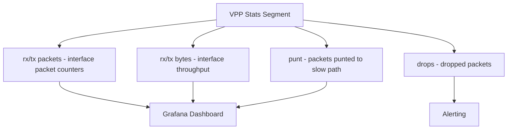

# Monitor Calico VPP Host Networking

Author: [nawazdhandala](https://github.com/nawazdhandala)

Tags: Calico, Kubernetes, Networking, VPP, DPDK, Monitoring, Performance

Description: Set up monitoring for Calico VPP host networking using VPP metrics, Prometheus integration, and performance dashboards to maintain visibility into VPP dataplane health.

---

## Introduction

Monitoring Calico VPP requires tracking metrics that are unique to the VPP dataplane - VPP interface counters, punt counters, buffer allocation failures, and TCP/session dataplane statistics. These metrics are not available through standard Linux networking tools or the Felix metrics that apply to the kernel dataplane.

VPP exposes a rich set of performance counters through its native stats segment. Calico VPP can expose selected VPP statistics directly from `calico-vpp-agent` in Prometheus format. Combined with Calico's own agent metrics, this provides comprehensive observability into the VPP dataplane health.

## Prerequisites

- Calico VPP deployed and operational
- Prometheus and Grafana deployed in the cluster
- Calico VPP Prometheus feature gate enabled

## Step 1: Enable VPP Prometheus Metrics

Enable the built-in Calico VPP Prometheus endpoint. The agent listens on `:8888` by default and serves metrics at `/metrics` when the Prometheus feature gate is enabled:

```bash
kubectl patch configmap calico-vpp-config \
  -n calico-vpp-dataplane \
  --type merge \
  -p '{"data":{"CALICOVPP_FEATURE_GATES":"{\"prometheusEnabled\":true}"}}'

kubectl rollout restart daemonset/calico-vpp-node \
  -n calico-vpp-dataplane
```

Configure Prometheus to scrape each node IP on port `8888`, or expose the host-networked `calico-vpp-node` pods through your existing Kubernetes monitoring setup.

## Step 2: Key VPP Metrics


```mermaid
graph TD
    A[VPP Stats Segment] --> B[rx/tx packets - interface packet counters]
    A --> C[rx/tx bytes - interface throughput]
    A --> D[drops - dropped packets]
    A --> E[punt - packets punted to slow path]
    B --> F[Grafana Dashboard]
    C --> F
    D --> G[Alerting]
    E --> F
```

| Metric | Description | Alert Threshold |
|--------|-------------|----------------|
| `cni_projectcalico_vpp_rx_packets` / `cni_projectcalico_vpp_tx_packets` | Per-worker interface packet counters | Unexpected traffic drop or imbalance |
| `cni_projectcalico_vpp_rx_bytes` / `cni_projectcalico_vpp_tx_bytes` | Per-worker interface byte counters | Unexpected throughput drop |
| `cni_projectcalico_vpp_drops` | Packets dropped on a VPP interface | Sustained rate > 0 |
| `cni_projectcalico_vpp_punt` | Packets punted to slow path | High sustained rate |
| `cni_projectcalico_vpp_rx_miss` / `cni_projectcalico_vpp_rx_no_buf` | Receive drops from missing buffers or allocation failures | Sustained rate > 0 |

## Step 3: VPP Interface Counters

```bash
# Check interface counters via VPP CLI

kubectl exec -n calico-vpp-dataplane ds/calico-vpp-node -c vpp -- \
  vppctl show interface counters

# Reset counters for a clean measurement
kubectl exec -n calico-vpp-dataplane ds/calico-vpp-node -c vpp -- \
  vppctl clear interfaces
```

## Step 4: Prometheus Alerts for VPP

```yaml
groups:
  - name: calico-vpp
    rules:
      - alert: VPPInterfaceDrops
        expr: rate(cni_projectcalico_vpp_drops{vppInterfaceName="GigabitEthernet0/0/0"}[5m]) > 100
        for: 1m
        labels:
          severity: critical
        annotations:
          summary: "VPP uplink interface {{ $labels.vppInterfaceName }} is dropping packets"

      - alert: VPPReceiveBufferPressure
        expr: rate(cni_projectcalico_vpp_rx_no_buf[5m]) > 0 or rate(cni_projectcalico_vpp_rx_miss[5m]) > 0
        for: 5m
        labels:
          severity: warning
        annotations:
          summary: "VPP receive buffer pressure on {{ $labels.vppInterfaceName }}"

      - alert: VPPHighPuntRate
        expr: rate(cni_projectcalico_vpp_punt[5m]) > 100
        for: 10m
        labels:
          severity: warning
        annotations:
          summary: "VPP interface {{ $labels.vppInterfaceName }} has a high punt rate"
```

## Step 5: Grafana Dashboard

Key panels for a VPP health dashboard:

```plaintext
# Throughput panel
sum(rate(cni_projectcalico_vpp_rx_bytes[5m])) + sum(rate(cni_projectcalico_vpp_tx_bytes[5m]))

# Packet rate per second
sum(rate(cni_projectcalico_vpp_rx_packets[5m])) + sum(rate(cni_projectcalico_vpp_tx_packets[5m]))

# Drop rate
rate(cni_projectcalico_vpp_drops[5m])

# Punt rate
rate(cni_projectcalico_vpp_punt[5m])
```

## Step 6: Correlate with Host Network Metrics

Compare VPP throughput with host NIC counters to detect driver issues. This works for kernel-visible interfaces such as AF_PACKET and AF_XDP uplinks; DPDK-bound interfaces may no longer appear as standard Linux network devices:

```bash
# On the node, check NIC RX/TX counters
ethtool -S eth0 | grep -E "rx_packets|tx_packets|rx_bytes|tx_bytes"
```

## Conclusion

Monitoring Calico VPP requires VPP-native metrics that expose performance counters not available through standard Linux networking tools. By enabling the built-in Calico VPP Prometheus endpoint and tracking interface counters, drop counters, punt counters, and receive buffer pressure, you can maintain visibility into VPP dataplane health and detect performance degradation before it impacts application traffic. Correlate VPP metrics with host NIC statistics where the uplink remains visible to Linux to catch hardware-level issues that VPP's software metrics won't directly reveal.
