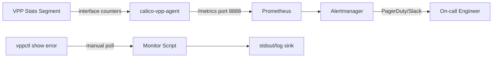

# How to Monitor Calico VPP for Troubleshooting Signals

Author: [nawazdhandala](https://github.com/nawazdhandala)

Tags: Calico, VPP, Kubernetes, Networking, Troubleshooting, Monitoring

Description: Monitor Calico VPP error counters, interface statistics, and process health using Prometheus metrics and VPP's built-in stats socket to detect issues before they affect application traffic.

---

## Introduction

VPP exposes runtime statistics through two channels: a stats segment (high-frequency interface counters) and the `vppctl show error` command (per-node-graph drop counters). Monitoring these signals surfaces packet drops, interface errors, and DPDK driver failures before they escalate to visible application issues. The Calico VPP agent can also expose a Prometheus metrics endpoint for VPP interface, TCP, and session statistics.

## VPP Prometheus Metrics (calico-vpp-agent)

```bash
# Enable CALICOVPP_FEATURE_GATES prometheusEnabled first.
# calico-vpp-agent exposes metrics on port 8888 by default when enabled.

kubectl get pod -n calico-vpp-dataplane -l k8s-app=calico-vpp-node \
  -o jsonpath='{.items[0].metadata.name}' | xargs -I{} \
  kubectl exec -n calico-vpp-dataplane {} -c agent -- \
  wget -qO- http://localhost:8888/metrics | grep -E "^(cni_projectcalico_vpp_|go_)"
```

## ServiceMonitor for VPP Agent Metrics

```yaml
apiVersion: v1
kind: Service
metadata:
  name: calico-vpp-agent-metrics
  namespace: calico-vpp-dataplane
  labels:
    k8s-app: calico-vpp-node
spec:
  selector:
    k8s-app: calico-vpp-node
  ports:
    - name: metrics
      port: 8888
      targetPort: 8888
---
apiVersion: monitoring.coreos.com/v1
kind: ServiceMonitor
metadata:
  name: calico-vpp-agent
  namespace: calico-vpp-dataplane
spec:
  selector:
    matchLabels:
      k8s-app: calico-vpp-node
  endpoints:
    - port: metrics
      path: /metrics
      interval: 30s
```

## Continuous VPP Error Counter Monitor

```bash
#!/bin/bash
# monitor-vpp-errors.sh - Poll VPP error counters across all nodes
VPP_NAMESPACE="${VPP_NAMESPACE:-calico-vpp-dataplane}"

while true; do
  echo "=== VPP Error Counters $(date) ==="
  for pod in $(kubectl get pods -n "${VPP_NAMESPACE}" \
    -l k8s-app=calico-vpp-node -o jsonpath='{.items[*].metadata.name}'); do

    NODE=$(kubectl get pod -n "${VPP_NAMESPACE}" "${pod}" \
      -o jsonpath='{.spec.nodeName}')
    ERRORS=$(kubectl exec -n "${VPP_NAMESPACE}" "${pod}" -c vpp -- \
      vppctl show error 2>/dev/null | awk '$1 ~ /^[0-9]+$/ && $1 > 0 {count++} END {print count+0}')

    if [ "${ERRORS}" -gt 0 ]; then
      echo "NODE ${NODE}: ${ERRORS} non-zero error counters"
      kubectl exec -n "${VPP_NAMESPACE}" "${pod}" -c vpp -- \
        vppctl show error | awk '$1 !~ /^[0-9]+$/ || $1 > 0'
    else
      echo "NODE ${NODE}: OK"
    fi
  done
  sleep 30
done
```

## Monitoring Architecture



## Alert Rules for VPP Health

```yaml
apiVersion: monitoring.coreos.com/v1
kind: PrometheusRule
metadata:
  name: calico-vpp-alerts
  namespace: calico-vpp-dataplane
spec:
  groups:
    - name: calico.vpp
      rules:
        - alert: CalicoVPPAgentMetricsDown
          expr: up{namespace="calico-vpp-dataplane",pod=~"calico-vpp-node-.*"} == 0
          for: 2m
          annotations:
            summary: "calico-vpp-agent metrics endpoint is unreachable"
        - alert: CalicoVPPPodNotRunning
          expr: kube_pod_status_phase{namespace="calico-vpp-dataplane",pod=~"calico-vpp-node-.*",phase!="Running"} > 0
          for: 5m
          annotations:
            summary: "VPP pod {{ $labels.pod }} is not running"
```

## Conclusion

Monitoring Calico VPP requires polling VPP error counters (which track per-node-graph packet drops) and scraping the calico-vpp-agent Prometheus endpoint when it is enabled. The error counter monitor script is the fastest way to detect active forwarding issues across all VPP nodes. Combine it with Prometheus alerts on agent metrics availability and pod health to catch VPP issues in the first few minutes rather than waiting for application teams to report connectivity failures.
