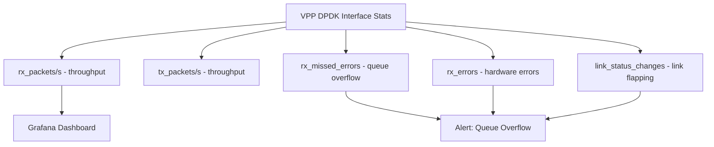

# Monitor Calico VPP Uplink Configuration

Author: [nawazdhandala](https://github.com/nawazdhandala)

Tags: Calico, Kubernetes, Networking, VPP, DPDK, Uplink, Monitoring

Description: Set up monitoring for Calico VPP uplink interfaces to track NIC health, DPDK driver stability, queue depth utilization, and uplink throughput metrics.

---

## Introduction

Monitoring the Calico VPP uplink provides visibility into the physical network connection that underpins all pod networking. Unlike standard Kubernetes node network monitoring, VPP uplink monitoring requires accessing DPDK-level NIC statistics that are only available through VPP's own metrics system. Physical NIC errors, RX queue overflows, and DPDK driver resets are all conditions that must be detected early to prevent silent packet loss.

## Prerequisites

- Calico VPP with uplink configured and operational
- Prometheus and Grafana deployed
- VPP Prometheus exporter deployed

## Step 1: Configure VPP Interface Metrics Scraping

```yaml
# ServiceMonitor for VPP exporter
apiVersion: monitoring.coreos.com/v1
kind: ServiceMonitor
metadata:
  name: vpp-uplink-metrics
  namespace: monitoring
spec:
  selector:
    matchLabels:
      app: vpp-exporter
  endpoints:
    - port: metrics
      interval: 15s
      path: /metrics
```

## Step 2: Key Uplink Metrics



| Metric | Description | Alert |
|--------|-------------|-------|
| `vpp_interface_rx_packets` | Uplink RX packet rate | N/A (informational) |
| `vpp_interface_rx_bytes` | Uplink throughput | Alert when approaching NIC max |
| `vpp_dpdk_rx_missed_errors` | RX ring overflow | > 0 |
| `vpp_dpdk_rx_errors` | Hardware NIC errors | > 0 |
| `vpp_dpdk_link_status_changes` | NIC link flaps | > 1 in 5m |

## Step 3: Prometheus Alerts

```yaml
groups:
  - name: calico-vpp-uplink
    rules:
      - alert: VPPUplinkRxOverflow
        expr: rate(vpp_dpdk_rx_missed_errors[5m]) > 0
        for: 1m
        labels:
          severity: critical
        annotations:
          summary: "VPP uplink RX queue overflow on {{ $labels.node }}"
          description: "Increase num-rx-desc or add worker threads"

      - alert: VPPUplinkNearCapacity
        expr: |
          rate(vpp_interface_rx_bytes{interface="GigabitEthernet0/0/0"}[5m]) * 8 /
          vpp_interface_max_bandwidth > 0.8
        for: 5m
        labels:
          severity: warning
        annotations:
          summary: "VPP uplink is at {{ $value | humanizePercentage }} capacity"

      - alert: VPPUplinkLinkFlapping
        expr: increase(vpp_dpdk_link_status_changes[5m]) > 1
        for: 1m
        labels:
          severity: critical
        annotations:
          summary: "VPP uplink NIC link is flapping on {{ $labels.node }}"
```

## Step 4: Grafana Dashboard Panels

Create a dedicated uplink dashboard:

```plaintext
# RX/TX Throughput
rate(vpp_interface_rx_bytes{interface=~"GigabitEthernet.*"}[5m]) * 8 / 1e9

# Packet rate
rate(vpp_interface_rx_packets{interface=~"GigabitEthernet.*"}[5m])

# Queue utilization (using DPDK stats)
vpp_dpdk_queue_fill_ratio

# Error counters
rate(vpp_dpdk_rx_missed_errors[5m])
rate(vpp_dpdk_rx_errors[5m])
```

## Step 5: Uplink Driver Health Check

Monitor DPDK binding stability:

```bash
# CronJob to verify DPDK binding is maintained
cat > /tmp/check-dpdk-binding.sh <<'EOF'
#!/bin/bash
EXPECTED_DRIVER="vfio-pci"
ACTUAL_DRIVER=$(dpdk-devbind.py --status-dev net | grep "0000:00:0a.0" | \
  grep -o "drv=[^ ]*" | cut -d= -f2)

if [ "$ACTUAL_DRIVER" != "$EXPECTED_DRIVER" ]; then
  echo "ALERT: NIC 0000:00:0a.0 bound to $ACTUAL_DRIVER, expected $EXPECTED_DRIVER"
  exit 1
fi
echo "OK: NIC correctly bound to vfio-pci"
EOF
```

## Conclusion

Monitoring Calico VPP uplink interfaces requires tracking DPDK-level NIC statistics including RX queue overflow rates, hardware error counts, and link stability metrics. RX queue overflow (rx_missed_errors) is the most important metric to alert on, as it indicates silent packet loss that may not be visible from the application layer. Uplink capacity monitoring ensures you can scale nodes or NIC capacity before reaching saturation.
