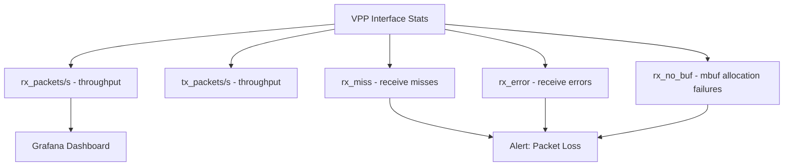

# Monitor Calico VPP Uplink Configuration

Author: [nawazdhandala](https://github.com/nawazdhandala)

Tags: Calico, Kubernetes, Networking, VPP, DPDK, Uplink, Monitoring

Description: Set up monitoring for Calico VPP uplink interfaces to track NIC health, DPDK driver stability, queue depth utilization, and uplink throughput metrics.

---

## Introduction

Monitoring the Calico VPP uplink provides visibility into the physical network connection that underpins all pod networking. Unlike standard Kubernetes node network monitoring, VPP uplink monitoring requires accessing VPP interface statistics from VPP's own metrics system. Physical NIC errors, RX queue misses, and DPDK driver binding changes are all conditions that must be detected early to prevent silent packet loss.

## Prerequisites

- Calico VPP with uplink configured and operational
- Prometheus and Grafana deployed
- Calico VPP Prometheus metrics enabled or a VPP Prometheus exporter deployed

## Step 1: Configure VPP Interface Metrics Scraping

```yaml
# ServiceMonitor for VPP exporter

apiVersion: monitoring.coreos.com/v1
kind: ServiceMonitor
metadata:
  name: vpp-uplink-metrics
  namespace: monitoring
spec:
  selector:
    matchLabels:
      app: vpp-exporter
  endpoints:
    - port: metrics
      interval: 15s
      path: /metrics
```

## Step 2: Key Uplink Metrics


```mermaid
graph TD
    A[VPP Interface Stats] --> B[rx_packets/s - throughput]
    A --> C[tx_packets/s - throughput]
    A --> D[rx_miss - receive misses]
    A --> E[rx_error - receive errors]
    A --> F[rx_no_buf - mbuf allocation failures]
    B --> G[Grafana Dashboard]
    D --> H[Alert: Packet Loss]
    E --> H
    F --> H
```

| Metric | Description | Alert |
|--------|-------------|-------|
| `cni_projectcalico_vpp_rx_packets` | Uplink RX packet rate | N/A (informational) |
| `cni_projectcalico_vpp_rx_bytes` | Uplink throughput | Alert when approaching NIC max |
| `cni_projectcalico_vpp_rx_miss` | RX packets dropped because no buffer was available | > 0 |
| `cni_projectcalico_vpp_rx_error` | Erroneous received packets | > 0 |
| `cni_projectcalico_vpp_rx_no_buf` | RX mbuf allocation failures | > 0 |

## Step 3: Prometheus Alerts

```yaml
groups:
  - name: calico-vpp-uplink
    rules:
      - alert: VPPUplinkRxOverflow
        expr: |
          sum by (instance, vppInterfaceName) (
            increase(cni_projectcalico_vpp_rx_miss{vppInterfaceName="GigabitEthernet0/0/0"}[5m])
          ) > 0
        for: 1m
        labels:
          severity: critical
        annotations:
          summary: "VPP uplink RX misses on {{ $labels.instance }}"
          description: "Increase num-rx-desc or add worker threads"

      - alert: VPPUplinkNearCapacity
        expr: |
          sum by (instance, vppInterfaceName) (
            rate(cni_projectcalico_vpp_rx_bytes{vppInterfaceName="GigabitEthernet0/0/0"}[5m])
          ) * 8 / 10e9 > 0.8
        for: 5m
        labels:
          severity: warning
        annotations:
          summary: "VPP uplink is at {{ $value | humanizePercentage }} capacity"

      - alert: VPPUplinkRxErrors
        expr: |
          sum by (instance, vppInterfaceName) (
            increase(cni_projectcalico_vpp_rx_error{vppInterfaceName="GigabitEthernet0/0/0"}[5m])
          ) > 0
        for: 1m
        labels:
          severity: critical
        annotations:
          summary: "VPP uplink RX errors on {{ $labels.instance }}"
```

## Step 4: Grafana Dashboard Panels

Create a dedicated uplink dashboard:

```plaintext
# RX/TX Throughput
sum by (instance, vppInterfaceName) (
  rate(cni_projectcalico_vpp_rx_bytes{vppInterfaceName=~"GigabitEthernet.*"}[5m])
) * 8 / 1e9

# Packet rate
sum by (instance, vppInterfaceName) (
  rate(cni_projectcalico_vpp_rx_packets{vppInterfaceName=~"GigabitEthernet.*"}[5m])
)

# Queue pressure indicators
sum by (instance, vppInterfaceName) (
  rate(cni_projectcalico_vpp_rx_miss{vppInterfaceName=~"GigabitEthernet.*"}[5m])
)
sum by (instance, vppInterfaceName) (
  rate(cni_projectcalico_vpp_rx_no_buf{vppInterfaceName=~"GigabitEthernet.*"}[5m])
)

# Error counters
sum by (instance, vppInterfaceName) (
  rate(cni_projectcalico_vpp_rx_error{vppInterfaceName=~"GigabitEthernet.*"}[5m])
)
```

## Step 5: Uplink Driver Health Check

Monitor DPDK binding stability:

```bash
# CronJob to verify DPDK binding is maintained
cat > /tmp/check-dpdk-binding.sh <<'EOF'
#!/bin/bash
EXPECTED_DRIVER="vfio-pci"
ACTUAL_DRIVER=$(dpdk-devbind.py --status-dev net | grep "0000:00:0a.0" | \
  grep -o "drv=[^ ]*" | cut -d= -f2)

if [ "$ACTUAL_DRIVER" != "$EXPECTED_DRIVER" ]; then
  echo "ALERT: NIC 0000:00:0a.0 bound to $ACTUAL_DRIVER, expected $EXPECTED_DRIVER"
  exit 1
fi
echo "OK: NIC correctly bound to vfio-pci"
EOF
```

## Conclusion

Monitoring Calico VPP uplink interfaces requires tracking VPP interface statistics including RX miss rates, receive error counts, and buffer allocation failures. RX misses (rx_miss) are the most important metric to alert on, as they indicate packet loss that may not be visible from the application layer. Uplink capacity monitoring ensures you can scale nodes or NIC capacity before reaching saturation.
