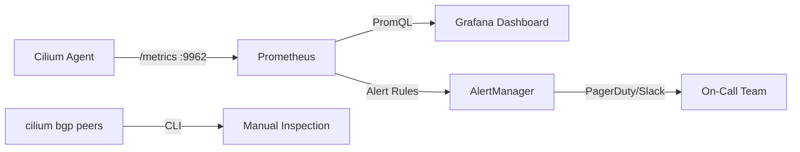

# Monitoring Cilium BGP Sessions

Author: [nawazdhandala](https://github.com/nawazdhandala)

Tags: Cilium, Kubernetes, Networking, BGP, eBPF

Description: Monitor Cilium BGP session health, route advertisement metrics, and peer state changes using Cilium's built-in metrics, Prometheus, and Grafana dashboards.

---

## Introduction

BGP session monitoring is critical for maintaining network reliability in Kubernetes clusters that depend on BGP for service reachability. A session that flaps for even a few seconds can cause service disruptions as routes are withdrawn and re-advertised. Continuous monitoring of BGP session state, prefix counts, and timer health enables proactive detection of problems before they escalate.

Cilium exposes BGP-related metrics through its Prometheus endpoint, including session state transitions, advertised prefix counts, and connection attempt rates. These metrics integrate with standard Prometheus and Grafana setups, and can feed alerting rules that page on-call engineers before end-users notice issues. Combined with the `cilium bgp peers` command for ad-hoc inspection, you have full visibility into your BGP control plane.

This guide covers setting up BGP monitoring from enabling Prometheus metrics through creating Grafana dashboards and alerting rules.

## Prerequisites

- Cilium with BGP Control Plane enabled and sessions established
- Prometheus Operator or standalone Prometheus in the cluster
- Grafana (optional) for dashboards
- `cilium` CLI installed

## Step 1: Enable Cilium Prometheus Metrics

```bash
helm upgrade cilium cilium/cilium \
  --namespace kube-system \
  --reuse-values \
  --set prometheus.enabled=true \
  --set operator.prometheus.enabled=true
```

Verify the metrics endpoint:

```bash
kubectl port-forward -n kube-system svc/cilium-agent 9962:9962
curl -s http://localhost:9962/metrics | grep bgp
```

## Step 2: Key BGP Metrics to Monitor

```bash
# Session state (1=established, 0=not established)
cilium_bgp_session_state

# Number of prefixes advertised to each peer
cilium_bgp_announced_prefixes_total

# Number of prefixes received from each peer
cilium_bgp_received_prefixes_total

# BGP update message counts
cilium_bgp_updates_total

# Connection attempt rate (high rate = session flapping)
cilium_bgp_connect_retry_timer_expired_total
```

## Step 3: Create Prometheus Alerting Rules

```yaml
apiVersion: monitoring.coreos.com/v1
kind: PrometheusRule
metadata:
  name: cilium-bgp-alerts
  namespace: monitoring
spec:
  groups:
    - name: cilium-bgp
      rules:
        - alert: CiliumBGPSessionDown
          expr: cilium_bgp_session_state == 0
          for: 2m
          labels:
            severity: critical
          annotations:
            summary: "Cilium BGP session down on {{ $labels.node }}"
            description: "BGP session to peer {{ $labels.peer }} on node {{ $labels.node }} has been down for 2 minutes."
        - alert: CiliumBGPPrefixDrop
          expr: decrease(cilium_bgp_announced_prefixes_total[5m]) > 0
          for: 1m
          labels:
            severity: warning
          annotations:
            summary: "BGP prefix count decreased on {{ $labels.node }}"
```

## Step 4: Grafana Dashboard Queries

Key PromQL queries for a BGP monitoring dashboard:

```promql
# Session state by node and peer
cilium_bgp_session_state{job="cilium-agent"}

# Total prefixes advertised over time
sum(cilium_bgp_announced_prefixes_total) by (node)

# Session establishment rate (flap indicator)
rate(cilium_bgp_connect_retry_timer_expired_total[5m])
```

## Step 5: Ad-Hoc BGP Health Checks

```bash
# Quick health check across all nodes
cilium bgp peers

# Check specific node
kubectl get ciliumbgpnodeconfig worker-0 -o yaml

# Watch for state changes in real-time
watch -n 5 cilium bgp peers
```

## BGP Monitoring Stack



## Conclusion

Comprehensive BGP monitoring in Cilium requires both metric-based alerting for automated detection and CLI tooling for ad-hoc investigation. The `cilium_bgp_session_state` metric is your primary health indicator — alert on any session that stays down for more than 2 minutes. Complement session monitoring with prefix count tracking to detect silent route withdrawal issues that can cause traffic blackholes even when sessions remain established.
