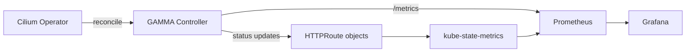

# How to Monitor Cilium GAMMA Support in the Cilium Gateway API

Author: [nawazdhandala](https://github.com/nawazdhandala)

Tags: Cilium, Kubernetes, GAMMA, Gateway API, Monitoring

Description: Set up comprehensive monitoring for Cilium GAMMA support in the Gateway API controller using Prometheus metrics and Hubble observability.

---

## Introduction

Monitoring Cilium GAMMA support in the Gateway API controller ensures the controller continues to operate correctly as the cluster scales and routes change. Key signals include controller reconciliation success rates, HTTPRoute acceptance status, and eBPF program health.

Unlike monitoring specific routes, controller-level monitoring tracks the health of the GAMMA system itself. This includes watching for reconciliation backlogs, controller restart rates, and API server connectivity.

## Prerequisites

- Cilium operator Prometheus metrics enabled
- Grafana connected to Prometheus
- Hubble relay deployed

## Operator Health Metrics

```promql
# Controller reconciliation rate
rate(controller_runtime_reconcile_total{controller="httproute"}[5m])

# Controller reconciliation errors
rate(controller_runtime_reconcile_errors_total{controller="httproute"}[5m])
```

## Architecture



## Monitor HTTPRoute Status via kube-state-metrics

If kube-state-metrics is configured with custom resource support:

```promql
sum by (name, namespace) (
  kube_customresource_status_condition{
    resource="httproutes",
    condition="Accepted",
    status="False"
  }
)
```

## Hubble Controller Metrics

Monitor flows affected by GAMMA routes:

```bash
hubble observe --type trace --follow | grep "mesh-route"
```

## Alert on Controller Errors

```yaml
groups:
  - name: gamma-controller
    rules:
      - alert: GammaControllerReconcileErrors
        expr: |
          rate(controller_runtime_reconcile_errors_total{
            controller="httproute"
          }[5m]) > 0.1
        for: 5m
        labels:
          severity: warning
        annotations:
          summary: "GAMMA controller reconciliation error rate elevated"
```

## Conclusion

Monitoring Cilium GAMMA support at the controller level provides early warning of reconciliation failures before they affect traffic. Combining operator Prometheus metrics with kube-state-metrics for route status gives a complete picture of GAMMA controller health.
