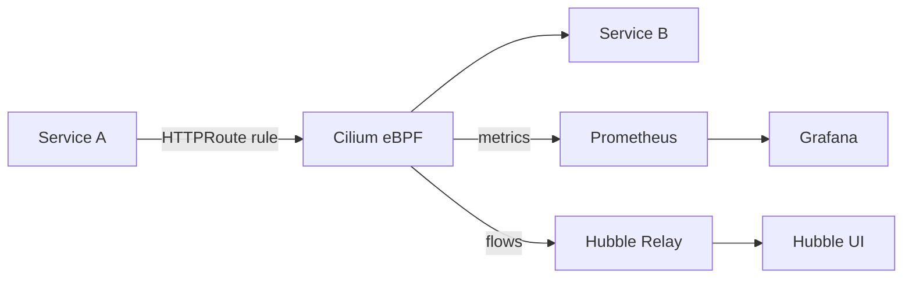

# How to Monitor Cilium GAMMA Support

Author: [nawazdhandala](https://github.com/nawazdhandala)

Tags: Cilium, Kubernetes, GAMMA, Gateway API, Monitoring, Observability

Description: Monitor Cilium GAMMA service mesh routing using Prometheus metrics and Hubble flow data to ensure east-west traffic routing stays healthy.

---

## Introduction

Monitoring Cilium GAMMA support ensures that service-to-service routing rules remain active and effective over time. Unlike ingress monitoring which focuses on north-south traffic, GAMMA monitoring tracks east-west flows between workloads inside the cluster.

Cilium provides two primary monitoring surfaces for GAMMA: Prometheus metrics from the operator and agent, and Hubble flow data that shows per-connection routing decisions. Together they give operators both aggregate visibility and per-request traceability.

This guide covers the metrics and Hubble queries most relevant to GAMMA health monitoring.

## Prerequisites

- Cilium with Prometheus metrics enabled
- Hubble relay and UI enabled
- Grafana connected to Prometheus
- GAMMA and Gateway API enabled in Cilium

## Key Prometheus Metrics for GAMMA

| Metric | Description |
|--------|-------------|
| `cilium_policy_l7_total` | L7 policy decisions (relevant when GAMMA routes enforce L7 rules) |
| `cilium_forward_count_total` | Total forwarded packets per endpoint |
| `cilium_drop_count_total` | Dropped packets-check for unexpected drops on mesh services |

Query for HTTP-level policy decisions:

```bash
rate(cilium_policy_l7_total{direction="ingress"}[5m])
```

## Architecture



## Monitor with Hubble

Watch east-west flows between services:

```bash
hubble observe --namespace <namespace> --follow \
  --from-service <source> --to-service <target>
```

Count dropped flows over a time window:

```bash
hubble observe --namespace <namespace> --verdict DROPPED \
  --since 10m | wc -l
```

## Grafana Dashboard Queries

Traffic distribution across GAMMA backends (when weights are configured):

```promql
sum by (destination_workload) (
  rate(cilium_forward_count_total{destination_namespace="<ns>"}[1m])
)
```

## Create Alerting Rules

```yaml
groups:
  - name: gamma-mesh
    rules:
      - alert: GammaHighDropRate
        expr: |
          rate(cilium_drop_count_total{reason="POLICY_DENIED"}[5m]) > 10
        for: 2m
        labels:
          severity: warning
        annotations:
          summary: High drop rate in GAMMA mesh traffic
```

## Conclusion

Monitoring Cilium GAMMA support requires combining Prometheus metrics for aggregate health with Hubble flow data for per-request visibility. Setting up drop rate alerts and traffic distribution dashboards ensures mesh routing issues are caught and resolved quickly.
