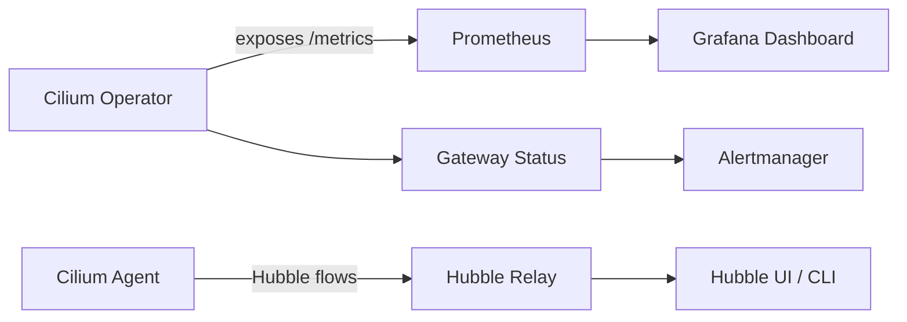

# How to Monitor Cilium Gateway API Addresses Support

Author: [nawazdhandala](https://github.com/nawazdhandala)

Tags: Cilium, Kubernetes, Gateway API, Monitoring, Observability

Description: A guide to monitoring the health and IP allocation status of Cilium Gateway API addresses using Prometheus metrics and Hubble observability.

---

## Introduction

Monitoring Cilium's Gateway API address allocation ensures that IP assignment issues are detected proactively rather than discovered during an outage. Cilium exposes Prometheus metrics for the operator, and Hubble provides flow-level visibility for traffic entering via gateway addresses.

Effective monitoring of Gateway API addresses involves tracking address assignment events, load balancer service status changes, and upstream network flows. Alerting on these signals allows teams to respond before users are affected.

This guide covers setting up metric collection, building Grafana dashboards, and using Hubble to trace gateway traffic.

## Prerequisites

- Cilium with Prometheus metrics enabled
- Hubble enabled with relay
- Grafana connected to Prometheus
- `hubble` CLI available

## Enable Cilium Operator Metrics

Ensure the operator exposes metrics by checking its configuration:

```bash
kubectl get cm -n kube-system cilium-config -o jsonpath='{.data.operator-prometheus-serve-addr}'
```

If not set, update via Helm:

```bash
helm upgrade cilium cilium/cilium --reuse-values \
  --set operator.prometheus.enabled=true \
  --set operator.prometheus.port=9963
```

## Key Prometheus Metrics

| Metric | Description |
|--------|-------------|
| `cilium_operator_gateway_api_addresses_total` | Total addresses allocated to gateways |
| `cilium_k8s_client_api_calls_total` | API calls made by Cilium operator |
| `cilium_operator_process_cpu_seconds_total` | Operator CPU usage |

Query for gateway-related API operations:

```bash
rate(cilium_k8s_client_api_calls_total{api_call=~".*gateway.*"}[5m])
```

## Architecture



## Use Hubble to Monitor Gateway Traffic

Watch flows entering via a gateway IP:

```bash
GATEWAY_IP=$(kubectl get gateway <gateway-name> -n <namespace> \
  -o jsonpath='{.status.addresses[0].value}')
hubble observe --to-ip $GATEWAY_IP --follow
```

Filter for dropped packets:

```bash
hubble observe --verdict DROPPED --namespace <namespace>
```

## Create an Alert for IP Allocation Failures

In Alertmanager, create a rule to detect stale gateway conditions:

```yaml
groups:
  - name: cilium-gateway
    rules:
      - alert: GatewayAddressNotProgrammed
        expr: kube_gateway_status_conditions{type="Programmed",status="False"} > 0
        for: 5m
        labels:
          severity: warning
        annotations:
          summary: "Gateway {{ $labels.name }} address not programmed"
```

## Conclusion

Monitoring Cilium Gateway API address support through Prometheus metrics and Hubble flow data provides real-time visibility into IP allocation health. Setting up alerts for unassigned addresses ensures your team can respond to infrastructure issues before they impact users.
