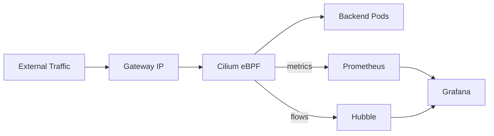

# How to Monitor Cilium Gateway API Support

Author: [nawazdhandala](https://github.com/nawazdhandala)

Tags: Cilium, Kubernetes, Gateway API, Monitoring, Observability

Description: Monitor Cilium Gateway API support using Prometheus metrics, Hubble flow data, and Gateway status conditions to maintain healthy ingress operations.

---

## Introduction

Monitoring Cilium's Gateway API support gives operators visibility into ingress health at both the infrastructure layer (load balancer IPs, service health) and the application layer (HTTP success rates, latency). Cilium's Prometheus metrics and Hubble observability provide both.

Unlike traditional ingress monitoring, Gateway API monitoring benefits from the multi-layer structure: GatewayClass, Gateway, and Route objects each have status conditions that can be scraped and alerted on. Combined with real-time flow data from Hubble, this gives a comprehensive view of ingress health.

## Prerequisites

- Cilium with Prometheus and Hubble enabled
- Grafana with Prometheus datasource
- kube-state-metrics for Gateway API resource status

## Key Metrics

| Metric | Description |
|--------|-------------|
| `cilium_operator_process_resident_memory_bytes` | Operator memory (reconciliation overhead) |
| `cilium_forward_count_total` | Forwarded packets per endpoint |
| `cilium_http_requests_total` | HTTP request counts (when L7 policy enabled) |

## Architecture



## Hubble for Gateway Traffic Monitoring

Watch ingress flows:

```bash
hubble observe --type trace --follow \
  | grep -v "kube-system"
```

Monitor HTTP error rates:

```bash
hubble observe --protocol http --verdict DROPPED --since 10m
```

## Prometheus Dashboard

HTTP request rate through Gateway:

```promql
sum by (destination_workload) (
  rate(cilium_forward_count_total{destination_namespace="<ns>"}[1m])
)
```

## Alerting

```yaml
groups:
  - name: gateway-api
    rules:
      - alert: GatewayNotProgrammed
        expr: |
          kube_gateway_status_conditions{type="Programmed",status="False"} > 0
        for: 5m
        labels:
          severity: critical
```

## Conclusion

Monitoring Cilium Gateway API support combines Gateway object status conditions, Prometheus network metrics, and Hubble flow data. This multi-layer approach provides early warning for both infrastructure and application-level ingress issues.
