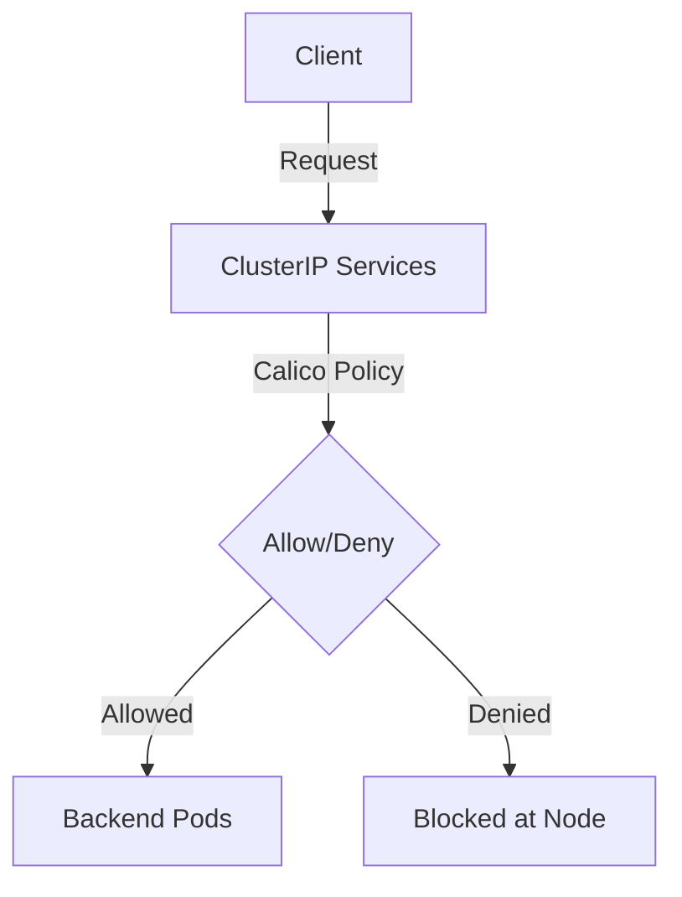

# How to Monitor Calico ClusterIP Service Policy Impact

Author: [nawazdhandala](https://github.com/nawazdhandala)

Tags: Calico, Kubernetes, Network Policy, ClusterIP, Security

Description: Monitor Calico ClusterIP service policies to secure internal Kubernetes service-to-service communication.

---

## Introduction

ClusterIP Service Policies in Calico gives you control over how traffic flows through Kubernetes service networking. The `projectcalico.org/v3` API provides the tools needed to secure ClusterIP Services traffic effectively while maintaining service availability.

Proper ClusterIP Services policy configuration is essential for clusters that expose services to external traffic. Without it, any source can reach your NodePort or ClusterIP services, creating significant attack surface.

This guide covers monitor ClusterIP Services policies in Calico with practical, production-tested configurations.

## Prerequisites

- Kubernetes cluster with Calico v3.26+
- `calicoctl` and `kubectl` installed
- Understanding of Kubernetes service networking

## Core Configuration

```yaml
apiVersion: projectcalico.org/v3
kind: NetworkPolicy
metadata:
  name: protect-clusterip-service
  namespace: production
spec:
  order: 100
  selector: app == 'backend-service'
  ingress:
    - action: Allow
      source:
        selector: tier == 'frontend'
      destination:
        ports: [8080]
    - action: Allow
      source:
        selector: tier == 'monitoring'
      destination:
        ports: [9090]
    - action: Deny
  egress:
    - action: Allow
      destination:
        selector: app == 'database'
      destination:
        ports: [5432]
    - action: Allow
      protocol: UDP
      destination:
        ports: [53]
    - action: Deny
  types:
    - Ingress
    - Egress
```


## Verification

```bash
# Apply the policy
calicoctl apply -f monitor-clusterip-services.yaml

# Verify traffic behavior
kubectl exec -n test test-pod -- curl -s --max-time 5 http://service-name:8080
echo "Result: $?"
```

## Architecture



## Conclusion

ClusterIP Service Policies policies in Calico provide essential security controls for Kubernetes service traffic. Configure them carefully, test bidirectional traffic flows, and use staged policies to preview impact before enforcement. Regular monitoring of denial rates helps you detect misconfigurations and unauthorized access attempts before they impact service availability.
