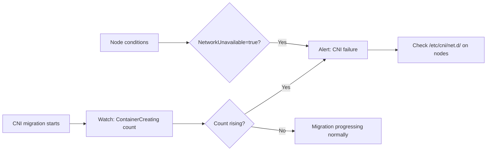

# How to Monitor ContainerCreating After Uninstalling Calico

Author: [nawazdhandala](https://github.com/nawazdhandala)

Tags: Calico, Kubernetes, Networking, Troubleshooting

Description: Monitor for pods stuck in ContainerCreating during or after Calico CNI removal using pod phase metrics and CNI health checks.

---

## Introduction

During Calico CNI removal, monitoring ContainerCreating pod counts provides real-time visibility into whether pod scheduling is functioning. A rising ContainerCreating count indicates that new pods are not able to get network configuration - a direct sign that the CNI layer is broken.

Setting up monitoring before the migration begins ensures you have a dashboard and alerts ready when the removal happens. This is especially important for automated migrations where the removal is scripted and may proceed faster than manual oversight can track.

## Symptoms

- ContainerCreating pod count rising during or after CNI removal
- Alert fires on pod scheduling failures
- Nodes report CNI not initialized in node conditions

## Root Causes

- CNI migration window without monitoring
- No alert defined for ContainerCreating pods

## Diagnosis Steps

```bash
# Real-time ContainerCreating count
kubectl get pods --all-namespaces | grep ContainerCreating | wc -l
```

## Solution

**Step 1: Alert on ContainerCreating pods**

```yaml
apiVersion: monitoring.coreos.com/v1
kind: PrometheusRule
metadata:
  name: pod-containercreating-alerts
  namespace: monitoring
spec:
  groups:
  - name: pod.scheduling
    rules:
    - alert: PodsStuckContainerCreating
      expr: |
        count(kube_pod_status_phase{phase="Pending"}) by (namespace) > 5
      for: 5m
      labels:
        severity: critical
      annotations:
        summary: "Multiple pods stuck in Pending/ContainerCreating in {{ $labels.namespace }}"
        description: "{{ $value }} pods pending - possible CNI failure"
    - alert: NodeCNINotReady
      expr: |
        kube_node_status_condition{condition="NetworkUnavailable",status="true"} == 1
      for: 2m
      labels:
        severity: critical
      annotations:
        summary: "Node {{ $labels.node }} reports network unavailable"
```

**Step 2: Watch migration progress**

```bash
# During CNI migration - watch ContainerCreating in real-time
watch -n5 "kubectl get pods --all-namespaces | grep -E 'ContainerCreating|Pending' | head -20"
```

**Step 3: Monitor node CNI readiness**

```bash
# Check node conditions for network availability
kubectl get nodes -o json | jq '.items[] | {name: .metadata.name, conditions: [.status.conditions[] | select(.type=="NetworkUnavailable")]}'
```



## Prevention

- Set up monitoring before starting CNI migration
- Establish baseline ContainerCreating count to detect regression
- Alert on any node reporting NetworkUnavailable condition

## Conclusion

Monitoring ContainerCreating after Calico removal requires tracking pod phase metrics and node network condition status. Alerts on pending pod counts and NetworkUnavailable node conditions provide fast detection of CNI failures during migration.
