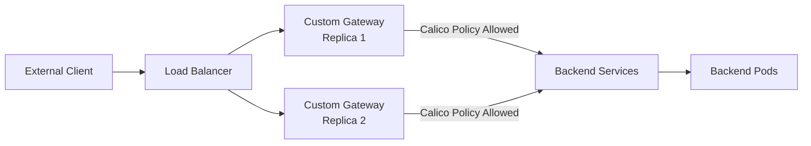

# How to Monitor Custom Calico Ingress Gateways

Author: [nawazdhandala](https://github.com/nawazdhandala)

Tags: Calico, Kubernetes, Ingress, Gateway, Custom Networking

Description: Monitor custom Calico ingress gateway health with request metrics, error tracking, and connection pool statistics.

---

## Introduction

Custom ingress gateways in Calico environments go beyond the standard NGINX or Traefik controllers to implement specialized requirements: dedicated gateways per tenant, protocol-aware gateways for gRPC or WebSocket traffic, or gateways with custom authentication and routing logic.

Building custom gateways with Calico requires understanding how to properly configure Calico network policies to allow ingress traffic from the gateway pods to backend services, how to expose the gateway via LoadBalancer or NodePort services, and how to ensure the gateway pod itself has the network access it needs.

## Prerequisites

- Calico installed
- Custom gateway deployment (Envoy, Nginx, HAProxy, or custom)
- kubectl and calicoctl access

## Deploy Custom Gateway

```yaml
apiVersion: apps/v1
kind: Deployment
metadata:
  name: custom-gateway
  namespace: gateway-system
spec:
  replicas: 2
  selector:
    matchLabels:
      app: custom-gateway
  template:
    metadata:
      labels:
        app: custom-gateway
    spec:
      containers:
      - name: gateway
        image: envoyproxy/envoy:v1.28.0
        ports:
        - containerPort: 80
        - containerPort: 443
---
apiVersion: v1
kind: Service
metadata:
  name: custom-gateway
  namespace: gateway-system
spec:
  type: LoadBalancer
  selector:
    app: custom-gateway
  ports:
  - port: 80
    targetPort: 80
  - port: 443
    targetPort: 443
```

## Configure Calico Policies for Gateway Access

```yaml
apiVersion: projectcalico.org/v3
kind: GlobalNetworkPolicy
metadata:
  name: allow-custom-gateway-egress
spec:
  selector: app == 'custom-gateway'
  types:
  - Egress
  egress:
  - action: Allow
    protocol: TCP
    destination:
      namespaceSelector: gateway-accessible == 'true'
      ports:
      - 8080
      - 8443
---
apiVersion: projectcalico.org/v3
kind: NetworkPolicy
metadata:
  name: allow-from-custom-gateway
  namespace: production
spec:
  selector: all()
  ingress:
  - action: Allow
    source:
      namespaceSelector: kubernetes.io/metadata.name == 'gateway-system'
      selector: app == 'custom-gateway'
```

## Verify Custom Gateway Routing

```bash
GW_IP=$(kubectl get svc -n gateway-system custom-gateway   -o jsonpath='{.status.loadBalancer.ingress[0].ip}')
curl -v http://${GW_IP}/health
curl -H "Host: backend.example.com" http://${GW_IP}/api/
```

## Custom Gateway Architecture



## Conclusion

Custom Calico ingress gateways require careful coordination between the gateway deployment, Calico network policies, and service configuration. Define explicit Calico policies that allow the gateway pods to reach backend services while blocking unwanted lateral movement. Monitor gateway metrics to detect routing failures or traffic anomalies early.
