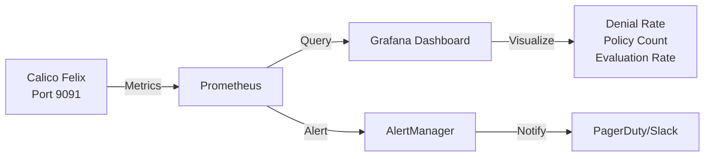

# How to Monitor the Impact of Default Deny Policies in Calico

Author: [nawazdhandala](https://github.com/nawazdhandala)

Tags: Calico, Kubernetes, Network Policy, Monitoring, Prometheus, Security

Description: Monitor the real-world impact of Calico default deny policies using Prometheus metrics, Grafana dashboards, and flow log analysis.

---

## Introduction

Applying a default deny policy is only the beginning. Ongoing monitoring is what separates a security team that is in control from one that is reacting to surprises. Calico exposes rich metrics through Felix and Typha that let you track policy evaluation counts, denied packet rates, and endpoint connection states in real time.

Without monitoring, you cannot know if your deny policy is silently blocking legitimate traffic that just hasn't been caught yet, or if an attacker is probing your network boundaries. Monitoring also helps you identify policy optimization opportunities — rules that never match are candidates for removal.

This guide shows you how to set up Prometheus-based monitoring for your Calico default deny policies, build Grafana dashboards for operational visibility, and configure alerts for anomalous traffic patterns.

## Prerequisites

- Kubernetes cluster with Calico v3.26+
- Prometheus Operator deployed in the cluster
- Grafana for visualization
- `calicoctl` and `kubectl` installed

## Step 1: Enable Calico Metrics

Felix exposes Prometheus metrics by default on port 9091:

```bash
kubectl patch felixconfiguration default --type=merge -p '{
  "spec": {
    "prometheusMetricsEnabled": true,
    "prometheusMetricsPort": 9091
  }
}'
```

## Step 2: Create a ServiceMonitor for Prometheus

```yaml
apiVersion: monitoring.coreos.com/v1
kind: ServiceMonitor
metadata:
  name: calico-felix
  namespace: kube-system
  labels:
    app: calico-felix
spec:
  selector:
    matchLabels:
      k8s-app: calico-node
  namespaceSelector:
    matchNames:
      - kube-system
  endpoints:
    - port: metrics
      interval: 30s
      path: /metrics
```

## Step 3: Key Metrics to Track

| Metric | Description |
|--------|-------------|
| `felix_denied_packets_total` | Total packets denied by policy |
| `felix_active_network_policies` | Number of active network policies |
| `felix_policy_evaluation_total` | Policy evaluations per second |
| `felix_ipsets_total` | Number of active IP sets |

```bash
# Query denied packets
curl http://localhost:9091/metrics | grep felix_denied
```

## Step 4: Grafana Dashboard Query Examples

```promql
# Denied packets per second
rate(felix_denied_packets_total[5m])

# Policy evaluation rate
rate(felix_policy_evaluation_total[5m])

# Active policies count
felix_active_network_policies
```

## Step 5: Set Up Alerting

```yaml
apiVersion: monitoring.coreos.com/v1
kind: PrometheusRule
metadata:
  name: calico-policy-alerts
  namespace: kube-system
spec:
  groups:
    - name: calico.policy
      rules:
        - alert: HighDenialRate
          expr: rate(felix_denied_packets_total[5m]) > 100
          for: 2m
          labels:
            severity: warning
          annotations:
            summary: "High packet denial rate detected"
            description: "More than 100 packets/s denied in the last 5 minutes"
```

## Monitoring Architecture



## Conclusion

Monitoring Calico default deny policies with Prometheus and Grafana gives you the operational visibility needed to run a secure cluster with confidence. Track denial rates, policy evaluation counts, and set up alerts for anomalous spikes. Regular review of these metrics helps you continuously improve your policy set — removing unused rules and catching unexpected traffic patterns before they become incidents.
