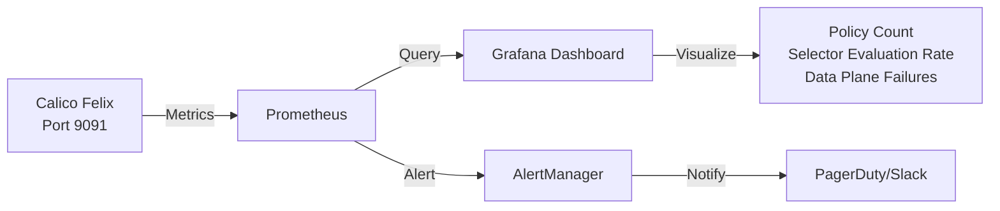

# How to Monitor the Impact of Default Deny Policies in Calico

Author: [nawazdhandala](https://github.com/nawazdhandala)

Tags: Calico, Kubernetes, Network Policy, Monitoring, Prometheus, Security

Description: Monitor the real-world impact of Calico default deny policies using Prometheus metrics, Grafana dashboards, and flow log analysis.

---

## Introduction

Applying a default deny policy is only the beginning. Ongoing monitoring is what separates a security team that is in control from one that is reacting to surprises. Calico exposes rich metrics through Felix that let you track active policy counts, selector evaluation behavior, and data plane update health in real time.

Without monitoring, you cannot know if your policy set is growing unexpectedly, if selectors are becoming expensive to evaluate, or if Felix is retrying failed data plane updates. Monitoring also helps you identify policy optimization opportunities - broad selectors and high policy counts are candidates for review.

This guide shows you how to set up Prometheus-based monitoring for your Calico default deny policies, build Grafana dashboards for operational visibility, and configure alerts for anomalous policy or data plane behavior.

## Prerequisites

- Kubernetes cluster with Calico v3.26+
- Prometheus Operator deployed in the cluster
- Grafana for visualization
- `calicoctl` and `kubectl` installed

## Step 1: Enable Calico Metrics

Felix exposes Prometheus metrics on port 9091 when metrics reporting is enabled:

```bash
kubectl patch felixconfiguration default --type=merge -p '{
  "spec": {
    "prometheusMetricsEnabled": true,
    "prometheusMetricsPort": 9091
  }
}'
```

## Step 2: Create a ServiceMonitor for Prometheus

```yaml
apiVersion: v1
kind: Service
metadata:
  name: felix-metrics-svc
  namespace: kube-system
  labels:
    app: calico-felix
spec:
  clusterIP: None
  selector:
    k8s-app: calico-node
  ports:
    - name: metrics
      port: 9091
      targetPort: 9091
---
apiVersion: monitoring.coreos.com/v1
kind: ServiceMonitor
metadata:
  name: calico-felix
  namespace: kube-system
  labels:
    app: calico-felix
spec:
  selector:
    matchLabels:
      app: calico-felix
  namespaceSelector:
    matchNames:
      - kube-system
  endpoints:
    - port: metrics
      interval: 30s
      path: /metrics
```

## Step 3: Key Metrics to Track

| Metric | Description |
|--------|-------------|
| `felix_active_local_policies` | Number of active policies on this host |
| `felix_cluster_num_policies` | Total number of policies in the cluster |
| `felix_label_index_selector_evals` | Selector evaluation counts by result |
| `felix_int_dataplane_failures` | Number of failed data plane updates that Felix will retry |

```bash
# Query active policy metrics

curl -s http://localhost:9091/metrics | grep felix_active_local_policies
```

## Step 4: Grafana Dashboard Query Examples

```promql
# Active policies on each Felix instance
felix_active_local_policies

# Selector evaluation rate
rate(felix_label_index_selector_evals[5m])

# Data plane update failures
rate(felix_int_dataplane_failures[5m])
```

## Step 5: Set Up Alerting

```yaml
apiVersion: monitoring.coreos.com/v1
kind: PrometheusRule
metadata:
  name: calico-policy-alerts
  namespace: kube-system
spec:
  groups:
    - name: calico.policy
      rules:
        - alert: CalicoFelixDataplaneFailures
          expr: rate(felix_int_dataplane_failures[5m]) > 0
          for: 2m
          labels:
            severity: warning
          annotations:
            summary: "Calico Felix data plane update failures detected"
            description: "Felix has reported failed data plane updates in the last 5 minutes"
```

## Monitoring Architecture


```mermaid
flowchart LR
    A[Calico Felix\nPort 9091] -->|Metrics| B[Prometheus]
    B -->|Query| C[Grafana Dashboard]
    B -->|Alert| D[AlertManager]
    D -->|Notify| E[PagerDuty/Slack]
    C -->|Visualize| F[Policy Count\nSelector Evaluation Rate\nData Plane Failures]
```

## Conclusion

Monitoring Calico default deny policies with Prometheus and Grafana gives you the operational visibility needed to run a secure cluster with confidence. Track active policy counts, selector evaluation behavior, and data plane failures, then set up alerts for anomalous spikes. Regular review of these metrics helps you continuously improve your policy set - removing unused rules and catching unexpected policy or data plane behavior before it becomes an incident.
