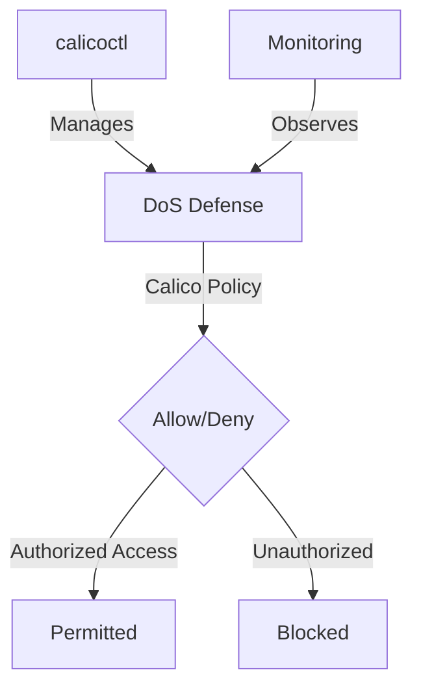

# How to Monitor Calico DoS Defense Policy Effectiveness

Author: [nawazdhandala](https://github.com/nawazdhandala)

Tags: Calico, Kubernetes, Network Policy, DoS Defense, Security

Description: Monitor Calico network policies for DoS defense to protect cluster workloads from denial of service attacks.

---

## Introduction

DoS Defense with Calico Policies is an important security consideration for production Calico deployments. The `projectcalico.org/v3` API provides the tools needed to monitor DoS Defense effectively, combining Calico's network policy with proper access controls and monitoring.

This guide covers monitor DoS Defense in Calico with practical configurations and operational best practices.

## Prerequisites

- Kubernetes cluster with Calico v3.26+
- `calicoctl` and `kubectl` installed
- Understanding of Calico's monitoring and security architecture
- HostEndpoints configured for the node interfaces where DoS mitigation should be enforced

## Core Configuration

```yaml
apiVersion: projectcalico.org/v3
kind: GlobalNetworkPolicy
metadata:
  name: dos-defense-deny-list
spec:
  selector: apply-dos-mitigation == 'true'
  doNotTrack: true
  applyOnForward: true
  ingress:
    - action: Deny
      source:
        selector: dos-deny-list == 'true'
  types:
    - Ingress
---
# Block known bad actors

apiVersion: projectcalico.org/v3
kind: GlobalNetworkSet
metadata:
  name: dos-block-bad-actors
  labels:
    dos-deny-list: 'true'
spec:
  nets:
    - 198.51.100.0/24  # Known attack source
    - 203.0.113.0/24
```

## Implementation

```bash
# Apply DoS defense policies
calicoctl apply -f dos-defense.yaml

# Verify Felix has active policy on the node
curl -s http://node-ip:9091/metrics | grep felix_active_local_policies

# Check denial counters if Calico Enterprise or Calico Cloud policy metrics are enabled
watch -n1 'curl -s http://policy-metrics-endpoint/metrics | grep calico_denied_packets'
```

## eBPF Dataplane (Calico)

```bash
# Enable eBPF dataplane with the Tigera operator
kubectl patch installation.operator.tigera.io default --type merge -p '{"spec":{"calicoNetwork":{"linuxDataplane":"BPF"}}}'
```

## Architecture



## Conclusion

Monitor DoS Defense in Calico requires a combination of proper policy configuration, regular monitoring, and proactive testing. Use the patterns in this guide as a foundation and adapt them to your specific security requirements. Always validate changes in staging before production and maintain comprehensive logging for security visibility.
