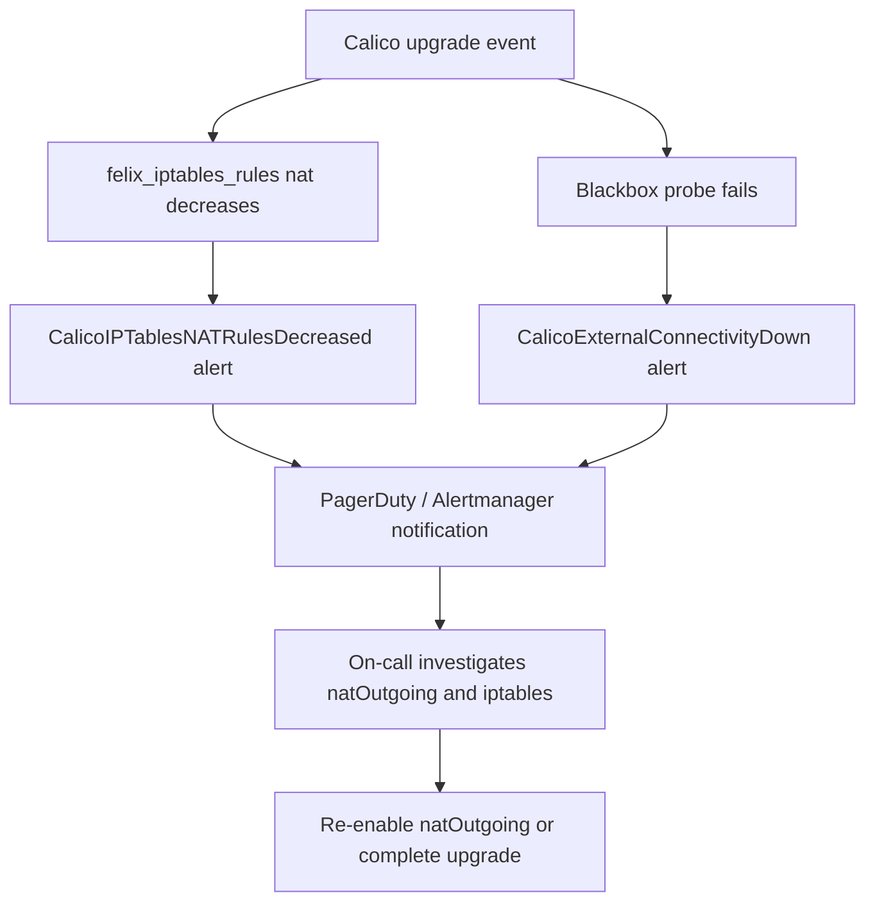

# How to Monitor for External Connectivity Broken After Calico Upgrade

Author: [nawazdhandala](https://github.com/nawazdhandala)

Tags: Calico, Kubernetes, Networking, Troubleshooting, Monitoring

Description: Monitor for external connectivity failures related to Calico upgrades using blackbox exporter probes, Felix metrics, and alerting on natOutgoing and MASQUERADE rule changes.

---

## Introduction

Monitoring for external connectivity failures after Calico upgrades requires detecting both the connectivity loss itself and the upstream Calico configuration changes that cause it. The blackbox exporter can continuously probe external endpoints from within pods, while Felix metrics expose the current state of iptables rules managed by Calico.

Effective monitoring correlates Calico upgrade events with connectivity probe failures. By tracking the `felix_iptables_chains` metric before and after upgrades, you can detect when MASQUERADE rules are removed from the NAT table. This metric drops when natOutgoing is disabled, providing an early warning before user-facing impact.

## Symptoms

- No alert fired when pods lost external connectivity after upgrade
- External connectivity degradation discovered via user reports, not monitoring

## Root Causes

- No external connectivity probes monitoring pod-to-internet traffic
- No alerts on Calico configuration changes post-upgrade

## Solution

**Monitoring 1: Blackbox exporter probe for external connectivity**

```yaml
apiVersion: monitoring.coreos.com/v1
kind: Probe
metadata:
  name: external-connectivity-from-pods
  namespace: monitoring
spec:
  jobName: external-connectivity
  prober:
    url: blackbox-exporter.monitoring.svc:9115
  module: http_2xx
  targets:
    staticConfig:
      static:
      - https://1.1.1.1
      - https://8.8.8.8
```

**Monitoring 2: PrometheusRule for connectivity alerts**

```yaml
apiVersion: monitoring.coreos.com/v1
kind: PrometheusRule
metadata:
  name: calico-external-connectivity-alerts
  namespace: monitoring
spec:
  groups:
  - name: calico.external-connectivity
    rules:
    - alert: CalicoExternalConnectivityDown
      expr: probe_success{job="external-connectivity"} == 0
      for: 3m
      labels:
        severity: critical
      annotations:
        summary: "External connectivity probe failing"
        description: "Pods cannot reach external IPs. Check Calico natOutgoing and iptables rules."
    - alert: CalicoIPTablesNATRulesDecreased
      expr: |
        felix_iptables_rules{table="nat"} < felix_iptables_rules{table="nat"} offset 10m
      for: 5m
      labels:
        severity: warning
      annotations:
        summary: "Calico NAT iptables rules decreased"
        description: "Felix NAT rules dropped - natOutgoing may have been disabled."
```

**Monitoring 3: PodMonitor for Felix metrics**

```yaml
apiVersion: monitoring.coreos.com/v1
kind: PodMonitor
metadata:
  name: calico-felix-nat-metrics
  namespace: kube-system
spec:
  selector:
    matchLabels:
      k8s-app: calico-node
  podMetricsEndpoints:
  - port: felix-metrics-svc
    interval: 30s
    path: /metrics
    metricRelabelings:
    - sourceLabels: [__name__]
      regex: "felix_iptables.*"
      action: keep
```

**Monitoring 4: Alert on calico-node version drift**

```yaml
- alert: CalicoNodeVersionDrift
  expr: |
    count(count by (image) (kube_pod_container_info{container="calico-node"})) > 1
  for: 5m
  labels:
    severity: warning
  annotations:
    summary: "Multiple calico-node versions running"
    description: "Mixed calico-node versions detected - upgrade may be incomplete or stuck."
```

**Monitoring 5: Verify monitoring with a test**

```bash
# Simulate connectivity failure to verify alerts fire
kubectl get pods -n monitoring | grep blackbox

# Check current probe status in Prometheus
# Query: probe_success{job="external-connectivity"}
# Expected: 1 (success) when connectivity is working

# Check Felix NAT rule count
# Query: felix_iptables_rules{table="nat"}
# Expected: > 10 when natOutgoing is enabled
```



## Prevention

- Deploy blackbox exporter probes before running any Calico upgrades
- Set alert thresholds tight enough to catch failures within 3 minutes
- Review monitoring dashboards immediately after each Calico upgrade

## Conclusion

Monitoring external connectivity after Calico upgrades combines blackbox probes for direct connectivity validation with Felix metrics for iptables rule health. Alerting on both probe failures and NAT rule decreases provides early warning of natOutgoing changes before widespread user impact.
