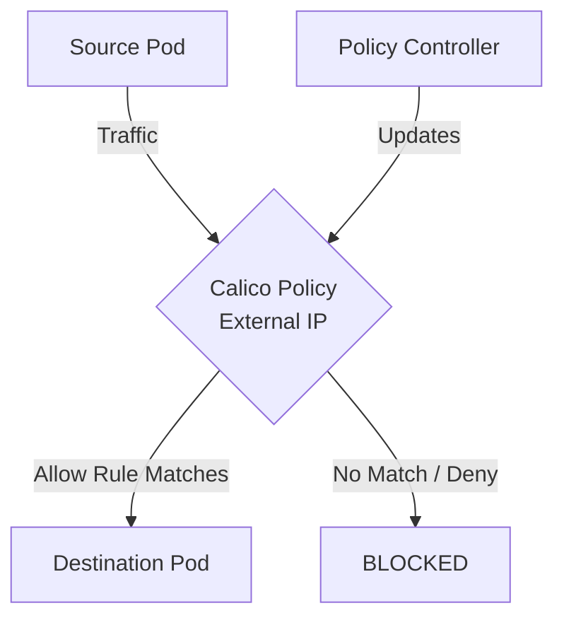

# How to Monitor the Impact of External IP Policies in Calico

Author: [nawazdhandala](https://github.com/nawazdhandala)

Tags: Calico, Kubernetes, Network Policy, External IP, Security

Description: Monitor the effectiveness of External IP Policies in Calico using metrics and analytics.

---

## Introduction

External IP Policies in Calico provides fine-grained network security controls using the `projectcalico.org/v3` API. This guide covers how to monitor External IP effectively.

Calico's extensible policy model supports External IP through its `GlobalNetworkPolicy` and `NetworkPolicy` resources, giving you cluster-wide and namespace-scoped control over traffic that matches your External IP criteria.

This guide provides practical techniques for monitor External IP in your Kubernetes cluster, following security best practices and production-tested patterns.

## Prerequisites

- Kubernetes cluster with Calico v3.26+
- `calicoctl` and `kubectl` installed
- Basic understanding of Calico network policy concepts

## Step 1: Enable Prometheus Metrics

```bash
kubectl patch felixconfiguration default --type=merge -p '{"spec":{"prometheusMetricsEnabled":true}}'
```

## Step 2: Key Metrics

```promql
# Denied packets rate
rate(felix_denied_packets_total[5m])

# Active policies
felix_active_network_policies

# Policy evaluation rate
rate(felix_policy_evaluation_total[5m])
```

## Step 3: Set Up Alerts

```yaml
apiVersion: monitoring.coreos.com/v1
kind: PrometheusRule
metadata:
  name: calico-external-ip-alerts
spec:
  groups:
    - name: calico.policy
      rules:
        - alert: HighDenialRate
          expr: rate(felix_denied_packets_total[5m]) > 50
          for: 2m
          labels:
            severity: warning
          annotations:
            summary: "High packet denial rate for External IP policies"
```

## Step 4: Grafana Dashboard

Track denial rates, policy evaluation counts, and active policy counts on a single dashboard to quickly spot anomalies related to External IP policy changes.

## Architecture



## Conclusion

Monitor External IP policies in Calico requires attention to policy ordering, selector accuracy, and bidirectional rule coverage. Follow the patterns in this guide to ensure your External IP policies are correctly configured, tested, and monitored. Always validate in staging before applying to production, and maintain comprehensive logging for visibility into policy decisions.
