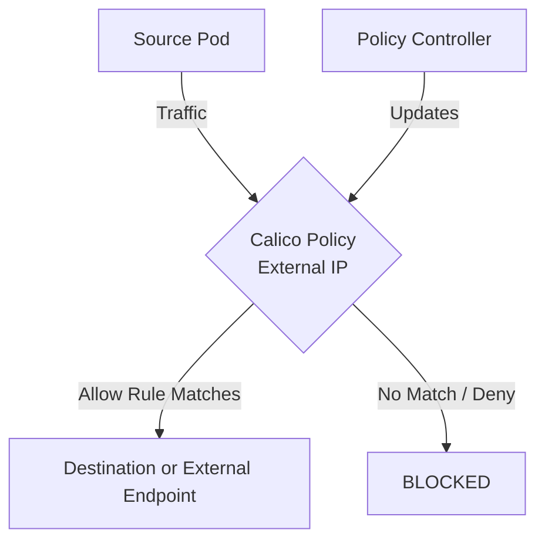

# How to Monitor the Impact of External IP Policies in Calico

Author: [nawazdhandala](https://github.com/nawazdhandala)

Tags: Calico, Kubernetes, Network Policy, External IP, Security

Description: Monitor the effectiveness of External IP Policies in Calico using metrics and analytics.

---

## Introduction

Calico network policies for external IPs provide fine-grained network security controls using the `projectcalico.org/v3` API. This guide covers how to monitor External IP rules effectively.

Calico's extensible policy model supports external IPs and networks through its `GlobalNetworkPolicy` and `NetworkPolicy` resources using CIDR `nets` rules or network sets, giving you cluster-wide and namespace-scoped control over traffic that matches your external IP criteria.

This guide provides practical techniques for monitor External IP in your Kubernetes cluster, following security best practices and production-tested patterns.

## Prerequisites

- Kubernetes cluster with Calico v3.26+
- `calicoctl` and `kubectl` installed
- Basic understanding of Calico network policy concepts

## Step 1: Enable Prometheus Metrics

```bash
kubectl patch felixconfiguration default --type=merge -p '{"spec":{"prometheusMetricsEnabled":true}}'
```

## Step 2: Key Metrics

```promql
# Active local policies

felix_active_local_policies

# Cluster policy count
felix_cluster_num_policies

# Selector evaluation rate
rate(felix_label_index_selector_evals[5m])

# Dataplane update failures
rate(felix_int_dataplane_failures[5m])

# iptables restore errors
rate(felix_iptables_restore_errors[5m])
```

## Step 3: Set Up Alerts

```yaml
apiVersion: monitoring.coreos.com/v1
kind: PrometheusRule
metadata:
  name: calico-external-ip-alerts
spec:
  groups:
    - name: calico.policy
      rules:
        - alert: HighSelectorEvaluationRate
          expr: sum(rate(felix_label_index_selector_evals[5m])) > 1000
          for: 2m
          labels:
            severity: warning
          annotations:
            summary: "High selector evaluation rate for Calico external IP policies"
```

## Step 4: Grafana Dashboard

Track active local policies, cluster policy counts, selector evaluation rates, and dataplane update errors on a single dashboard to quickly spot anomalies related to External IP policy changes.

## Architecture


```mermaid
flowchart TD
    A[Source Pod] -->|Traffic| B{Calico Policy\nExternal IP}
    B -->|Allow Rule Matches| C[Destination or External Endpoint]
    B -->|No Match / Deny| D[BLOCKED]
    E[Policy Controller] -->|Updates| B
```

## Conclusion

Monitor External IP policies in Calico requires attention to policy ordering, selector accuracy, and bidirectional rule coverage. Follow the patterns in this guide to ensure your External IP policies are correctly configured, tested, and monitored. Always validate in staging before applying to production, and maintain comprehensive logging for visibility into policy decisions.
