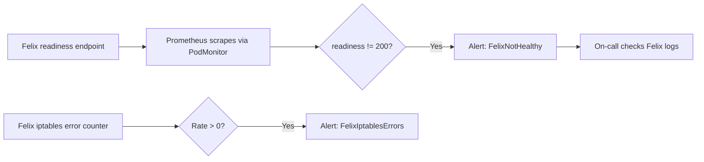

# How to Monitor Felix Not Starting in Calico

Author: [nawazdhandala](https://github.com/nawazdhandala)

Tags: Calico, Kubernetes, Networking, Troubleshooting

Description: Monitor for Felix startup and runtime failures in Calico using readiness probe metrics, Felix health endpoints, and log-based alerting.

---

## Introduction

Monitoring for Felix failures requires tracking the calico-node pod's readiness state (which reflects Felix health) and watching Felix-specific log patterns that indicate startup or runtime errors. Felix exposes a readiness endpoint at `/readiness` on port 9099 that returns 200 when healthy - this is the most direct health signal.

## Symptoms

- calico-node pod not ready but no alert fired for Felix specifically
- Felix failures detected only after NetworkPolicy stops working

## Root Causes

- No Felix-specific monitoring beyond generic pod readiness alerts
- Felix health endpoint not monitored

## Diagnosis Steps

```bash
NODE_POD=<calico-node-pod>
kubectl exec $NODE_POD -n kube-system -- \
  wget -qO- http://localhost:9099/readiness 2>/dev/null
# Returns 200 if healthy
```

## Solution

**Alert on calico-node not ready (covers Felix health)**

```yaml
apiVersion: monitoring.coreos.com/v1
kind: PrometheusRule
metadata:
  name: felix-health-alerts
  namespace: monitoring
spec:
  groups:
  - name: felix.health
    rules:
    - alert: FelixNotHealthy
      expr: |
        kube_pod_status_ready{
          namespace="kube-system",
          pod=~"calico-node-.*",
          condition="true"
        } == 0
      for: 3m
      labels:
        severity: critical
      annotations:
        summary: "Felix unhealthy on {{ $labels.pod }}"
    - alert: FelixIptablesErrors
      expr: |
        rate(felix_iptables_restore_errors_total[5m]) > 0
      for: 2m
      labels:
        severity: warning
      annotations:
        summary: "Felix iptables errors on {{ $labels.instance }}"
```

**Monitor Felix metrics directly**

```bash
# Enable Felix Prometheus metrics
kubectl patch felixconfiguration default \
  --type merge \
  --patch '{"spec":{"prometheusMetricsEnabled":true}}'

# Check Felix-specific metrics
NODE_POD=<calico-node-pod>
kubectl exec $NODE_POD -n kube-system -- \
  wget -qO- http://localhost:9091/metrics | grep "felix_" | head -20
```



## Prevention

- Enable Felix Prometheus metrics in all clusters
- Monitor both Felix readiness and Felix iptables error metrics
- Set up PodMonitor to scrape Felix metrics endpoint

## Conclusion

Monitoring Felix health requires tracking calico-node pod readiness (which reflects Felix health via readiness probes) and Felix iptables error counters from the Prometheus metrics endpoint. These two signals cover both startup and runtime Felix failures.
