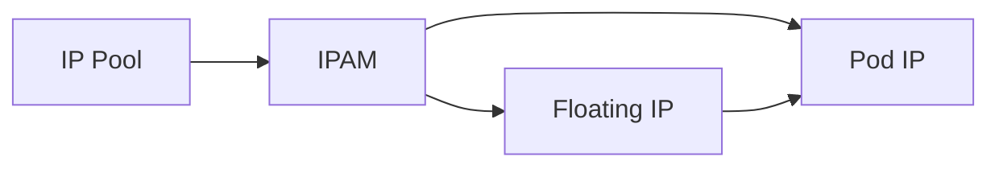

# How to Monitor Floating IPs with Calico

Author: [nawazdhandala](https://github.com/nawazdhandala)

Tags: Calico, Kubernetes, IPAM, Floating IP, Networking

Description: Monitor floating IP assignment and routing health in Calico to detect failover failures.

---

## Introduction

Floating IPs with Calico provide a stable additional address for reaching a pod. The floating IP is assigned to a workload endpoint and can move between pods over time.

## Prerequisites

- Calico CNI plugin installed with floating IPs enabled
- kubectl and calicoctl access
- IP pools configured for the floating IP ranges
- Manifest-managed Calico deployment, because pod floating IPs are not supported for operator-managed Calico clusters

## Configuration

```bash
calicoctl get ippools -o yaml
calicoctl ipam show --show-blocks
```

## Example

```yaml
apiVersion: projectcalico.org/v3
kind: IPPool
metadata:
  name: example-pool
spec:
  cidr: 10.48.0.0/16
  blockSize: 26
  natOutgoing: true
```

```yaml
apiVersion: v1
kind: Pod
metadata:
  name: floating-ip-example
  annotations:
    cni.projectcalico.org/floatingIPs: "[\"10.48.0.10\"]"
spec:
  containers:
    - name: nginx
      image: nginx
```

## Verification

```bash
calicoctl ipam show --ip=10.48.0.10
calicoctl ipam check -o ipam-report.json
kubectl get pods -A -o wide
```

## Architecture



## Conclusion

How to Monitor Floating IPs with Calico helps ensure your Calico deployment handles floating IP assignment correctly for your specific workload requirements.
