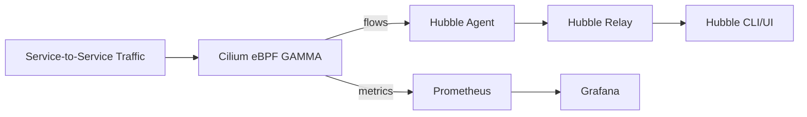

# How to Monitor GAMMA in the Cilium Gateway API

Author: [nawazdhandala](https://github.com/nawazdhandala)

Tags: Cilium, Kubernetes, GAMMA, Gateway API, Monitoring

Description: Monitor GAMMA service mesh routes in the Cilium Gateway API using Prometheus and Hubble to track east-west traffic health and routing fidelity.

---

## Introduction

Monitoring GAMMA routes in the Cilium Gateway API provides ongoing visibility into whether service mesh routing rules remain active and effective. Because GAMMA routes are enforced in the eBPF datapath without sidecar proxies, monitoring requires using Cilium's own observability stack rather than proxy-based metrics.

Hubble is the primary monitoring tool for GAMMA traffic. It exposes per-flow data showing which backend each request was routed to, the verdict (FORWARDED or DROPPED), and the applicable policy. Prometheus metrics from the Cilium agent provide aggregate throughput and drop rate data.

## Prerequisites

- Cilium with Prometheus and Hubble enabled
- GAMMA HTTPRoutes deployed
- Grafana connected to Prometheus

## Monitor Route Status Continuously

Watch for HTTPRoute condition changes:

```bash
kubectl get httproute -A -w
```

## Architecture



## Key Hubble Commands

Monitor active flows between mesh services:

```bash
hubble observe --namespace <namespace> --type trace --follow
```

Filter by verdict to find anomalies:

```bash
hubble observe --verdict DROPPED --namespace <namespace> --since 5m
```

## Prometheus Queries for GAMMA Health

Track policy decisions by direction:

```promql
sum by (direction) (rate(cilium_policy_l7_total[5m]))
```

Monitor endpoint-level forwarding:

```promql
rate(cilium_forward_count_total{destination_namespace="<ns>"}[1m])
```

## Alerting on GAMMA Route Failure

```yaml
groups:
  - name: gamma-monitoring
    rules:
      - alert: GammaRouteAcceptedFalse
        expr: kube_httproute_status_parents_condition{type="Accepted",status="False"} > 0
        for: 3m
        labels:
          severity: critical
```

## Conclusion

Monitoring GAMMA in Cilium uses Hubble for real-time flow data and Prometheus for aggregate metrics. Combined with alerting on route conditions, this approach ensures your service mesh routing remains reliable and observable.
