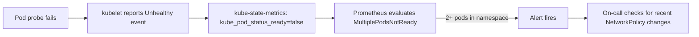

# How to Monitor Health Checks Failing After Enabling Calico Policies

Author: [nawazdhandala](https://github.com/nawazdhandala)

Tags: Calico, Kubernetes, Networking, Troubleshooting

Description: Monitor for Kubernetes probe failures caused by Calico NetworkPolicies using pod readiness metrics, probe failure counters, and pod restart rate alerts.

---

## Introduction

Monitoring for health check failures caused by Calico NetworkPolicies requires tracking pod readiness state, probe failure events, and pod restart rates at the namespace level. When a NetworkPolicy change blocks kubelet probe traffic, multiple pods in the affected namespace will transition to NotReady simultaneously - this correlated failure pattern is a strong signal that a policy change is the root cause rather than an application issue.

Prometheus kube-state-metrics exposes the pod readiness and container restart count metrics needed to build these alerts. Combining them with a Kubernetes event watch for probe failures provides fast detection and useful context for diagnosis.

## Symptoms

- Multiple pods in a namespace transition to NotReady at the same time
- Pod restart rate spikes after a NetworkPolicy is applied
- No application-level changes correlate with the health check failures

## Root Causes

- NetworkPolicy applied without monitoring for readiness regression
- No alert defined for correlated pod readiness failures across a namespace

## Diagnosis Steps

```bash
# Check pod readiness state
kubectl get pods -n <namespace> -o wide | grep "0/"

# Check for probe failure events
kubectl get events -n <namespace> | grep -i "probe\|unhealthy\|failed"
```

## Solution

**Step 1: Alert on namespace-level pod readiness drop**

```yaml
apiVersion: monitoring.coreos.com/v1
kind: PrometheusRule
metadata:
  name: pod-readiness-alerts
  namespace: monitoring
spec:
  groups:
  - name: pod.readiness
    rules:
    - alert: MultiplePodsNotReady
      expr: |
        count by (namespace) (
          kube_pod_status_ready{condition="false",namespace!~"kube-system|kube-public"}
        ) > 2
      for: 3m
      labels:
        severity: warning
      annotations:
        summary: "Multiple pods not ready in {{ $labels.namespace }}"
        description: "{{ $value }} pods are not ready in {{ $labels.namespace }} - possible NetworkPolicy probe block"
    - alert: PodRestartSpike
      expr: |
        increase(kube_pod_container_status_restarts_total{namespace!~"kube-system"}[10m]) > 5
      for: 5m
      labels:
        severity: warning
      annotations:
        summary: "Pod restart spike in {{ $labels.namespace }}/{{ $labels.pod }}"
```

**Step 2: Watch for probe failure events**

```bash
# Continuous watch for probe failure events
kubectl get events --all-namespaces --watch \
  --field-selector reason=Unhealthy 2>/dev/null
```

**Step 3: Create a readiness correlation dashboard**

Monitor these metrics in Grafana for correlation with policy changes:
- `kube_pod_status_ready` grouped by namespace
- `kube_pod_container_status_restarts_total` rate grouped by namespace
- Policy creation events (from Kubernetes audit log if enabled)



## Prevention

- Alert on any namespace showing >2 pods NotReady simultaneously
- Correlate policy creation timestamps with pod readiness events in Grafana
- Include post-policy readiness check in change management process

## Conclusion

Monitoring for health check failures from Calico policies requires tracking correlated pod readiness drops across namespaces. The pattern of multiple pods becoming NotReady simultaneously after a policy change is a reliable signal. Prometheus rules on kube-state-metrics pod readiness metrics detect this pattern within minutes.
