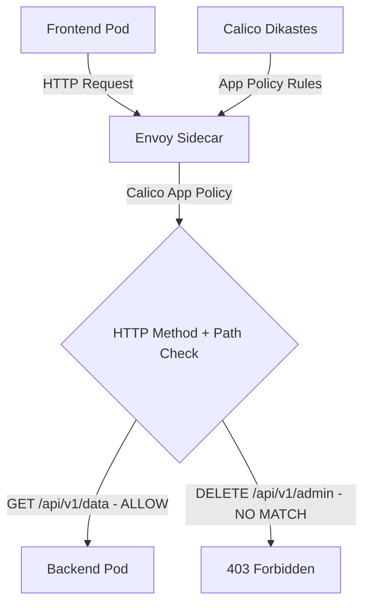

# How to Monitor HTTP Method Policy Impact with Calico and Istio

Author: [nawazdhandala](https://github.com/nawazdhandala)

Tags: Calico, Kubernetes, Network Policy, Istio, HTTP Methods, Security

Description: Monitor Calico HTTP method-based network policies using Istio to control access by HTTP verb (GET, POST, DELETE, etc.).

---

## Introduction

HTTP Method Policies with Calico and Istio combines Calico's network-layer enforcement with Istio's application-layer visibility. This powerful combination lets you write policies that reference HTTP attributes - methods and paths - in addition to network-level properties like IP addresses and ports.

Calico's `projectcalico.org/v3` NetworkPolicy and GlobalNetworkPolicy resources (available with Istio integration) allow you to write HTTP match rules that are evaluated by Istio's Envoy sidecar proxies rather than only at the network layer. This enables fine-grained control like "allow GET requests to /api/health but deny POST requests to /api/admin" by allowing only the method and path combinations you want.

This guide covers monitor HTTP Method Policies using Calico and Istio together.

## Prerequisites

- Kubernetes cluster with Calico application layer policy support and Istio v1.22+ installed
- Calico-Istio integration configured (Dikastes sidecar)
- `calicoctl`, `kubectl`, and `istioctl` installed
- Workloads with Istio sidecar injection enabled

## Core Configuration

```yaml
apiVersion: projectcalico.org/v3
kind: NetworkPolicy
metadata:
  name: monitor-http-method-policies
  namespace: production
spec:
  order: 100
  selector: app == 'backend-api'
  ingress:
    - action: Allow
      source:
        selector: app == 'frontend'
      http:
        methods:
          - GET
          - POST
        paths:
          - exact: /api/v1/data
          - prefix: /api/v1/public
  types:
    - Ingress
```

## Istio + Calico Setup

```bash
# Verify Calico-Istio integration

kubectl get configmap -n istio-system istio-sidecar-injector -o yaml | grep "dikastes:" -A 5
kubectl get pods -n calico-system -l k8s-app=csi-node-driver
kubectl get felixconfiguration default -o yaml | grep policySyncPathPrefix

# Enable sidecar injection for namespace
kubectl label namespace production istio-injection=enabled --overwrite

# Ensure the protected workload gets both Envoy and Dikastes sidecars
kubectl patch deployment backend-api -n production -p '{"spec":{"template":{"metadata":{"annotations":{"inject.istio.io/templates":"sidecar,dikastes"}}}}}'
```

## Test Application-Layer Policy

```bash
# Test allowed method
kubectl exec -n production frontend-pod -- curl --fail -X GET http://backend-api:8080/api/v1/data
echo "GET /api/v1/data (should pass): $?"

# Test denied method/path
kubectl exec -n production frontend-pod -- curl --fail -X DELETE http://backend-api:8080/api/v1/admin
echo "DELETE /api/v1/admin (should be denied): $?"
```

## Architecture



## Conclusion

HTTP Method Policies with Calico and Istio provides fine-grained network security for Kubernetes, combining network-layer enforcement with application-layer policy evaluation. By filtering on HTTP methods and paths, you can implement access controls that are impossible with pure network-layer policies. Ensure your Calico-Istio integration is properly configured and test both allowed and denied request patterns to verify your application-layer policies are working correctly.
