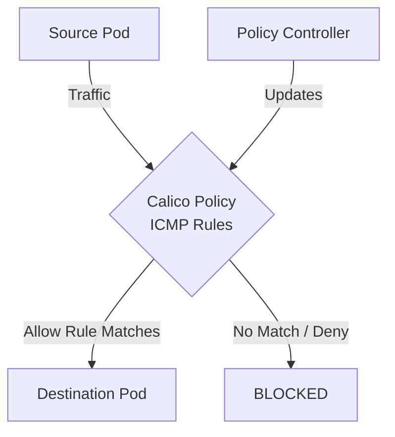

# How to Monitor the Impact of ICMP and Ping Rules in Calico

Author: [nawazdhandala](https://github.com/nawazdhandala)

Tags: Calico, Kubernetes, Network Policy, ICMP, Security, Network

Description: Monitor the effectiveness of ICMP and Ping Rules in Calico using metrics and analytics.

---

## Introduction

ICMP and Ping Rules in Calico provides fine-grained network security controls using the `projectcalico.org/v3` API. This guide covers how to monitor ICMP Rules effectively.

Calico's extensible policy model supports ICMP Rules through its `GlobalNetworkPolicy` and `NetworkPolicy` resources, giving you cluster-wide and namespace-scoped control over traffic that matches your ICMP Rules criteria.

This guide provides practical techniques for monitor ICMP Rules in your Kubernetes cluster, following security best practices and production-tested patterns.

## Prerequisites

- Kubernetes cluster with Calico v3.26+
- `calicoctl` and `kubectl` installed
- Basic understanding of Calico network policy concepts

## Step 1: Enable Prometheus Metrics

```bash
kubectl patch felixconfiguration default --type=merge -p '{"spec":{"prometheusMetricsEnabled":true}}'
```

## Step 2: Key Metrics

```promql
# Denied packets rate
rate(felix_denied_packets_total[5m])

# Active policies
felix_active_network_policies

# Policy evaluation rate
rate(felix_policy_evaluation_total[5m])
```

## Step 3: Set Up Alerts

```yaml
apiVersion: monitoring.coreos.com/v1
kind: PrometheusRule
metadata:
  name: calico-icmp-rules-alerts
spec:
  groups:
    - name: calico.policy
      rules:
        - alert: HighDenialRate
          expr: rate(felix_denied_packets_total[5m]) > 50
          for: 2m
          labels:
            severity: warning
          annotations:
            summary: "High packet denial rate for ICMP Rules policies"
```

## Step 4: Grafana Dashboard

Track denial rates, policy evaluation counts, and active policy counts on a single dashboard to quickly spot anomalies related to ICMP Rules policy changes.

## Architecture



## Conclusion

Monitor ICMP Rules policies in Calico requires attention to policy ordering, selector accuracy, and bidirectional rule coverage. Follow the patterns in this guide to ensure your ICMP Rules policies are correctly configured, tested, and monitored. Always validate in staging before applying to production, and maintain comprehensive logging for visibility into policy decisions.
