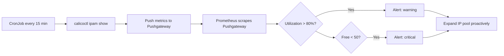

# How to Monitor IP Pool Exhaustion in Calico

Author: [nawazdhandala](https://github.com/nawazdhandala)

Tags: Calico, Kubernetes, Networking, Troubleshooting

Description: Monitor Calico IP pool utilization using calicoctl metrics, Prometheus alerts, and automated utilization checks to prevent exhaustion before it causes pod failures.

---

## Introduction

Monitoring Calico IP pool utilization is critical for preventing exhaustion. By the time pods start failing with IP allocation errors, the pool is already 100% utilized. Effective monitoring alerts at 70-80% utilization, providing a window to expand the pool before any impact occurs.

Calico does not natively expose IP pool utilization as Prometheus metrics in all versions, so monitoring typically requires a combination of periodic `calicoctl ipam show` runs and parsing the output for utilization percentage.

## Symptoms

- No alerts until 100% utilization causes pod failures
- IP pool utilization growing without visibility

## Root Causes

- No IPAM utilization monitoring configured
- calicoctl metrics not integrated with Prometheus

## Diagnosis Steps

```bash
calicoctl ipam show
calicoctl ipam show --show-blocks
```

## Solution

**Step 1: IPAM utilization Prometheus gauge**

```yaml
# CronJob that exports utilization as a Prometheus pushgateway metric
apiVersion: batch/v1
kind: CronJob
metadata:
  name: ipam-metrics-exporter
  namespace: kube-system
spec:
  schedule: "*/15 * * * *"
  jobTemplate:
    spec:
      template:
        spec:
          serviceAccountName: calico-node
          containers:
          - name: exporter
            image: calico/ctl:v3.27.0
            env:
            - name: PUSHGATEWAY_URL
              value: "http://pushgateway.monitoring.svc.cluster.local:9091"
            command:
            - /bin/sh
            - -c
            - |
              RESULT=$(calicoctl ipam show 2>/dev/null)
              FREE=$(echo "$RESULT" | grep -i "free" | grep -oP '\d+' | head -1 || echo "0")
              USED=$(echo "$RESULT" | grep -i "allocat" | grep -oP '\d+' | head -1 || echo "0")
              TOTAL=$((FREE + USED))
              if [ "$TOTAL" -gt 0 ]; then
                cat <<METRICS | curl -s --data-binary @- $PUSHGATEWAY_URL/metrics/job/calico_ipam
              # HELP calico_ipam_free_addresses Number of free IP addresses in Calico pools
              # TYPE calico_ipam_free_addresses gauge
              calico_ipam_free_addresses $FREE
              # HELP calico_ipam_used_addresses Number of used IP addresses in Calico pools
              # TYPE calico_ipam_used_addresses gauge
              calico_ipam_used_addresses $USED
              METRICS
              fi
          restartPolicy: Never
```

**Step 2: Alert on IPAM utilization thresholds**

```yaml
apiVersion: monitoring.coreos.com/v1
kind: PrometheusRule
metadata:
  name: calico-ipam-alerts
  namespace: monitoring
spec:
  groups:
  - name: calico.ipam
    rules:
    - alert: CalicoIPPoolHighUtilization
      expr: |
        calico_ipam_used_addresses /
        (calico_ipam_used_addresses + calico_ipam_free_addresses) > 0.8
      for: 15m
      labels:
        severity: warning
      annotations:
        summary: "Calico IP pool over 80% utilized"
    - alert: CalicoIPPoolCritical
      expr: |
        calico_ipam_free_addresses < 50
      for: 5m
      labels:
        severity: critical
      annotations:
        summary: "Calico IP pool critically low: {{ $value }} addresses remaining"
```



## Prevention

- Deploy IPAM metrics exporter and alerts during cluster setup
- Alert at 70% and 90% to give multiple expansion opportunities
- Include IP pool utilization in weekly cluster health reports

## Conclusion

Monitoring Calico IP pool utilization requires setting up a metrics exporter (since native Prometheus metrics may not include IPAM utilization in all versions) and alerting at multiple utilization thresholds. Alerting at 70-80% provides adequate lead time to expand the pool before pod failures occur.
