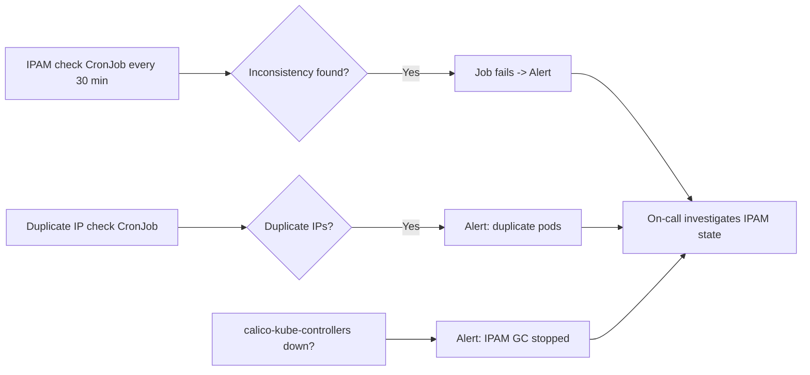

# How to Monitor for IPAM Block Conflicts in Calico

Author: [nawazdhandala](https://github.com/nawazdhandala)

Tags: Calico, Kubernetes, Networking, Troubleshooting

Description: Monitor for Calico IPAM block conflicts using scheduled calicoctl checks, duplicate IP detection, and calico-kube-controllers health monitoring.

---

## Introduction

Monitoring for IPAM block conflicts requires proactive checking since conflicts don't always surface immediately as network errors. The primary monitoring approach is a scheduled `calicoctl ipam check` that detects inconsistencies and alerts on failures, combined with duplicate IP detection that catches cases where two pods receive the same IP.

## Symptoms

- Duplicate pod IPs not detected until routing anomalies are reported
- IPAM check failures not generating alerts

## Root Causes

- No scheduled IPAM check
- calico-kube-controllers not monitored, preventing GC failure detection

## Diagnosis Steps

```bash
calicoctl ipam check
kubectl get pods --all-namespaces -o wide | awk '{print $7}' | sort | uniq -d
```

## Solution

**Scheduled IPAM check with alerting**

```yaml
apiVersion: batch/v1
kind: CronJob
metadata:
  name: ipam-conflict-monitor
  namespace: kube-system
spec:
  schedule: "*/30 * * * *"  # Every 30 minutes
  jobTemplate:
    spec:
      template:
        spec:
          serviceAccountName: calico-node
          containers:
          - name: monitor
            image: calico/ctl:v3.27.0
            command:
            - /bin/sh
            - -c
            - |
              if ! calicoctl ipam check 2>&1 | grep -qi "error\|conflict\|inconsist"; then
                echo "PASS: IPAM is consistent"
              else
                echo "ALERT: IPAM inconsistency detected"
                calicoctl ipam check
                exit 1
              fi
          restartPolicy: Never
```

**Alert on duplicate pod IPs**

```bash
# Script to detect duplicate pod IPs (run as CronJob)
DUPES=$(kubectl get pods --all-namespaces -o wide \
  | awk '{print $7}' | grep -v "IP\|<none>" | sort | uniq -d)
if [ -n "$DUPES" ]; then
  echo "ALERT: Duplicate pod IPs detected: $DUPES"
  exit 1
fi
```

**Monitor calico-kube-controllers**

```yaml
apiVersion: monitoring.coreos.com/v1
kind: PrometheusRule
metadata:
  name: calico-controllers-alert
  namespace: monitoring
spec:
  groups:
  - name: calico.controllers
    rules:
    - alert: CalicoKubeControllersDown
      expr: |
        kube_deployment_status_replicas_available{
          namespace="kube-system",
          deployment="calico-kube-controllers"
        } == 0
      for: 5m
      labels:
        severity: warning
      annotations:
        summary: "calico-kube-controllers unavailable - IPAM GC stopped"
```



## Prevention

- Deploy IPAM monitoring CronJobs during cluster bootstrap
- Alert on calico-kube-controllers unavailability (it runs IPAM GC)
- Include IPAM health in cluster health dashboard

## Conclusion

Monitoring IPAM block conflicts requires three components: a scheduled `calicoctl ipam check`, a duplicate IP detection check, and calico-kube-controllers health monitoring. Together these provide comprehensive coverage of IPAM health.
