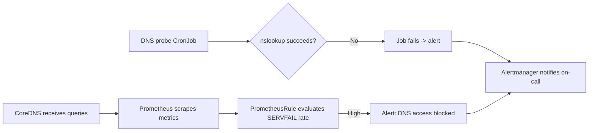

# How to Monitor kube-system Access Problems with Calico NetworkPolicy

Author: [nawazdhandala](https://github.com/nawazdhandala)

Tags: Calico, Kubernetes, Networking, Troubleshooting

Description: Monitor for kube-system access failures caused by Calico NetworkPolicies using DNS query success rate metrics, synthetic DNS probes, and policy audit logs.

---

## Introduction

Monitoring kube-system access problems requires focusing on the services that live there: CoreDNS query success rates, metrics-server availability, and admission webhook response times. When Calico NetworkPolicies block kube-system access, these metrics degrade in ways that can be detected before applications begin failing in large numbers.

CoreDNS metrics are particularly valuable as early warning signals. A spike in NXDOMAIN responses or a sudden drop in query rate from specific source namespaces indicates that egress policies are blocking DNS traffic. Combined with synthetic DNS probes, this provides fast detection of kube-system access regressions.

## Symptoms

- CoreDNS SERVFAIL or timeout rate increases after a policy change
- Metrics-server responds with errors or becomes unavailable
- Admission webhook latency increases due to connectivity issues

## Root Causes

- Egress policy applied without DNS allow
- kube-system ingress policy changed to block application namespaces
- New namespace deployed without baseline policies

## Diagnosis Steps

```bash
# Check CoreDNS query metrics
kubectl exec -n kube-system \
  $(kubectl get pods -n kube-system -l k8s-app=kube-dns -o name | head -1) \
  -- wget -qO- http://localhost:9153/metrics | grep "coredns_dns_requests_total"
```

## Solution

**Step 1: Enable CoreDNS metrics**

```yaml
# CoreDNS ConfigMap - add prometheus plugin
apiVersion: v1
kind: ConfigMap
metadata:
  name: coredns
  namespace: kube-system
data:
  Corefile: |
    .:53 {
        prometheus :9153
        errors
        health {
           lameduck 5s
        }
        ready
        kubernetes cluster.local in-addr.arpa ip6.arpa {
           pods insecure
           fallthrough in-addr.arpa ip6.arpa
           ttl 30
        }
        forward . /etc/resolv.conf
        cache 30
        loop
        reload
        loadbalance
    }
```

**Step 2: Alert on CoreDNS error rate per namespace**

```yaml
apiVersion: monitoring.coreos.com/v1
kind: PrometheusRule
metadata:
  name: coredns-namespace-alerts
  namespace: kube-system
spec:
  groups:
  - name: coredns.access
    rules:
    - alert: CoreDNSHighErrorRate
      expr: |
        rate(coredns_dns_responses_total{rcode="SERVFAIL"}[5m]) > 0.1
      for: 3m
      labels:
        severity: warning
      annotations:
        summary: "CoreDNS SERVFAIL rate elevated"
        description: "SERVFAIL responses at {{ $value }}/sec - possible NetworkPolicy blocking DNS"
```

**Step 3: Deploy DNS probe per namespace**

```yaml
apiVersion: batch/v1
kind: CronJob
metadata:
  name: dns-probe
  namespace: production
spec:
  schedule: "*/3 * * * *"
  jobTemplate:
    spec:
      template:
        spec:
          containers:
          - name: probe
            image: busybox
            command:
            - /bin/sh
            - -c
            - |
              nslookup kubernetes.default.svc.cluster.local || exit 1
              nslookup kube-dns.kube-system.svc.cluster.local || exit 1
              echo "DNS probes passed"
          restartPolicy: Never
```



## Prevention

- Deploy DNS probes in every namespace as part of provisioning automation
- Set up CoreDNS Grafana dashboard showing per-source error rates
- Alert on CronJob failure rate in addition to DNS error metrics

## Conclusion

Monitoring kube-system access via CoreDNS metrics and DNS probe CronJobs provides early detection of NetworkPolicy-induced DNS failures. CoreDNS SERVFAIL rate alerts detect cluster-wide issues, while per-namespace CronJob probes pinpoint which namespace has the blocking policy.
