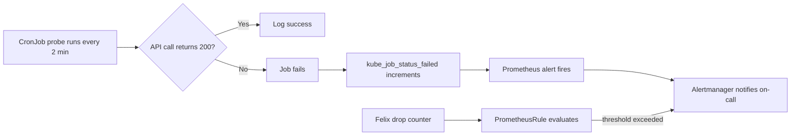

# How to Monitor Kubernetes API Access Problems with Calico Egress Policy

Author: [nawazdhandala](https://github.com/nawazdhandala)

Tags: Calico, Kubernetes, Networking, Troubleshooting

Description: Monitor for Calico egress policy blocks on Kubernetes API access using synthetic probes, Felix policy metrics, and API server error rate alerts.

---

## Introduction

Monitoring for Kubernetes API access failures caused by Calico egress policies requires detecting the failure quickly, before dependent workloads begin cascading. Operators, controllers, and service accounts all depend on API access - a silent block affects multiple systems simultaneously.

The most direct monitoring approach is a synthetic probe that periodically tests API access from within pods in each namespace that has egress policies applied. Complementing this with Calico Felix drop metrics and Kubernetes API server error rate alerts provides defense-in-depth monitoring.

This guide covers deploying a synthetic API access probe, creating PrometheusRules for API error rates, and watching Calico policy drop events specifically for traffic to the API server.

## Symptoms

- Operators fail silently for minutes before error rate alerts fire
- API server logs show increased 403/401 errors from certain source IPs
- Felix drop counter increases coinciding with time a new policy was applied

## Root Causes

- Egress policy applied without monitoring to detect API access regression
- No synthetic probe testing API connectivity from within pods
- API server error rate monitoring not configured

## Diagnosis Steps

```bash
# Check if any pods are failing API calls
kubectl get events --all-namespaces | grep -i "unauthorized\|connection refused\|timeout" | tail -20

# Check API server logs for connection issues
kubectl logs -n kube-system \
  $(kubectl get pods -n kube-system -l component=kube-apiserver -o name | head -1) \
  | grep -i "connection\|refused\|timeout" | tail -20
```

## Solution

**Step 1: Deploy synthetic API access probe**

```yaml
apiVersion: batch/v1
kind: CronJob
metadata:
  name: api-access-probe
  namespace: production
spec:
  schedule: "*/2 * * * *"
  jobTemplate:
    spec:
      template:
        spec:
          serviceAccountName: default
          containers:
          - name: probe
            image: curlimages/curl:latest
            command:
            - /bin/sh
            - -c
            - |
              TOKEN=$(cat /var/run/secrets/kubernetes.io/serviceaccount/token)
              RESULT=$(curl -sk -o /dev/null -w "%{http_code}" \
                https://kubernetes.default.svc.cluster.local/api/v1 \
                --header "Authorization: Bearer $TOKEN" \
                --max-time 5)
              if [ "$RESULT" != "200" ]; then
                echo "ALERT: API access failed with HTTP $RESULT"
                exit 1
              fi
              echo "API access OK: HTTP $RESULT"
          restartPolicy: Never
```

**Step 2: Alert on CronJob failures**

```yaml
apiVersion: monitoring.coreos.com/v1
kind: PrometheusRule
metadata:
  name: api-access-probe-alerts
  namespace: monitoring
spec:
  groups:
  - name: api.access
    rules:
    - alert: KubernetesAPIAccessBlocked
      expr: |
        kube_job_status_failed{
          namespace="production",
          job_name=~"api-access-probe.*"
        } > 0
      for: 5m
      labels:
        severity: critical
      annotations:
        summary: "Kubernetes API access blocked from production namespace"
        description: "Synthetic API access probe has been failing for 5 minutes"
```

**Step 3: Monitor Felix drops to API server CIDR**

```bash
# Enable Felix policy logging to see drops to API server IP
KUBE_IP=$(kubectl get svc kubernetes -o jsonpath='{.spec.clusterIP}')

# Watch Felix metrics for drops to this IP
NODE_POD=$(kubectl get pods -n kube-system -l k8s-app=calico-node -o name | head -1)
kubectl exec $NODE_POD -n kube-system -- \
  watch -n5 'wget -qO- http://localhost:9091/metrics | grep felix_iptables_dropped'
```



## Prevention

- Deploy API access probes in every namespace with egress policies
- Include probe deployment in namespace provisioning automation
- Review API server error rate graphs after any policy change

## Conclusion

Monitoring for Kubernetes API access failures from Calico egress policies requires deploying synthetic probes in affected namespaces, setting up alerts on probe failures, and watching Felix drop counters for traffic to the API server. This layered approach detects policy-induced API access failures within minutes of onset.
