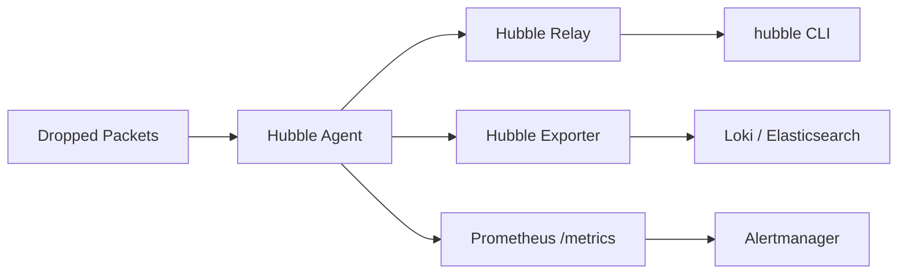

# How to Monitor or Log Dropped Network Traffic with Cilium

Author: [nawazdhandala](https://github.com/nawazdhandala)

Tags: Cilium, Kubernetes, Monitoring, Network Policy, Security, Observability

Description: Set up continuous monitoring and logging for dropped network traffic in Cilium using Hubble, Prometheus alerts, and structured log export.

---

## Introduction

Monitoring dropped traffic in Cilium serves two purposes: operational (detecting misconfigurations causing connectivity failures) and security (identifying unauthorized access attempts blocked by network policies). Cilium provides multiple mechanisms for capturing this data.

Hubble captures every drop event with reason codes. Prometheus exposes drop counters that can trigger alerts. The Hubble exporter can stream drop events to external log aggregation systems like Elasticsearch or Loki. Together these tools provide a comprehensive dropped traffic monitoring solution.

## Prerequisites

- Cilium with Hubble and Prometheus enabled
- Log aggregation system (optional, for long-term storage)

## Real-Time Drop Monitoring with Hubble

```bash
# Monitor all drops
hubble observe --verdict DROPPED --follow

# Monitor drops with context
hubble observe --verdict DROPPED --output json --follow | \
  jq '{time: .time, src: .flow.source.pod_name, dst: .flow.destination.pod_name, reason: .flow.drop_reason_desc}'
```

## Prometheus Drop Metrics

Cilium exposes drop counts by reason:

```promql
# Total drop rate
rate(cilium_drop_count_total[5m])

# Drops by reason
rate(cilium_drop_count_total[5m]) by (reason)

# Policy-related drops
rate(cilium_drop_count_total{reason="POLICY_DENIED"}[5m])
```

## Architecture



## Configure Hubble Exporter for Persistent Logging

```yaml
# In cilium-config ConfigMap
hubble-export-file-path: "/var/run/cilium/hubble/events.log"
hubble-export-file-max-size-mb: "10"
hubble-export-file-max-backups: "5"
hubble-export-allowlist: |
  {"verdict":["DROPPED"]}
```

## Alert on Elevated Drop Rates

```yaml
groups:
  - name: cilium-drops
    rules:
      - alert: CiliumHighDropRate
        expr: rate(cilium_drop_count_total[5m]) > 100
        for: 2m
        labels:
          severity: warning
        annotations:
          summary: "High packet drop rate: {{ $value }} drops/sec"
      - alert: CiliumPolicyDrops
        expr: rate(cilium_drop_count_total{reason="POLICY_DENIED"}[5m]) > 10
        for: 5m
        labels:
          severity: info
        annotations:
          summary: "Policy drops occurring - may indicate misconfiguration"
```

## Grafana Dashboard Panels

```promql
# Top drop reasons
topk(5, sum by (reason) (rate(cilium_drop_count_total[5m])))

# Drop rate per namespace
sum by (destination_namespace) (
  rate(cilium_drop_count_total[5m])
)
```

## Conclusion

Monitoring dropped network traffic in Cilium requires combining Hubble for real-time visibility, Prometheus for aggregate metrics and alerting, and the Hubble exporter for persistent log storage. Policy-related drops deserve special attention as they may indicate either intentional security enforcement or misconfiguration causing application failures.
