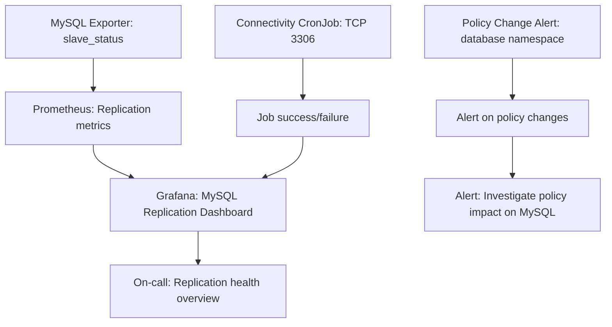

# How to Monitor MySQL Replication Problems in Calico Networks

Author: [nawazdhandala](https://github.com/nawazdhandala)

Tags: Calico, Kubernetes, MySQL, Replication, Monitoring, Prometheus

Description: Monitor MySQL replication health in Calico Kubernetes clusters using replication lag metrics, TCP connectivity checks, and network policy change alerts.

---

## Introduction

MySQL replication in Kubernetes is sensitive to network disruptions. Even brief connectivity interruptions between primary and replica pods can cause replication lag or full replication failure. Monitoring MySQL replication in a Calico environment requires tracking both the MySQL-level metrics (replication lag, I/O and SQL thread status) and the network-level metrics (TCP connectivity, policy changes) that can cause replication failures.

## Prerequisites

- MySQL deployed in Kubernetes with a MySQL Prometheus exporter
- Prometheus and Grafana deployed
- `kubectl` access

## Step 1: Deploy MySQL Exporter for Replication Metrics

```yaml
# mysql-exporter.yaml
apiVersion: apps/v1
kind: Deployment
metadata:
  name: mysql-exporter
  namespace: database
spec:
  replicas: 1
  selector:
    matchLabels:
      app: mysql-exporter
  template:
    metadata:
      labels:
        app: mysql-exporter
    spec:
      containers:
        - name: mysql-exporter
          image: prom/mysqld-exporter:v0.15.0
          env:
            - name: DATA_SOURCE_NAME
              valueFrom:
                secretKeyRef:
                  name: mysql-exporter-secret
                  key: dsn
          ports:
            - containerPort: 9104
          args:
            - --collect.slave_status
            - --collect.slave_hosts
```

```bash
# Create the MySQL exporter secret
kubectl create secret generic mysql-exporter-secret \
  -n database \
  --from-literal=dsn="exporter:password@tcp(mysql-0.mysql-headless.database.svc.cluster.local:3306)/"

# Apply the exporter
kubectl apply -f mysql-exporter.yaml
```

## Step 2: Create Prometheus Alerts for Replication Health

```yaml
# mysql-replication-alerts.yaml
apiVersion: monitoring.coreos.com/v1
kind: PrometheusRule
metadata:
  name: mysql-replication-health
  namespace: monitoring
spec:
  groups:
    - name: mysql.replication
      rules:
        # Alert when replication is not running
        - alert: MySQLReplicationIOThreadDown
          expr: |
            mysql_slave_status_slave_io_running == 0
          for: 2m
          labels:
            severity: critical
          annotations:
            summary: "MySQL replication I/O thread stopped on {{ $labels.instance }}"
            description: "Replica cannot connect to primary. Possible Calico network policy block on port 3306."

        # Alert when replication lag is high
        - alert: MySQLReplicationLagHigh
          expr: |
            mysql_slave_status_seconds_behind_master > 30
          for: 5m
          labels:
            severity: warning
          annotations:
            summary: "MySQL replication lag {{ $value }}s on {{ $labels.instance }}"
            description: "Replica is {{ $value }} seconds behind primary. Check network connectivity to primary."

        # Alert when SQL thread stops
        - alert: MySQLReplicationSQLThreadDown
          expr: |
            mysql_slave_status_slave_sql_running == 0
          for: 2m
          labels:
            severity: critical
          annotations:
            summary: "MySQL SQL replication thread stopped on {{ $labels.instance }}"
```

```bash
# Apply the alerts
kubectl apply -f mysql-replication-alerts.yaml
```

## Step 3: Monitor TCP Connectivity Between Primary and Replica

Add a connectivity check that specifically tests port 3306 between pods.

```yaml
# mysql-connectivity-probe.yaml
# Tests TCP connectivity from replica to primary on port 3306
apiVersion: batch/v1
kind: CronJob
metadata:
  name: mysql-connectivity-check
  namespace: database
spec:
  schedule: "*/5 * * * *"
  jobTemplate:
    spec:
      template:
        spec:
          containers:
            - name: checker
              image: nicolaka/netshoot
              command:
                - /bin/bash
                - -c
                - |
                  PRIMARY="mysql-0.mysql-headless.database.svc.cluster.local"
                  if timeout 5 bash -c "echo > /dev/tcp/${PRIMARY}/3306" 2>/dev/null; then
                    echo "OK: TCP 3306 reachable to ${PRIMARY}"
                  else
                    echo "FAIL: TCP 3306 NOT reachable to ${PRIMARY}"
                    exit 1
                  fi
          restartPolicy: Never
```

## Step 4: Alert on Network Policy Changes in Database Namespace

```yaml
# network-policy-change-alert.yaml
# Alerts when Calico policies in database namespace change
apiVersion: monitoring.coreos.com/v1
kind: PrometheusRule
metadata:
  name: database-policy-changes
  namespace: monitoring
spec:
  groups:
    - name: database.network.policy
      rules:
        - alert: DatabaseNamespacePolicyChanged
          expr: |
            changes(kube_networkpolicy_created{namespace="database"}[10m]) > 0
          labels:
            severity: warning
          annotations:
            summary: "Network policy changed in database namespace"
            description: "A network policy change in the database namespace may affect MySQL replication."
```

## Step 5: Build a Replication Health Dashboard



## Best Practices

- Set up MySQL replication monitoring before enabling network policies in the database namespace
- Correlate MySQL replication I/O thread failures with Calico policy change audit logs to identify policy-caused failures
- Use the MySQL exporter's `slave_hosts` metric to track which replicas are connected to the primary
- Monitor both the MySQL-level metrics and the network-level TCP connectivity for complete coverage

## Conclusion

Monitoring MySQL replication in Calico clusters requires MySQL Prometheus metrics for replication health, periodic TCP connectivity probes for port 3306, and Prometheus alerts that fire quickly on I/O thread failures. By correlating MySQL replication failures with Calico policy change events, you can rapidly identify when networking changes are the root cause of replication problems.
